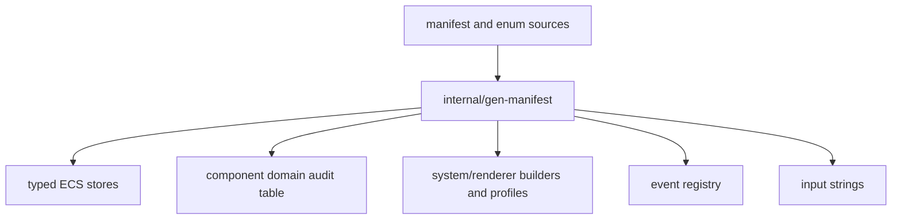

# Development, Builds, Diagnostics, and Operations

This guide covers the repository's generated-code contract, build variants,
verification surface, platform boundaries, and runtime diagnostics. The package
responsibility map is in [Package map](package-map.md).

## 1. Toolchain and dependencies

`go.mod` declares Go `1.27.1`; use that version or a compatible newer toolchain.
The application has no CGO requirement, but it is not standard-library-only.
Direct modules currently provide:

| Module | Responsibility used here |
|---|---|
| `github.com/lixenwraith/terminal` | Raw terminal, input events, cell flush, color-mode detection. |
| `github.com/lixenwraith/color` | RGB/palette values and blend functions. |
| `github.com/lixenwraith/toml` | FSM, content, keymap, audio, and persistence parsing/decoding. |
| `github.com/lixenwraith/log` | Asynchronous structured file logger behind `internal/vlog`. |
| `golang.org/x/sys`, `x/term` | Indirect platform/terminal support. |

Audio sends PCM to optional host commands; see [Audio](audio.md) for runtime
backend choices. A compiler, module download access, and a terminal are enough
to build the normal binary.

## 2. Common build workflow

```bash
git clone https://github.com/lixenwraith/vif
cd vif
make dev       # generated code + race-enabled debug build
./bin/vif
```

The Makefile targets are:

| Target | Effect |
|---|---|
| `generate` | Run the manifest/event/input code generator. |
| `dev` | Generate and build `cmd/vif` with the race detector/debug symbols. |
| `release` | Generate and build a stripped `-trimpath` native binary. |
| `headless` | Build `bin/vif-headless` without terminal presentation, renderers, or audio. |
| `nolog` | Release-style build with the `novlog` tag. |
| `wasm` | Build audio-free `web/vif.wasm` for the xterm.js host. |
| `windows` | Experimental audio/log-free `windows/amd64`, `CGO_ENABLED=0` cross-build. |
| `run` | Build the dev binary and execute it. |
| `test` | Generate and run `go test -race ./...`. |
| `verify` | Generate, test, vet, and compile full/`novlog`/audio-free/headless/WASM/Windows variants. |
| `arch-check` | Report `pkg/*` packages that import `internal/*`; diagnostic and separate from `verify`. |
| `tools` | Build `cmd/ascimage`, `cmd/soundlab`, and every `tool/*` command. |
| `allocator` | Build the website-to-K3s session allocator as `bin/vif-allocator`. |
| `serve` | Build WASM and the small HTTP server, then serve `web/`. |
| `install-config` | Copy `wad/` and the embedded keymap into the user config root, keeping existing files. |
| `install-config-force` | Replace files in the selected user config root. |
| `install` | Stage a distribution package: binary, `wad/` as a system config root, licence, docs. |
| `image` | Build the dedicated-session container image from `deploy/docker/Dockerfile`. |
| `image-check` | Run the built image's own `-check` as its numeric user, read-only and with no network. |
| `clean` | Remove `bin/`. |

`TAGS` appends native build tags and `PORT` changes the WASM server port.
`VIF_CONFIG_DIR` retargets `install-config`; `DESTDIR`, `PREFIX` and
`SYSCONFDIR` retarget `install`. See [Packaging](packaging.md).
`CONTAINER_ENGINE`, `IMAGE` and `IMAGE_TAG` retarget the image build — the engine
defaults to `docker` and accepts `podman`. The image is a `scratch` layer holding
one static non-root binary; `image-check` is the only way to prove it starts,
because there is no shell in it to ask.
Release-style profile targets use stripped linker flags; `dev` intentionally
retains diagnostics and enables race instrumentation.

Runtime modes and compile-time profiles are different boundaries. `-serve` in a
full binary skips presentation initialization; `make headless` also removes its
terminal adapter and generated renderer registry from the build. The tag contract,
measured artifacts, browser constraints, and future-renderer path are in
[Build profiles and platform boundaries](multi-platform.md).

## 3. Generated code

The human-edited source is `internal/manifest/definition.go` plus the event and
input enum declarations. `go generate ./internal/manifest/...` runs
`internal/gen-manifest` and rewrites:

| Generated file | Derived from | Contains |
|---|---|---|
| `internal/engine/component_store_gen.go` | manifest components | typed component fields, mask bits, initialization, per-entity/batch removal/wipe |
| `internal/engine/component_domain_gen.go` | `ComponentDef.Domain` | `componentDomains`, the replication-domain audit table |
| `internal/engine/snapshot_world_gen.go` | manifest components | the shared-world capture, its delta, and the install/reconcile passes over every store |
| `internal/engine/snapshot_pages_gen.go` | manifest components | the canonical page rows a correction manifest is hashed over, and the writer one repaired page is applied through |
| `internal/manifest/build_gen.go` | manifest systems | core constructors, active-name list, profiles, and snapshot declarations |
| `internal/manifest/build_audio_gen.go` | systems with the `audio` capability | audio-capable constructors and names |
| `internal/manifest/build_noaudio_gen.go` | audio capability boundary | audio-free event-sink constructors |
| `internal/manifest/render_gen.go` | manifest renderers | terminal renderer constructors and priorities |
| `internal/event/registry_gen.go` | `internal/event/type.go` and payload comments/types | event name/type/payload registry and the replication class table |
| `internal/input/strings_gen.go` | selected input enum const blocks | enum string/reverse lookup tables |



Do not edit files beginning `Code generated by gen-manifest`. Generation uses
the Go parser and formatter and deliberately sorts discovered enum/state data
where stable output matters. If formatting fails it leaves a `.err` artifact
beside the intended output for diagnosis.

Any change to components, system/renderer assembly, event declarations, or
input enums must include regenerated output. A clean-tree generation check is a
useful CI addition even though the current workflow does not perform one.

## 4. CLI reference

`-h`, `-help` and `--help` print the table below to **stdout** and exit zero, so
`./bin/vif -h | grep authority` works without redirecting stderr. A malformed
flag still goes to stderr with exit 2, which is the `flag` package's contract for
a usage error. Short and long forms of the same option share one line here and
one line in the program's own help; they are the same flag, not aliases, so
`-s` and `-config-scenario` write the same field and the last one on the command
line wins.

### Session

| Flag | Purpose |
|---|---|
| `-host <addr>` | Bind a session and play in it, for example `:7777`. |
| `-serve <addr>` | Bind a headless session with no local cursor: a dedicated host. |
| `-join <addr>` | Join a session at `host:port`; the host supplies seed, config and content identity. |
| `-players <n>` | Roster ceiling including self, `2`..`parameter.MaxPlayers`. Unset holds the whole roster. With `-serve` it counts guests, because the server is not one of them, and the session starts on its first guest and admits the rest as they arrive. |
| `-bots [N[:graph]\|graph]` | Same as `-bot`; requests from both flags add together. With `-serve`, bots keep the session occupied. |
| `-authority host\|migrate` | Where authorship goes when the authoring participant leaves. `host` pins it; `migrate` hands it to the lowest surviving identity. Default `host` with `-serve`, `migrate` otherwise. |
| `-size <WxH>` | Terminal-equivalent geometry for a run with no terminal of its own. Omitted on a server, the first guest's terminal sizes the session. |
| `-probe <addr>` | Serve `/health` and `/metrics`; `-serve` only. |
| `-first-join <dur>` | End a `-serve` run if no guest has connected within `dur`; zero waits forever. |
| `-empty <dur>` | End a `-serve` run `dur` after the last guest leaves; zero keeps the session. Also the window a dropped guest has to reclaim its slot. |
| `-drain <dur>` | How long a termination signal waits for a `-serve` roster to empty before exiting anyway; zero exits at once, and a second signal always does. |

### Configuration

| Flag | Purpose |
|---|---|
| `-d`, `-config-embedded` | Use the embedded scenario and content; mutually exclusive with `-s` and `-f`. |
| `-config-dir <dir>` | Search one categorized config root (`scenario/ input/ audio/ content/ image/ bot/`) before the user and system roots. |
| `-s`, `-config-scenario <name-or-path>` | Installed scenario name, a `scenario.toml`, or a directory containing one. |
| `-f`, `-config-content <path>` | Content directory, or a single pinned `.txt`/`.toml` file. |
| `-k`, `-config-keymap <path>` | Keymap override TOML. |
| `-config-music <path>` | Music pattern override TOML; strict optional. |
| `-config-sounds <path>` | Sound definition override TOML; strict optional. |

### Presentation and audio

| Flag | Purpose |
|---|---|
| `-color auto\|256\|true` | Colour depth. `auto` (the default) detects the terminal; `256` draws for a text console's sixteen colours; `true` forces truecolor. |
| `-mute[=false]` | Start muted, which is the default. `-mute=false` starts with sound. |
| `-ab`, `-audio-backend <name>` | Force an audio backend: `pacat`, `pw-cat`, `aplay`, `sox`, `ffplay`, `oss`, `null`, or `wav:path`. |

### Run

| Flag | Purpose |
|---|---|
| `-seed <n>` | Root RNG seed; zero draws one and logs it. |
| `-speed <rate>` | Initial play-mode rate: `1/8`, `1/4`, `1/2`, `1`, `2`, `4`, `8`. With `-script` or autonomous bots it is the run's wall pace instead and additionally accepts `max`. |
| `-script <path>` | Run a bounded authored TOML tick schedule; may be combined with `-host` or `-join`. |
| `-bot [N[:graph]\|graph]` | Add bots beside the human, including with `-host` or `-join`; omitted operands mean `1:default`. |
| `-headless` | With bots, run without a human or terminal; solo runs are unpaced. |
| `-watch` | Present a script or the first bot, with no human player. |
| `-r`, `-replay <path>` | Present a recorded journal instead of starting interactive play. |
| `-check` | Resolve and validate FSM, keymap, audio and content; print the result and exit. |
| `-schema` | Print the FSM and event schema as JSON, then exit. |

### Diagnostics

| Flag | Purpose |
|---|---|
| `-l`, `-log[=DIR]` | Enable structured logging; `DIR` overrides the user-state log directory. |
| `-lv`, `-log-level <level>` | `trace`, `debug`, `info`, `warn` or `error`; implies `-l`. |
| `-ls`, `-log-scope <spec>` | Which subsystems log (see below); implies `-l`. |
| `-lt`, `-log-stat <ticks>` | Status snapshot period in game ticks; zero disables; implies `-l`. |
| `-lr`, `-log-recorder <ticks>` | Flight recorder depth in game ticks; zero disables; implies `-l`. |
| `-log-stdout` | Write the log to stdout as JSON instead of to a file; implies `-l`. |
| `-j`, `-journal[=DIR]` | Record non-system-origin events to a replay journal; `DIR` overrides the user-state journal directory. |
| `-dev[=false]` | Capture runtime stderr to a file; on by default for `-race` builds. |

### Log scopes

`-ls` and `:log scope` share one grammar, printed at the foot of `-h`:

| Row | Meaning |
|---|---|
| Names | `app` `fsm` `event` `dispatch` `push` `input` `stat` `rec` `lock` `tap` |
| Letters | `a` `f` `e` `d` `p` `i` `s` `r` `l` `t`, positionally the same list |
| Sets | `all` is every scope — `dispatch` included — and `none` is nothing |
| Combine | join names or letters with `+`, `,` or a space: `app+fsm+stat` and `afs` are one set |
| Adjust | a leading `+` or `-` adds to or removes from the set already selected, instead of replacing it |

So `-ls afs` replaces the mask, `-ls +d` adds dispatch to it, and `-ls -t`
silences taps. `-ls all+dispatch` is `all` said twice.

### Combination rules

`-lv`, `-ls`, `-lt` and `-lr` each imply `-l`; `-ls` is parsed through
`vlog.ParseScopes` during flag parsing, before terminal startup, so a bad spec
fails before the screen is taken. A bare `-l` and a bare `-j` remain boolean, so
a directory requires `-l=DIR` and `-j=DIR`, not a space.

`-first-join`, `-empty` and `-drain` are refused without `-serve`, for the reason
`-probe` is: an interactive run is ended by the person who started it, and a flag
that ends a process must not silently do nothing.

`-serve` is a host of its own and does not combine with `-host` or `-join`.
`-host` and `-join` are mutually exclusive and available on interactive play or
the authored headless `-script` path; combining either with `-check`, `-schema`,
or `-replay` is an error. `-host` plays at once and opens its port once the clock
runs; `:host <addr> [host|migrate]` does the same on a run that is **already
playing**, at whatever tick it has reached — same acceptor, same identity
allocation, same capture. The joiner dials before constructing its `App`, so the
anchor seed is installed before RNG/content initialization. `:join <target>` is
the other half: a solo run, or one its
session left alone, dials target while it plays on and rebuilds itself joined once
admitted. `:session` reports what a run is part of.

### Two-terminal verification

```bash
# host
./bin/vif -d -host 127.0.0.1:7777

# joiner
./bin/vif -join 127.0.0.1:7777
```

Or, on a run that is already playing, type `:host :7777` in terminal 1 and dial it
from terminal 2 — the guest arrives holding the host's world at the tick it had
reached. `:session` on either side reports the role, address, identity, the cursor
slot that identity drives, peers and tick.

Both sides should show `2P` and its round trip, two cursors, and the same shared actors and
score/progression after either participant moves, types and fires. Use terminals
of different sizes and resize one mid-run: the shared map must not follow either
terminal. Quit the joiner and continue on the host; its badge becomes `Net: down`
and only the remote cursor disappears. The map stays latched either way — a run
that opened a session keeps its bounds — which `:session` names rather than the
status bar, along with the peers, the tick and how many succession candidates the
chain holds. For a LAN, bind `:7777` and join the host's reachable address. Public-internet routing uses the same socket code, but the
current operator path is plaintext and unauthenticated, so it is for trusted
peers only.

### Authored headless scripts

The `-script` format is a deliberately small deterministic input schedule. Its
top level names schema 1, a hard tick budget, and optional headless geometry.
Each `[[action]]` targets the completed `(run, tick)` position and sets exactly
one of `intent`, `text`, `command`, or `event`:

```toml
schema = 1
ticks = 2000
width = 120
height = 40

[[action]]
tick = 1
command = "god"

[[action]]
tick = 10
intent = "motion_right"
count = 6

[[action]]
tick = 100
event = "QuasarSpawnRequest"
payload = "x = 40\ny = 15"
```

Intent names are canonical keymap action names. `text` emits one semantic
text-character intent per rune; `command` performs command-mode entry, text,
and confirmation as separate settled groups. An event resolves through the
generated registry and its payload uses the same TOML field names as the
journal. Local and Bus events default to the player domain, Shared events to
shared; Stamped events require `domain = "player"` or `"shared"`.
Unknown top-level and action fields are errors. `run` and `tick` default to zero;
`count` applies only to an intent, and the four char-wait intents additionally
require a one-rune `char`. Geometry must either omit both dimensions or set both.

Pacing defaults to a property of the run rather than of the flags. Solo scripts
execute flat out; a host/join pair is wall-paced at the fixed game tick so two
independent processes can exchange artifacts normally; and a solo script that opens
a session itself with `:host` starts pacing at that moment, with the clock
re-anchored there rather than carried forward — otherwise the ticks it ran flat out
would be a debt the pacing immediately spends. That is what makes a mid-run join
scriptable at all.

`-speed` overrides the default. A ladder token paces one tick at that multiple of
the game interval, so `-speed 2` runs a script at twice real time and `-speed 1/2`
at half; `-speed max` removes pacing entirely and is refused alongside `-host` or
`-join`, because a participant that outruns its peers is not simulating the session
it is in.

Every participant of one session must use the same rate. Only the `max` case is
enforced, because the runtime cannot see a peer's pace: a faster participant is
rebased to the authority's tick by every correction, which keeps the session
correct and moves the world under a script's own schedule. A dedicated
host and an interactive participant always run real time.

### A dedicated host

`-serve` runs a host with no terminal, no renderer, no audio and no cursor of its
own — the shared world, the authority, the correction cadence and the roster, and
nothing a person would use locally. Holding no cursor is a roster property rather
than an absence: the coordinator keeps its participant identity, its authority
term and its vote, and its slot is `parameter.NoPlayerSlot`.

```bash
./bin/vif -serve :7777 -players 2 -size 120x40 -l -lv info -ls afs
./bin/vif -join server.example:7777          # each person, elsewhere
```

`-size` matters: a server has no terminal to derive geometry from, and what it
resolves is the D-14 map latch every joiner adopts. It logs a session summary
periodically rather than drawing a status bar, so `-l -lv info` is how the run is
watched. A server whose roster empties parks: it stops its clock at once, so the
world a returning guest reclaims is the world it left. An unbounded server starts a
fresh run after `parameter.SessionVacantReset`; one with `-empty` preserves the same
run until that grace expires. A returning participant releases the park and receives
the world at its stopped tick, into the slot its departure released. See
[Runtime](runtime.md) §1.2.

A server started this way runs until somebody stops it. One that was *allocated* —
created by a website when a player asked for a game — bounds its own life instead:

```bash
./bin/vif -serve :7777 -probe :7778 -log-stdout -lv info \
    -players 4 -size 120x40 -first-join 90s -empty 90s -drain 20s
```

It ends if no guest arrives inside the first window, ends after the roster has been
empty for the second, and answers a termination signal by draining — readiness
false, dials refused, existing gameplay untouched — for up to the third. One
`session ended` log line names which of those happened. The flags are refused
outside `-serve`; the policy is `internal/lifecycle` and the phases are documented
in [Runtime](runtime.md) §1.2. This is what `deploy/` runs; see
[Deploying the session fleet](kube-docker-deploy.md).

`-players` is a ceiling on every host shape and unset means the whole roster: the
session starts on its first guest and takes the rest through the mid-run gate, so
the example above holds at most two guests but plays as soon as one arrives.
A dialling host is admitted at most `parameter.NetworkAdmitBurst`
times per `NetworkAdmitWindow`, because the admission that follows a handshake
reads and sends a whole world and a peer cycling through it would otherwise spend
one connect per capture. A loopback dial is not counted: only this machine makes
one, a run's own bots among them.

### A scripted participant

A script in a session is an ordinary participant: it holds a roster slot, produces
crossings at the agreed apply ticks, and is corrected like any other guest. That
makes one side of a session reproducible while a person plays the other — a
scripted demonstration to join, or a fixed opponent to fuzz against while looking
for a defect that must survive being reproduced.

```bash
# terminal 1 — the scripted side; add -watch to present it here as well
./bin/vif -script script/sparring-host.toml -host 127.0.0.1:7777 -players 2

# terminal 2 — the person
./bin/vif -join 127.0.0.1:7777
```

`script/sparring-guest.toml` is the same arrangement with the roles reversed: the
person hosts and the script joins. Re-running either command reproduces the
scripted side exactly, so what changes between runs is only what the person did.

`-watch` presents a scripted run on its own terminal over the same manual clock
and the same script geometry, so the presented and headless forms simulate
identically. A presented run that is in a session offers pan and quit only: pause,
step and rate are instance-local and half a session cannot be paused.

`script/test.sh pair` runs both halves headless in one command. A mid-run form
takes no flag on the host half: it runs solo, opens hosting with `:host`, and the
guest dials it once the log says so.

In a session the driver schedules actions on the ticks it has issued, not on the
world's position: a join, a correction's jump or a reset moves the world and not the
schedule, so a guest half may join mid-run and `run` is refused. A solo run stays
absolute, and an action whose position it has passed is an error.

Use distinct log directories so each terminal's session log and journal are
unambiguous. Scripts do not inspect/assert world state or transport a snapshot;
process exit, paired journals, status records, and the cross-process gate provide
those verdicts. Interactive play remains the acceptance path for actual terminal
responsiveness and rendering.

`app.PlayJournal` and `journal.Load` can reassemble several
rotated files by `jseq`. The current CLI flag stores one string and passes one
path, so positional paths after `-r` are not a supported multi-file form.
The replay path rebuilds seed, config/content, timing, and geometry from its
anchor rather than `buildConfig`; normal gameplay flags do not override those
values. Session logging and `-dev` are still applied before playback starts;
`-j` is an App config flag and does not journal a replay.

### Bots beside a run

`-bot [N[:graph]|graph]` and `-bots` add bots to the session; bare flags add one
`default` bot beside the human. Each is a headless
instance in the same process that joins as any guest does: over loopback to its
holder's own listener, or to the address its holder joined. A solo run with bots
hosts on loopback and still pauses, since every other participant is its own; a
guest's bots leave with it. After takeover, new bots join a local admission
listener. `:bot add [N[:graph]|graph]` adds them; `:bot drop <slot>` removes one. Slots accept decimal or hex. Hosts can use
`:player drop <slot>` to remove a player with its bots, or any bot alone.
`-bot default -watch` permits these commands and `:n`. See [Bots](todo-bots.md) §4.

```bash
./bin/vif -bots 2                             # play beside two default bots
./bin/vif -serve 127.0.0.1:7777 -d -bots 3    # a session of three bots to join
./bin/vif -join 127.0.0.1:7777 -bots 1:default # bring your own bot
```

### End-to-end setups

`script/test.sh` is the command reference for running a setup by hand: `solo`,
`host`, `join`, `serve`, `serve-fleet`, `probe`, `pair`, and the automated `check`,
`lifetime`, `drain`, `identity` and `image` checks that print PASS or FAIL.

```sh
./script/test.sh list
./script/test.sh all
```

See [script/README.md](../script/README.md).

## 5. Validation and tests

The intended local gate is:

```bash
make verify
```

It covers race-enabled tests, package compilation, `novlog`, `vif_noaudio`,
`vif_headless`, `js/wasm`, `windows/amd64`, and vet. The audio-free internal suite
and the headless manifest/system suites also run under their tags. Verification
does not execute a real Windows artifact or exercise a real terminal/audio
backend. Windows is a best-effort cross-build rather than a supported release
target. Dependency assertions fail if the headless command regains
renderer/audio packages or the browser command regains the audio implementation.

The Go test suite covers `cmd/vif`, `cmd/soundlab`, the
headless/replay application harness, clocks/scheduler/time control, event
journaling and authored scripts, input/help/mode commands, selected gameplay-system surfaces,
parameters, profiling, audio, genetics, `float64` vectors/geometry, cell
mapping, and physics. Focused system/renderer tests now also cover multi-cursor
ownership, delayed drain interactions, cleaner trail behavior, and quasar range
clipping at centered map edges. The app suite includes seeded soak, mutation,
bisect, reset, journal-density, replay, operator-state comparisons, and a staged
correction that skips a quasar's release transition. FSM unit tests distinguish
side-effect-free staging from live local-lifecycle reconciliation and verify
delayed transition actions survive capture by compiled identity. Coverage is
still selective: many concrete
gameplay systems, renderers, content parsing paths, services, and network
failure modes have no focused test file. Standalone programs under `benchmark`
and `sandbox` remain experiments rather than production-supported tests.

The soak profiles are tiered rather than fixed, because the widest one is a
release-gate cost rather than an edit-cycle one. `soakScale(short, normal, full)`
in `internal/app` selects a repetition or step count per profile:

```bash
go test -short ./...        # smoke
go test ./...               # the default a change is validated against
VIF_SOAK=full go test ./... # the wide seed sweep
```

Every iteration is still reproducible from its seed, so a failure found by the
wide sweep reruns alone with `-run 'TestReplaySoak/<seed>'`.

Most `internal/app` tests call `t.Parallel`, so the package uses `GOMAXPROCS`
workers. The exceptions are the tests that drive a real socket against
wall-clock deadlines and the staged `tc netem` gate, which shapes loopback for
the whole machine; both are marked and must stay sequential. Under `-race` the
default profile runs the whole tree in roughly a minute and a half, of which
`internal/app` is most.

Configuration work should also run:

```bash
go run ./cmd/vif -check -g path/to/scenario
go run ./cmd/vif -check -g td                    # named installed game
go run ./cmd/vif -schema > /tmp/vif-schema.json
```

`-check` validates system names against the manifest and then the declared
dependency graph, rejecting a scenario that leaves an enabled system without a
system it requires. It also rejects an invalid `reconcile = true` marker: only
an immediate, unguarded `ClassLocal` `EmitEvent` in `on_enter`/`on_exit` may be
replayed by a live FSM import. Persistent holds should be modeled on a common
parent with paired marked acquisition/release actions. Two lints run inside
`make verify` rather than as separate
commands: `TestNoOrderDependentMapRange` reports map iteration whose order can
reach simulation state, and `TestSystemDomainProfiles` checks every declared
domain profile against the RNG streams, entity domains and component stores its
system touches. Both carry an allowlist that wants a reason, not a name.

For audio documents, use `soundlab validate`; for visual behavior, exercise the
blend tester and both color modes. Runtime terminal interactions still need a
manual smoke test because unit tests do not reproduce every emulator.

## 6. Current CI workflows

`.github/workflows/test.yml` runs on pushes to selected development branches
and pull requests to `main`, `master`, or `develop`. Its single Go 1.27.1 job
downloads modules, runs `go vet ./...`, builds `./...`, and runs
`go test -race -v ./...` with race output redirected to `race.*`; those files
are uploaded for seven days on failure.

CI does not run generation followed by a clean-tree check, the profile build
matrix, Windows cross-compilation, or terminal/audio smoke tests. `make verify`
covers generation, race tests, the compile matrix, and vet locally; host-I/O
behavior remains separate runtime validation work.

`.github/workflows/release.yml` builds the downloadable archives nightly and on a
`vX.Y.Z` tag; [Packaging](packaging.md) §2 lists what each publishes and how a
nightly or pre-release says it is not a final release.

## 7. Platform matrix

| Target | Status | Key behavior |
|---|---|---|
| Linux | Primary native target | Unix signals/crash reset; process audio backends; optional stderr fd capture. |
| FreeBSD | Native target | Unix handling plus optional `/dev/dsp` OSS backend. |
| `js/wasm` | Supported constrained build | xterm.js host, embedded scenario/content/keymap, audio omitted, `vlog` stub, no host discovery or raw socket transport. |
| Windows amd64 | Experimental cross-build only | `CGO_ENABLED=0`, `novlog`, `vif_noaudio`; published as an untested zip and removable if field reports show it is broken. |
| Other native OSes | Not a documented support contract | May compile through generic files but are not covered by Makefile verification. |

### WASM host

`web/index.html` creates an xterm.js terminal, optional WebGL renderer and fit
addon, and starts the Go WASM instance in a Worker (`web/worker.js`), so a frame
xterm takes long to draw never delays a tick, a probe echo or a socket read. The
page batches the worker's writes into microtasks, relays text/binary input and
resizes to it, prevents the context menu, and maintains focus. `make serve` builds `web/vif.wasm` and serves this
directory. Before launch, `web/terminal.js` maps `window.VIF_ARGS` and repeated
`arg` query parameters into `Go.argv`.

`web/` is the deployed launcher, not a harness that resembles one. Its asset paths
are absolute (`/vendor/xterm-5.5/`) so they resolve both under `make serve`, which
serves this directory at the root, and under a site that installs it at a path.
Copy the directory; do not rewrite a path in it.

The browser build does not perform native config-root discovery for `scenario.toml`,
keymap, content, audio overrides, or logs. Embedded assets make it playable;
audio and logging compile out. Browser JavaScript cannot open the framed TCP
socket used by native `-join`, so a browser joins over the session's `wss://`
route instead — the page's own WebSocket wrapped as a `net.Conn` — and `-host`,
`-serve` and a `host:port` target still fail validation. Arguments can select
embedded behavior but cannot turn a URL into a filesystem path. See
[Build profiles and platform boundaries](multi-platform.md) for the transport and
HTTP resource-provider strategy.

## 8. Structured logging

`internal/vlog` is a leaf facade over the external logger so any game package
can log without importing application composition. Normal native builds write
asynchronous JSON Lines files named `vif-log-<timestamp>.jsonl`.

| Policy | Current value |
|---|---|
| Queue | 8,192 records |
| Flush | 50 ms |
| File rotation | 64 MB |
| Total log budget | 512 MB |
| Minimum free disk | 100 MB |
| Retention | 24 hours |
| Heartbeat | 60 seconds |
| Process-exit drain | 2 seconds |
| Panic flush | 200 ms |

With `-log-session-id`, the per-file cap is 8 MB and directory-wide cleanup is
disabled so one commissioned writer cannot remove another session's files. The
fleet node owns the shared-directory bound and cleanup policy.

Every record can carry subsystem plus run/tick correlation stamps.
Scopes are `app`, `fsm`, `event`, `dispatch`, `push`, `input`, `stat`, `rec`,
`lock`, and `tap`; unknown subsystem labels fall into tap. Errors bypass scope
filtering, while level still applies.

[Logging and diagnostics](logging-and-diagnostics.md) is the full reference for
record shapes, scopes, the status registry, the flight recorder, and the
diagnostic playbooks. This section covers only the build-facing policy.

Replay capture is a separate `vif-jrn-*` JSONL sink. `-j` records every
journaled-origin event regardless of session log level/scope, and its anchor
carries the seed, RNG session, config/corpus identity and fingerprint, fixed
tick interval, and simulation geometry. `-r` runs those records through a
manual-clock App; this is reproduction input, not another diagnostic scope.

Logging is disabled at compile time for `wasm` or `novlog`. In enabled builds,
log arguments are formatted asynchronously: call sites must pass primitive
values/copies, never component pointers, pooled event payloads, or reusable
scratch slices whose contents may change before formatting.

`:log` can start/stop a session and change level/scope/snapshot interval at
runtime. Stop detaches the sink immediately and drains off the world-locking
command goroutine.

## 9. Status and snapshots

`internal/status.Registry` dynamically registers typed atomic bool, int,
float, and string metrics. Systems cache returned pointers during initialization
and update them without map lookups in hot paths.

Snapshot indexing projects stable keys into bounded semantic groups and sorts
groups/members. Allocation buffers, combat attribution, FSM regions, and active
player slots therefore remain separate readable records without renaming keys.
`Registry.Freeze`, called by `Scheduler.Prepare` from either `Start` or a
driven tick/settle path, closes the metric set and caches that index permanently;
a registration afterwards yields a detached cell and increments `stat.late`. Periodic snapshots run after a completed tick and
after releasing the world lock, so all tick-owned writes are settled and async
logging cannot extend lock time.

`-lt`/`:log stat` controls periodic emission; the default period is a coarse
heartbeat because the flight recorder holds fine-grained history. `-lr`/`:log
rec` controls the recorder, which keeps the last N ticks of the full registry
in memory and writes only on a trigger. `:t save` writes an on-demand
standalone context plus registry snapshot captured under the world lock.

## 10. Crash and runtime capture

Application goroutines should start through `core.Go`, which recovers panics,
invokes the logging crash hook, restores/finalizes the terminal, prints the
stack, and exits according to platform behavior. The crash hook first runs a
registered flush callback, so the flight-recorder window reaches disk ahead of
the panic record. The terminal poll goroutine has an additional emergency reset
because its blocking loop is especially capable of stranding raw mode.

Go runtime diagnostics such as race reports write directly to file descriptor
2 and would corrupt/disappear behind an alternate screen. `-dev` redirects
stderr to `vif-stderr-<timestamp>.log` before terminal startup, periodically
parses complete blocks, and logs lightweight path/offset/size summaries. At
shutdown it restores the original descriptor and removes an empty capture.
Race builds enable this automatically unless `-dev=false`.

This capture is supported by Unix descriptor helpers; generic/WASM builds use
different paths. Never treat runtime-capture files as unbounded permanent
telemetry—archive or remove them according to development needs.

## 11. Contribution workflow

1. Read the high-level architecture and the relevant domain document.
2. Keep edits within the package ownership rules in [Package map](package-map.md).
3. Update manifest/event/input source declarations and regenerate where needed.
   A new system is declared in `internal/manifest/definition.go`, profile and
   dependencies included; see [the domain model](domain-design.md).
4. Add focused tests, including error/overflow/pause/reset paths where the
   subsystem is concurrent.
5. Run formatting, `make verify`, config checks, and the appropriate manual
   terminal/color/audio smoke test.
6. Update domain docs when a public rule, lifecycle, configuration schema,
   external boundary, or known limitation changes.
7. Keep generated files and human source in the same commit.

Do not “fix” unrelated dirty-tree changes during a focused contribution. Avoid
blocking I/O inside the world lock, storing game behavior in renderers, calling
peer systems directly, or exposing host service implementations across package
boundaries. Anything iterating a map before a write, an RNG draw or an event
push has to sort first; determinism across instances is the invariant the
domain model rests on.

## 12. Source map

| Concern | Primary source |
|---|---|
| Build targets | `Makefile`, `go.mod` |
| CLI and filesystem policy | `cmd/vif/main.go`, `internal/app/config.go`, `internal/resource/resolve.go`, `internal/paths` |
| Code generation | `internal/manifest/manifest.go`, `definition.go`, `internal/gen-manifest` |
| CI | `.github/workflows/test.yml` |
| Browser host | `web/index.html`, `web/terminal.js`, `web/terminal.css` |
| Logging | `internal/vlog/*.go` |
| Metrics and flight recorder | `internal/status/*.go`, `internal/engine/snapshot.go` |
| Journal, replay, fuzz, and authored scripts | `internal/event/journal*.go`, `origin.go`, `internal/journal`, `internal/app/replay.go`, `play.go`, `script.go` |
| Crash/runtime capture | `internal/core/crash_handler*.go`, `dev.go`, `redirect_*.go` |
