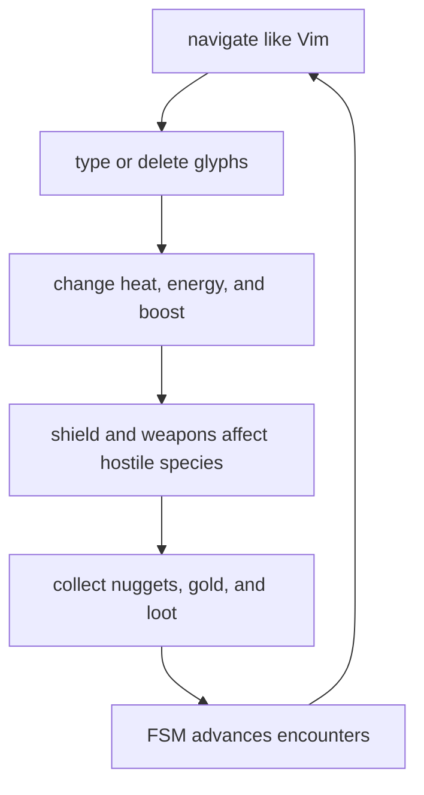
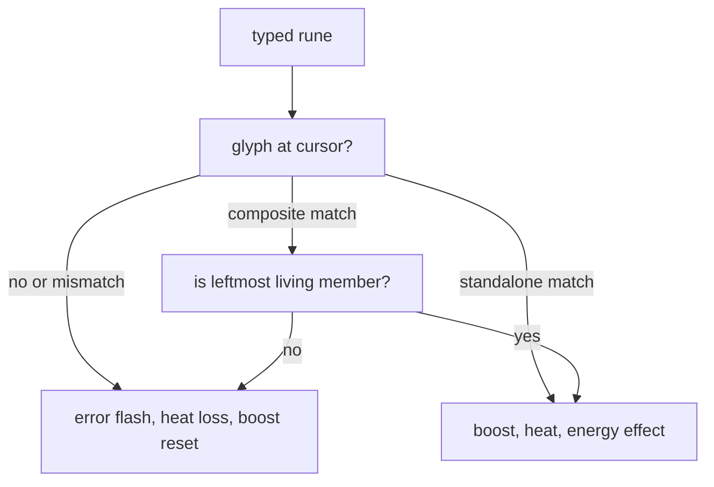

# Gameplay Design

vif combines Vim-style text navigation with a real-time typing and
survival game. This document describes the current mechanics as implemented.
Key bindings and parser details are in [Input and modes](input-and-modes.md),
while campaign sequencing is authored through the state machine described in
[FSM and configuration](fsm-and-configuration.md).

## 1. Core gameplay loop

The local cursor is both the player's text-editing position and the player
combat entity. Movement is discrete on the character grid. Hostile species,
projectiles, and effects may keep higher-precision `float64` kinetic state but
are projected back into the same grid for collision and rendering.

The embedded/default campaign is endless rather than a fixed sequence of
levels. Typing drives the resource economy, drains supply the first hostile
pressure, and kill counters let the FSM introduce composite encounters. The
author may replace that progression entirely with external TOML configuration.

## 2. Cursor and player state

The world starts with an empty, 16-slot cursor roster. The playable shipped FSM
configurations request a protected cursor at the map center; `CursorSystem`
then creates the entity and attaches cursor, ping, energy, heat, shield, boost,
weapon, and combat components. Each cursor owns an independent copy of that
state. A roster slot identifies its human, bot, or remote control source, while
one selected local slot receives terminal input and anchors the camera/UI.

Ordinary startup spawns one human-controlled local cursor. With `-host` and
`-join`, the startup gate assigns up to `parameter.MaxPlayers` slots and every
world creates the same roster in slot order, with one locally controlled cursor
and the rest remote. The boot script's initial heat and energy values are a
template applied to every admitted cursor, not only slot zero.

| State | Meaning |
|---|---|
| Position | Text cursor, player collision point, weapon origin, and camera subject. |
| Energy | Signed resource whose nonzero polarity activates the shield and colors attacks. |
| Heat | Bounded typing momentum; excess becomes overheat and can trigger a burst. |
| Boost | Timed reward from correct typing or credited kills that protects ordinary energy penalties and accelerates heat gain. |
| Shield | Elliptical defensive/collection area active whenever energy is nonzero. |
| Weapon | Charge counts, orbiting indicators, and independent cooldowns per weapon kind; see [Combat and weapons](combat.md). |
| Ping | Crosshair, selection/grid feedback, and cursor movement visuals. |
| Combat | Player ownership/type and hit-point metadata used by the combat matrix. |

Cursor entities cannot be destroyed through ordinary gameplay because their
protection mask is `ProtectAll`. `CursorSystem` owns explicit despawn, and a
level reset clears the roster before the reset FSM requests replacement
cursors.

## 3. Typing rules

Insert-mode character input emits a character event at the cursor cell.
`TypingSystem` selects the first glyph in that cell and validates the rune.

A correct character:

- activates boost for 9 seconds, or extends an already active boost by 10
  seconds;
- adds one heat, or two if boost was already active before the key;
- changes energy according to the glyph color and current heat;
- increments correct-input and streak metrics;
- emits visual/audio feedback, removes the glyph, and moves the cursor one cell
  right when the map edge permits.

A typing error flashes the cursor, removes 10 heat, deactivates boost, plays the
error sound, increments the error metric, and resets the streak.

For composite text, the next valid member is the living member with the lowest
X, then Y, then entity ID. This enforces visible left-to-right typing even if
members were internally created in a different order. Gold members use the
universal heat/boost reward but omit normal color energy conversion; the FSM
owns the completion reward.

Delete operators are spatial actions, not simulated keystrokes. Characterwise
ranges clamp X on their first and last rows; linewise ranges cover every glyph
on selected rows. Glyphs with `ProtectFromDelete` survive. Deletion gathers
targets before publishing a batched death request, avoiding mutation during
store iteration.

## 4. Glyph production and decay

`GlyphSystem` pulls blocks from the immutable content corpus and places lines in
available map space. Blue and green glyphs are the regular resource-producing
text; levels dark, normal, and bright control presentation and energy cost.
Red, white, and gold exist for hostile/special mechanics.

Spawn pacing adapts to screen occupancy: sparse maps receive text faster while
dense maps sharply reduce new placement. Placement excludes a region around the
cursor and retries only a bounded number of positions.

Decay is an explicit wave mechanic. `ParticleSystem` selects decay or blossom
rules from `ParticleComponent.Behavior`: decay marks eligible glyphs and removes
them over time while blossom spreads the inverse level transformation. Both
respect `ProtectFromParticle`, share a deterministic Player-domain RNG stream and
the same wall/boundary destruction rules, and remain Player-domain. Dust, flash,
fade, splash, marker, explosion, and motion-marker systems are transient feedback
rather than durable text state.

## 5. Energy, heat, boost, and shield

### Energy

Energy is signed. Positive and negative values are both useful: either polarity
activates the shield, while attack color/polarity derives from the sign.

| Delta class | Rule |
|---|---|
| Reward | Increases absolute magnitude without crossing through zero. |
| Penalty | Converges toward zero, clamps there, and is multiplied by the current encounter damage multiplier. Boost or ember can block it. |
| Passive | Converges toward zero and clamps, but bypasses boost/ember protection. |
| Spend | Converges toward zero and may cross it; used by explicit player actions such as jumps. |

Energy loot and lightning energy drain are rewards, so both grow the current
magnitude: positive energy rises and negative energy becomes more negative.
At exactly zero no polarity remains, so the next reward establishes positive
polarity; a shield drain that first clamps negative energy to zero can therefore
look like a reversal when a later reward arrives, but the reward did not cross zero.
Nugget and gold jumps spend 1% and 10% of the current magnitude, respectively;
from either polarity they converge toward zero, while only an oversized fixed
spend crosses zero in one change.
Glyph changes remain signed by color and can move energy across zero.

Blue, green, and red glyphs start with different signed base values. The energy
system adjusts the actual change with current heat, so the relationship is part
of the live resource economy rather than a fixed reward table. Completing a
storm cycle increases the penalty multiplier; reset returns it to one.

### Heat and ember

Heat is clamped from `0` to `100`. Positive additions beyond the cap accumulate
overheat. Reaching the overheat threshold emits a heat burst, flashes the meter,
and activates the ember phase. Ember decays heat periodically and protects
ordinary energy penalties while active. A heat penalty also clears the
overheat accumulation.

HeatSystem requests the bursting participant's sweeping cleaner locally.
Special-attack heat spending consumes overheat before current heat without
resetting the remaining overheat or triggering the penalty sound.

### Boost

Boost is a per-cursor timed reward. A correct character or a species kill
credited to that cursor activates it for 9 seconds when inactive or extends it
by 10 seconds when already active. Combat systems retain the last damaging
cursor on the target, and fatal species lifecycle paths publish
`EventSpeciesKilled` carrying that credit; lifecycle deaths or unowned attacks
carry no cursor and grant no boost. A typing error deactivates the typing
cursor's boost.

While active, boost doubles the per-character heat gain and prevents ordinary
energy penalties. Passive drain and explicit spends remain effective.

### Shield

The shield activates whenever energy is nonzero and deactivates at zero. It is
an ellipse around the cursor, not a rectangular grid range. It:

- absorbs or converts several hostile-species contacts into energy penalties;
- collects nuggets and nearby homing loot;
- supplies the bounds shown in Visual mode;
- consumes a percentage of current energy over time as passive drain.

Because passive drain converges to zero, keeping a shield active is never free. The
drain interval starts when the shield does rather than inheriting whatever instant
the component was carrying, and a stamp ahead of this instance's clock — which a
cursor materialised from an authority further along carries — restarts the interval
instead of starving it. `energy.passive_count` and `energy.passive_drained` are how
to tell a drain that has stopped from one that is working and being outpaced.
Collision behavior still varies by attacker through combat/species profiles.

## 6. Collectibles

### Nuggets

At most one normal nugget is tracked by `NuggetSystem`. When absent, the system
attempts a random free-cell spawn after the one-second spawn interval. A beacon
periodically emits a directional cleaner cue toward it.

A nugget is collected by exact cursor overlap or by entering the active
shield/ember collection ellipse. Collection adds 10 heat. `Tab` jumps to the
nugget and spends one percent energy when a target exists.

### Gold sequences

A gold encounter creates a protected, bright, 10-character alphanumeric
composite at a free horizontal span. It lasts 10 seconds and must be typed in
left-to-right member order. Gold members resist deletion and particle effects.

`Shift-Tab` jumps to the first remaining gold member and spends ten percent
energy. Completion, timeout, external damage, and explicit cancellation emit
different events. The Gold system cleans up the composite, but the active FSM
decides what completion earns. In the embedded campaign, completion adds heat
and energy.

### Species loot

Kills are evaluated against ordered, species-specific drop tiers, rolled for each
local cursor. Unique tiers skip weapon loot already at full charge or in flight;
skipped entries add their fallback count to every later tier. Pity-adjusted rolls
improve repeated misses.
Drops burst away from the death point, then home using direct line of sight or a
flow field and collect near the player.

A drop belongs to the cursor whose kill produced it and only that cursor can
collect it, so both halves of the route are the owner's: the line of sight is
tested against the owner, and the flow field it falls back to is a private one
seeded from the owner's cell rather than the shared field over every cursor on
the map. With two participants, a drop that lands beside the other one still
goes home. A drop walled off from its owner comes to rest where it is.

| Loot | Rune | Collection effect |
|---|---|---|
| Rod | `L` | Adds a rod charge/orb. |
| Launcher | `M` | Adds a launcher charge/orb. |
| Disruptor | `P` | Adds a disruptor charge/orb. |
| Turret | `B` | Adds a turret charge/orb. |
| Emitter | `R` | Adds an emitter charge/orb. |
| Heat | `H` | Adds the configured heat reward (currently 10). |
| Energy | `E` | Adds the configured energy reward (currently 10,000). |

Weapon loot is lettered for its attack: lightning, missile, pulse, bullet, ray.
The exact tier rates are gameplay balance data in `internal/profile/loot.go`;
documentation does not duplicate every rate because those values are expected
to change during tuning.

## 7. Weapons and attacks

Main fire has its own cooldown. It emits a directional cleaner colored by
energy polarity and asks every owned, ready weapon to fire. Automatic fire
starts with main and special enabled; `a` cycles both → off → main only.
Main-only repeats the main-fire path without special attacks.

Special fire needs 1 heat; below that it converts nothing and emits no blast.
It converts all loose, living Player-domain **dark** green glyphs plus dark blue
glyphs for nonnegative energy or dark red glyphs for negative energy. Conversion
commits synchronously, then all existing and newly created dust is consumed into
one explosion center per occupied cell, within the center budget. Glyphs the
resulting blast covers are themselves converted and become the next attack's
dust; dark ones flash away instead, and shared or composite-member glyphs are
never taken. The blast spends its heat from overheat first, so 156 becomes 155
and 1 becomes 0. Without dust or eligible glyphs it spends nothing. Each center
deals 2 base damage and uses an explosion mass of 1.0. Player targets resolve
locally; only center/radius/attack geometry crosses for shared combat.

| Weapon | Model |
|---|---|
| Main cleaner | Directional player attack/effect originating at the owning cursor. Each impact chains into the rod's lightning, so the energy drain and its zap span the firing cursor and the species rather than the impact cell. |
| Rod | Direct lightning against unique nearest targets, rewarding energy in the attacker's current polarity. |
| Launcher | Homing/area missiles assigned from the nearest-target set. |
| Disruptor | Stun pulse centred on its orb; it fires only while a target is inside the ellipse. |
| Turret | One spread bullet per charge from its orb at the nearest targets; each hit is direct damage. |
| Emitter | A sustained ray from the cursor through its orb to the first wall, one cell wide to the orb and three past it, sweeping as the orb orbits; more charges fire longer and hit harder. |

Weapon ownership is represented by charge count: zero means not owned. Each
owned type has an orbiting orb entity and a separate cooldown. The combat system
uses attack profiles to route attacker/defender pairs, damage types, collision
profiles, chained attacks, and kinetic effects. This central matrix avoids
embedding every target-specific response in projectile systems.

The special-fire input path is separate from main fire; Backspace or Space uses
it under the default mapping. See source and keymap documentation when changing
this behavior because fire requests, auto-fire, macros, and mouse repeat all
share timing constraints.

Cleaner visuals are background-only moving trails. They preserve any glyph
foreground in a traversed cell, use max-background blending so overlapping
auto-fire does not accumulate into a flash, and shrink the visible tail while
a blocked cleaner drains to its stop point.

## 8. Hostile and structural actors

| Actor | Current design role |
|---|---|
| Drain | Local population is `ceil(current heat × 10 / 100)`, capped at 10 and excluding overheat: heat 0 gives 0; 1–10 gives 1; 11–20 gives 2; 91–100 gives 10. Materializes, chases, drains shield energy, and removes heat on unshielded contact. |
| Quasar | Large composite, 5 cells wide by 3 high. Tracks the cursor and emits lightning when the cursor leaves its effective range. It is created by fusing drains in the default progression. |
| Swarm | Fast composite, 4 cells wide by 2 high, created from enraged drains. It tracks/charges, may teleport around blocked line of sight, absorbs drains, and has bounded charges/lifetime. |
| Storm | Multi-part boss with independently moving circles and 3D orbital dynamics. The green circle pulses an area, the red circle carries a turret it fires in bursts at the nearest cursor, and the blue circle creates swarm pressure. |
| Pylon | Stationary ablative hostile structure/damage sponge that pushes nearby species. |
| Snake | Segmented composite species with separately modeled head and body members and formation lifecycle. |
| Eye | Five-by-three composite navigation attacker. It belongs to a target group, homes along routes, and self-destructs on contact; its parameters are evolution-managed. |
| Tower | Player-owned stationary ablative structure. It blocks cursor placement and acts as a target in tower-defense scenarios. |
| Gateway | Timed anchored spawner. It emits eye or snake spawn requests with route/adaptation metadata and disappears when its anchor is gone. |
| Bullet | Straight projectile stopped by bounds and walls; a mounted turret's strikes cursors and shields, a cursor's strikes species. |

The component `SpeciesType` catalog includes drain, swarm, quasar, storm,
pylon, snake, eye, and tower. Gateway and bullet are mechanics/entities but are
not genetic species. Species systems own formation-specific movement and
spawning; common damage is delegated to `CombatSystem`, common movement math to
`pkg/vmath/physics`, and path selection to `pkg/navigation`.

## 9. Walls, maps, navigation, and environment

Walls are grid entities with directional masks and optional energy/visual
properties. Level setup can size the logical map independently of the terminal
viewport, decide whether resizing crops it, and clear or preserve entities.
Camera offsets translate between map, viewport, and screen coordinates.

Maze events can generate a maze, rooms, braiding, entrance/exit data, and a
solution path. Pattern assets can also become wall layouts. Navigation then uses
either flow fields toward a target or precomputed multi-route graphs. More
detail is in [AI, physics, and evolution](ai-physics-and-evolution.md).

`EnvironmentSystem` owns map-wide gameplay effects rather than rendering
post-process effects. Its first effect is wind: `EventWindStart` supplies force,
direction in terminal-plane radians, and duration; a later valid start replaces
the current wind and `EventWindCancel` ends it. Each tick varies force by up to
10% and direction by about five degrees from a deterministic Shared RNG stream,
then applies `force / mass` to mobile species. Drains, swarm, quasar, eye, snake
head, and storm are affected. Cursor kinetics, snake body-local deformation,
pylons/towers, weapons/projectiles/loot, dust, and the decay/blossom particle
behaviors are not yet wind targets. See [Generic kinetic analysis](generic-kinetic.md)
for the exact motion paths and extension plan.

## 10. Embedded campaign progression

The campaign has one source, `internal/asset/scenario/`, compiled into native,
headless, and browser builds. `-s main` uses it unless a configuration root supplies
an explicit `scenario/main` override. Only the background monitor starts at boot;
it spawns and arms the cursor before opening `main`.

1. `main` cycles gold sequences and decay waves. Ten drain kills elect the causal
   cursor, pause `main`, and begin a quasar encounter.
2. The quasar holds that owner's grayout and drains. Three quasar kills lead to a
   storm; earlier kills return to `main`.
3. Each storm kill raises the species damage multiplier. Three storm kills create
   a full-map maze without rooms and spawn one Kraken at its center.
4. Kraken contact destroys walls. Its body stays within the map; tentacles can
   extend beyond it, but only their in-map cells interact.
5. The first Kraken kill returns to `main`; another three storm kills open the
   second Kraken encounter. Its defeat starts tower defense. Thus the escalation
   is **3 storms → 1 Kraken → 3 storms → 1 Kraken → tower**.
6. Destroying the tower's pylons resumes `main`; losing the tower fails the run.
   Encounter transitions preserve uncollected loot. Snakes keep one cursor target
   and its route until it disappears, becomes unreachable, or another route is
   over one-third shorter.
7. Any participant reaching zero heat **and** zero energy ends the run. The shared
   monitor consumes owner-authored defeat state, cancels encounters, clears the
   level and loot, then rearms the roster. Every shipped scenario uses this defeat
   rule; tower defense also retains its objective-failure and victory conditions.

`wad/scenario/td` is a standalone 500-by-250 tower defense, `blank` is an authoring
scaffold, and `kraken` is a repeating combat arena. Each entry has a short
`description` for scenario listings.

## 11. System inventory

The manifest registers these tick systems, grouped here by responsibility. The
grouping is editorial and is not the replication domain, which each system
declares for itself:

| Group | Systems |
|---|---|
| Frame/player | `cursor`, `ping`, `transient`, `camera`, `energy`, `shield`, `heat`, `boost`, `weapon` |
| Typing/world | `typing`, `composite`, `wall`, `tower`, `gateway`, `loot`, `glyph`, `nugget`, `particle`, `gold` |
| Spawning/effects | `materialize`, `cleaner`, `fuse`, `spirit`, `lightning`, `missile` |
| Motion/environment/combat | `navigation`, `soft_collision`, `environment`, `combat` |
| Species | `drain`, `quasar`, `swarm`, `storm`, `pylon`, `snake`, `eye`, `mount`, `bullet` |
| Particles | `dust`, `flash`, `fadeout`, `marker`, `explosion`, `motion_marker`, `splash` |
| Lifecycle/learning | `death`, `timer`, `adaptation`, `genetic` |
| Sound | `audio`, `music` |

The table uses runtime `Name()` values, which the manifest keys now match;
`TestActiveSystemsMatchRuntimeNames` keeps the two together, so configuration
validation, the `:system` command and the manifest all name a system the same
way. `MetaSystem` is event-only and added directly by the app, declaring its
profile in `manifest.ContextSystems`.

Each entry declares a domain profile and its dependencies in
`internal/manifest/definition.go`; see [the domain model](domain-design.md).

## 12. Balance and ownership map

| Concern | Source of truth |
|---|---|
| Player and collectible constants | `internal/parameter/gameplay.go`, `player.go`, `collectible.go` |
| Species tuning | `internal/parameter/{drain,quasar,swarm,storm,pylon,snake,eye,tower}.go` |
| Combat matrix and profiles | `internal/component/combat.go`, `internal/system/combat.go` |
| Drop tables and rewards | `internal/profile/loot.go`, `internal/component/loot.go`, `internal/parameter/loot.go` |
| Drop routing and homing | `internal/system/loot.go`, `internal/profile/homing.go` |
| Environment effects | `internal/system/environment.go`, `internal/parameter/environment.go`, `internal/profile/mass.go` |
| System behavior | Matching files in `internal/system` |
| Default progression | `internal/asset/scenario/*.toml` |
| External scenarios | `wad/scenario/td`, `wad/scenario/blank`, `wad/scenario/kraken` |

Changing a number in `parameter` changes a mechanic; changing a transition in
TOML changes when that mechanic is invoked. Keep that distinction intact when
adding a campaign or balancing a system.
