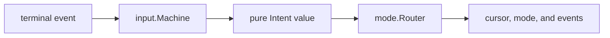
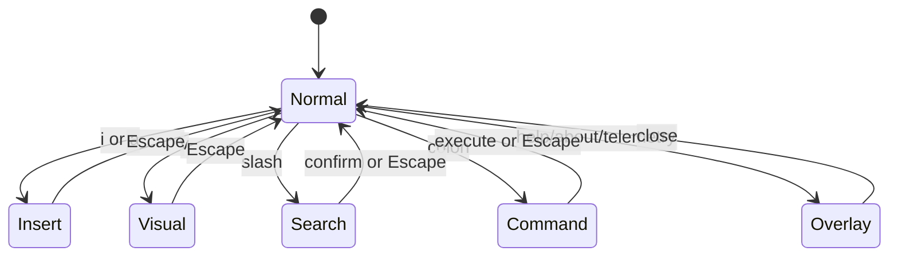

# Input, Modes, and Commands

The interaction layer deliberately separates terminal key decoding from game
behavior. `internal/input` parses host events into engine-independent semantic
intents; `internal/mode` applies those intents to the world while holding its
update lock.

## 1. Input pipeline



The terminal service polls in its own goroutine and writes to a bounded event
channel. The application input loop passes events to `input.Machine`, which
maintains only parsing context. The router owns engine-aware state such as
selection anchors, search results, history, undo, macros, mouse holds, and
auto-fire. It drives only the roster's selected local cursor; `CursorSystem`
applies and announces placement so live input, replay, bots, and remote
producers share the same entity-owned path.

`Intent` is a data structure, not a callback. It includes intent type, motion,
operator, special action, target mode, count, optional character, the pointer
cell in terminal coordinates, captured command text, and a flag identifying macro
playback. This boundary makes the
parser testable without constructing an ECS world.

## 2. Modes



| Mode | Purpose | Simulation behavior |
|---|---|---|
| Normal | Motions, counts, operators, find/search repeat, actions, macros. | Continues unless the game was separately paused. |
| Visual | Select a characterwise range from an anchor and apply delete operations. | Continues; active shield bounds are exposed as the selection/ping boundary. |
| Insert | Type glyphs at the cursor; arrows move; Delete/Space/Backspace support edit-like deletion. | Continues in real time. |
| Search | Edit and confirm a forward search pattern; `n`/`N` repeat later. | Uses text-entry routing. |
| Command | Edit and execute a colon command with history. | Pauses a single-instance game; a live network session continues. |
| Overlay | Navigate help, about, or telemetry content; `/` filters telemetry cards. | Pauses a single-instance game; a live network session continues. |

Escape resets pending parser state and normally returns to Normal. Command and
overlay completion coordinate their own pause result in a single-instance game,
so a command such as `:new`, `:help`, or `:telemetry` can intentionally keep the game
paused until its follow-up state is ready. `MetaSystem` refuses the pause request
when a peer is live, leaving those modes available as non-blocking inspection.

## 3. Normal-mode grammar

The parser implements a focused Vim-like grammar rather than forwarding raw
key sequences:

```text
[count] motion
[count] d [count] motion
[count] d d
[count] f|F|t|T character
[count] d f|F|t|T character
g command
g direction color
q register / @ register
```

The internal parser states are idle, numeric count, character wait, operator
wait, operator-character wait, `g` prefix, operator-`g` prefix, marker color
wait, macro-record register wait, macro-play register wait, and infinite macro
wait. Invalid continuations cancel the pending grammar rather than leaking a
partial action into the game.

Counts begin with `1` through `9`; `0` continues an existing count but is a line
motion when idle. Operator and motion counts compose. Motions are clamped by map
bounds and apply game-specific definitions of words, paragraphs, columns, and
screen positions over the glyph grid.

## 4. Default bindings

### Global and action keys

| Key | Action |
|---|---|
| `Ctrl-Q`, `Ctrl-C` | Quit. |
| `Ctrl-S` | Cycle audio mute state. |
| `a` in Normal | Cycle auto-fire: both weapons → off → main only. |
| `Esc` | Cancel pending input or return toward Normal mode. |
| Arrow keys | Move in the applicable mode. |
| `Tab` | Jump to the active nugget. |
| `Shift-Tab` | Jump to the first remaining gold character. |
| `Enter` in Normal | Fire main weapons. |
| `Backspace` in Normal | Fire the special weapon path. |
| `Space` in Normal | Fire the special weapon path. |
| `PageUp`, `PageDown` | Half-page vertical motion; page overlays when an overlay owns input. |

### Normal motions

| Keys | Motion |
|---|---|
| `h j k l` | Left, down, up, right. |
| `H J K L` | Half-page left, down, up, right. |
| `w W` | Next word / next whitespace-delimited WORD. |
| `b B` | Previous word / WORD. |
| `e E` | End of word / WORD. |
| `0 ^ $` | Line start, first non-whitespace, line end. |
| `[ O` / `] o` | Previous / next occupied column target. |
| `M m G` | Vertical middle, horizontal middle, screen bottom. |
| `{ }` | Previous / next paragraph. |
| `%` | Matching bracket. |
| `f F t T` + character | Find/till forward or backward. |
| `; ,` | Repeat the last find in the same or opposite direction. |

### Prefixes, editing, and modes

| Keys | Action |
|---|---|
| `gg` | Screen top. |
| `go`, `g$`, `gm` | Map origin, map end, map center. |
| `gh`, `gj`, `gk`, `gl` then `r`, `g`, or `b` | Show and jump to a red, green, or blue glyph in that direction. Repeating the direction key uses its repeat behavior. |
| `d` + motion | Delete the motion range. |
| `dd` | Delete the current line. |
| `x`, `D` | Delete current glyph / through line end. |
| `u` | Cursor-motion undo. |
| `i` | Enter Insert at the cursor. |
| `v` | Enter Visual mode. |
| `/` | Enter Search mode. |
| `:` | Enter Command mode. |
| `n`, `N` | Repeat search forward/backward. |

The implementation is Vim-inspired, not an attempt to reproduce every Vim
edge case. Commands operate on the two-dimensional game grid and delete glyph
entities, so behavior around empty cells, camera edges, and composites is
defined by vif's motion/operator code.

## 5. Insert, search, and command text editing

Printable Insert input becomes `EventCharacterTyped`. Arrow/Home/End/Page keys
remain navigation. Delete removes the current glyph. Insert-mode Space and
Backspace use forward/back deletion semantics in addition to moving the cursor.

Search and Command keep their own editable rune buffers and cursor positions.
Home/End and Left/Right edit the line; Up/Down browse command history in Command
mode. Search remembers its last pattern and find commands remember their last
target/direction for `n`, `N`, `;`, and `,`.

The router retains up to 256 cursor undo positions and 256 command-history
entries. These are session interaction structures, not persisted editor files.

## 6. Macros

Macros record semantic intents after parsing, so they replay the same actions
even when they contain multi-key motions or commands.

| Sequence | Behavior |
|---|---|
| `qa` ... `q` | Record into register `a`; an empty recording clears it. |
| `@a` | Play register `a` once. |
| `3@a` | Play it three times. |
| `@@a` | Play it indefinitely. |
| `@@@` | Play every non-empty register indefinitely. |
| `q` + playing register | Stop that register's playback. |
| `q@` or `Ctrl-@` | Stop all playback. |

Registers are lowercase `a` through `z`. Different registers can play
concurrently. The 16 ms input ticker polls playback; each active register emits
at most one intent when its 250 ms playback interval has elapsed. Simultaneous
work is ordered by playback start time. Recorded intents originating from
playback are marked, preventing recursive re-recording and excluding synthetic
activity from APM.

Macro state resets on both `:new` and `:new!` and is not saved across process
runs. Other operator preferences have a different reset contract below.

## 7. Mouse and automatic fire

When terminal mouse reporting is enabled:

| Input | Behavior |
|---|---|
| Left press | Move the cursor to the translated map cell and fire main. |
| Left drag | Continue moving the cursor. |
| Held left | Repeat main fire at the shared repeat interval. |
| Right press/hold | Fire/repeat special without moving first. |
| Wheel | Move the cursor using the event coordinates. |
| Bare motion | Move only when free-mouse mode is enabled. |

Translation runs terminal to viewport by the game-area offsets, then viewport to
map through `ConfigResource.ViewportToMap`, which is the inverse of the centering
the renderer applies. A pointer in the margin around a map smaller than the
viewport resolves to no cell and is rejected rather than clamped, so a click can
only ever land on the cell drawn under it. The cursor is drawn on every cell the
pointer names at once; the simulation is placed on the newest of them once a tick,
so a fast sweep costs one placement a tick and cells it only passed are never
visited (D-18).

A bot's pointer names a map cell instead (`Intent.MapCell`), and the router takes
it only where `ConfigResource.MapToViewport` says the viewport shows it: a bot
reaches no further than a mouse on the same screen would.

`:mouse enable|disable|free` controls reporting and free motion. `:free` is a
short toggle for free mouse motion. Input is ignored while suspended, in
Command mode, or where pause/overlay policy blocks it.

Automatic fire starts in both-weapons mode. `a` in Normal mode or bare `:auto`
cycles both weapons → off → main only → both weapons. `:auto on`, `:auto off`,
and `:auto main` select a state directly. Main-only repeats the main-fire
path, including ready equipped weapons, without requesting special attacks.
Manual and held-button attacks remain available in every state. Held-button and
auto-fire deadlines share de-duplication within each cooldown slot. `a` remains
ordinary text in Insert, Search, and Command modes.

## 8. APM signal

APM exists to drive adaptive music, not to score macros or raw device event
rate. The scheduler admits dispatched input-origin events as gestures, so a
replay reproduces the count from the journal:

- macro playback, auto-fire, every other origin, and input while paused admit nothing;
- one dispatch pass is one gesture: `:` pauses and changes mode, a click fires;
- one key mashed diminishes: a key (the event, with a motion's direction or a typed
  character) repeated within 500 ms counts only on its 1st, 2nd, 4th, 8th... press,
  so `h` and `l` in turn count in full while a held or hammered `l` counts by its log;
- a pointer placement (`pointer` on the move record) counts one gesture per six
  columns travelled (a row is two), at most one per placement and six a second, so a
  dodging pointer reads like mashed keys and a slow reposition like a few presses;
- a one-second bucket holds at most eight actions, a music APM of 480.

`GameState` publishes a 60-second APM and a five-second music APM. The status bar
shows the short window, which is the one the music system maps to tempo and
intensity; see [Audio](audio.md).

## 9. Command mode

The command dispatcher recognizes aliases shown in the first column.

| Command | Purpose |
|---|---|
| `:quit`, `:q` | Exit. |
| `:new`, `:n` | Reset simulation state; in a live session only the host may request it, and both participants reset. |
| `:new!` | Reset and purge the initiating operator's free-mouse, auto-fire, speed, telemetry HUD, and pins. |
| `:n <scenario>` | Rebuild the run on another scenario, by installed name or path. A scenario declares its own regions, so a different one needs a run of its own; naming the one already loaded resets in place instead. In a live session only the host may ask, and every guest rebuilds and rejoins with it. |
| `:help`, `:h`, `:?`; `:about` | Open overlays. |
| `:content` | Show corpus telemetry. |
| `:free [on\|off]` | Toggle or set free mouse. |
| `:auto [on\|off\|main]` | Cycle or set automatic fire. |
| `:mouse enable\|disable\|free` | Control terminal mouse input. |
| `:host <addr> [host\|migrate]` | Open this running game to participants (`:host :7777`), under the authority policy named: `host` ends the session with this participant, `migrate` hands it to a survivor. Refused if the run is already in a session. |
| `:join <target>` | Replace this solo game with the session at target, in any form `-join` takes; a browser takes only its `wss://` link. Refused while in a session. The game plays on while the dial runs and is replaced only once the host admits it; a refusal leaves it as it was, and a join that fails after that starts a solo game. |
| `:session` | Report the session role, address, participant identity, its cursor slot, peer count and tick. |
| `:bot [add [N[:graph]\|graph]\|drop <hex-slot>]` | List this run's bots; add one by graph or N by count (default graph: `default`); drop by the hexadecimal slot shown on its cursor. A solo run hosts on loopback; a guest's bots join its session and leave with it. |
| `:system <runtime-name> enable\|disable` | Toggle a system that honors meta-system commands. |
| `:flow [group]`, `:graph [group]` | Toggle navigation flow-field or route-graph debug views. |
| `:speed [rate\|+\|-\|reset]`, `:sp` | Report or set the rational simulation rate. |
| `:step [n]`, `:st` | Pause and advance complete ticks. |
| `:step [rate] fsm [region] [pause]` | Run until an FSM transition, optionally pausing there. |
| `:step [rate] ev <Event> [pause]` | Run until the named event is dispatched. |
| `:step off` | Disarm run-until and restore 1x. |
| `:region list\|spawn\|pause\|resume\|terminate ...` | Issue one scheduler-owned region primitive. |
| `:log ...` | Start/stop logging; set level/scope and snapshot period. |
| `:log rec [ticks\|flush\|fsm [on\|off]]` | Configure, request, or transition-trigger the flight recorder. |
| `:telemetry [save\|hud\|unpin]`, `:t` | Open the telemetry overlay; `save` writes a point-in-time status snapshot, `unpin` clears pins. |
| `:hud [on\|off]` | Toggle or set the pinned-card HUD; `:t hud` is the same. |
| `:debug`, `:d [prof [on\|off]\|cpu [s]\|heap\|mutex [s]\|trace [s]]` | Open the profiler report, toggle the profiler, or write a CPU, heap or mutex profile or an execution trace; see [Logging and diagnostics](logging-and-diagnostics.md) §11. |
| `:emit <EventName> [{ TOML payload }]` | Construct and publish a registered event for testing. |
| `:energy <value>`, `:heat <0-100>`, `:boost` | Directly manipulate player state for development. |
| `:god`, `:demon` | Apply high positive/negative energy test states. |
| `:blossom`, `:decay`, `:cleaner`, `:dust` | Trigger effect/gameplay events directly. |

The event registry validates `:emit` names and uses generated payload type
metadata to decode optional inline TOML. Commands below the first six rows are
primarily developer/authoring controls.

In a live session, pause, speed, step, system mutation, raw `:emit` and FSM region
operations are refused because applying them to only one scheduler would
desynchronise shared state. Pause alone is allowed to the authority while every
other participant is its own bot, which stands still with it; an arrival ends the
pause. `:host` is deliberately outside that guard: the guard exists to stop an
operator changing shared scheduling under a session that has already agreed on
it, and this is the command that creates one. It refuses a run that is already in
a session, which is the same rule stated where it belongs. `:bot` is outside it
too: a bot joins through the session's own gate, as any participant does.

A watched bot is live play: `:n` and `:bot` use the normal command path. While
its operator types a command, graph input waits and a live session keeps ticking.
These permissions do not apply to a recorded replay.

`:host` binds a socket and `:bot add` dials one, and both start goroutines, which is
more than any other command does, **inside the router's critical section** — the whole
intent path runs under the world lock and `mode/` must never acquire it itself. The
command reaches `engine.SessionController`, whose methods are therefore the
lock-held forms; an implementation that took the lock again wedges the instance at
the tick the command lands on, with neither a tick nor a signal able to recover it. Resizes retain D-14's locked map bounds. Help, telemetry
and about overlays remain local and do not pause; logging and view controls are
local inspection. Player grants and effect commands remain available because
they author the invoking cursor or use the ordinary player-to-shared crossing
path. The host's reset is the exceptional session-wide command and crosses at an
agreed tick; a guest reset is refused.

Free-mouse and auto-fire preferences, time scale, telemetry HUD visibility, and
pinned overlay cards are operator-owned and survive plain `:new`. Both reset
forms clear macros and transient command/overlay state. `:new!` additionally
turns the initiating instance's two preferences off, restores 1x, and clears its
HUD/pins; peers retain their own operator choices when the shared reset arrives.
Logging state is process diagnostic configuration and survives both forms.

Telemetry cards contain at most 15 metrics. Empty player slots are omitted until
they become active. A clipped selected card consumes `j`/`k` scroll steps before
selection moves beyond it; page motions still move by viewport rows. `/` edits a
card filter in the overlay's hint row while the overlay keeps its mode: every
space-separated term must occur in the group or one of its metric names, Enter
keeps the filter for navigation, Escape clears it, and closing the overlay drops
it. Pinning a card turns the HUD on. The live HUD starts at the viewport's
top-left and wraps pinned cards into columns. If the viewport cannot fit every
whole card, a `hidden` line names the omitted groups; the HUD intentionally has
no focus or navigation mode of its own.

Replay terminal keys are not entries in this command table or the keymap. A
`ModeReplay` App reserves `SPACE . + - h j k l 0 q` for viewer pause, step,
speed, pan/reset, and quit; those keys never become simulation intents.

System control uses `System.Name()`, which the manifest keys match. `:system`
refuses a disable that a system declares required, naming the dependents.

## 10. Keymap override files

Resolution order is:

1. path passed with `-k`;
2. `input/keymap.toml` under `-config-dir`;
3. the same under the user root, then under each system root;
4. the embedded `internal/asset/input/keymap.toml` document.

`make install-config` installs the embedded document without overwriting existing
user files. Existing `append` bindings are normalized to `toggle_auto_fire` when
loaded, so installed keymaps select the new action without restoring Insert-mode
append behavior. Other custom bindings are preserved. See
[External filesystem layout](filesystem-layout.md) for the shared root policy.

An override is sparse: unspecified bindings retain defaults. The accepted TOML
sections are:

| Section | Key form | Context |
|---|---|---|
| `[normal]` | one rune, `space`, `backslash`, or `zero` | Normal-mode rune bindings. |
| `[normal_keys]` | terminal key name | Normal/global special keys. |
| `[operator]` | rune | Motions accepted after `d`. |
| `[prefix_g]` | rune | Second key after `g`. |
| `[overlay]` | rune | Overlay rune bindings. |
| `[overlay_keys]` | terminal key name | Overlay special keys. |
| `[text_keys]` | terminal key name | Insert/Search/Command navigation/edit keys. |

Values are canonical action names from `internal/input/actionnames.go`. Use
`"none"` to unbind a default. Unknown sections are ignored by the explicit
section reader, while invalid key or action names inside supported sections
fail loading.

```toml
[normal]
space = "fire_main"
v = "none"

[normal_keys]
backspace = "undo"

[prefix_g]
m = "motion_origin"
```

## 11. Change checklist

When adding interaction behavior:

1. Add or reuse a semantic intent; do not embed an engine callback in the key
   table.
2. Extend parser state only when the action requires a multi-key grammar.
3. Route the intent under the world lock and emit a domain event where another
   system owns the effect.
4. Add the canonical action to the action registry if it is remappable.
5. Update default mappings, help overlay content, keymap examples, and tests
   together.
6. Decide explicitly whether the action counts toward APM, can be recorded, can
   run from playback, and is allowed while paused.

## 12. Source map

| Concern | Primary source |
|---|---|
| Intent/parser types | `internal/input/intent.go`, `state.go`, `machine.go` |
| Bindings and overrides | `internal/input/keytable.go`, `actionnames.go`, `keyconfig.go` |
| Mode routing | `internal/mode/router.go`, `actions.go`, `motions*.go`, `operators.go` |
| Search | `internal/mode/search.go` |
| Commands | `internal/mode/commands.go` |
| Macros | `internal/mode/macro.go` |
| APM | `internal/parameter/apm.go`, `internal/engine/game_state.go` |
