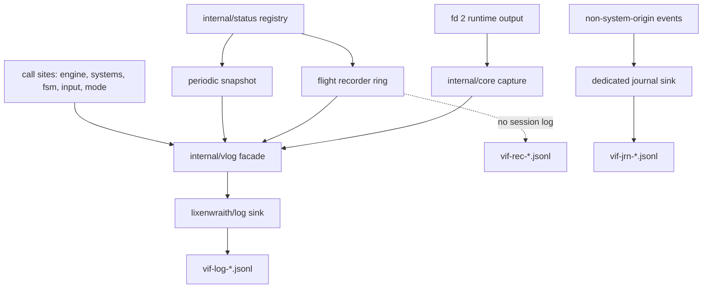

# Logging, Telemetry, and Diagnostics

vif's diagnostic surface has six cooperating layers: a structured JSON
Lines session log, a status metric registry with periodic snapshots, an
in-memory flight recorder that flushes only on a trigger, a dedicated replay
journal, a runtime stderr capture that folds Go runtime output back into
the log, and an opt-in profiler that publishes into the registry. Ordinary diagnostics join on `run` and `tick`; the journal uses its own
replay position `(run, tick, boundary)`.

This document is the authoritative reference for what is emitted, how to
control it, and what each record means. For the process lifecycle that
produces these records, see [Runtime and concurrency](runtime.md).

## 1. Layer map



| Layer | Package | Cost when idle | Written when |
|---|---|---|---|
| Session log | `internal/vlog` | one atomic load per guarded call site | continuously, level and scope permitting |
| Status registry | `internal/status` | one atomic store per metric update | never; values are read by snapshot and recorder |
| Periodic snapshot | `internal/status` | one modulo per tick | every `StatSnapshotTicks` ticks |
| Flight recorder | `internal/status` | one atomic load/store per frozen metric per tick | on a trigger only |
| Replay journal | `internal/event`, `internal/vlog` | payload encode on each external event | every non-system-origin event, independent of diagnostic filters |
| Runtime capture | `internal/core` | one `Stat` per drain interval | when the Go runtime writes to fd 2 |
| Profiler | `internal/prof` | one atomic load per timed call | once per second of running game while `:d prof` is on; captures on command |

## 2. Record shape

Every record is one JSON object on one line. The envelope is fixed; the
payload is an open key-value map.

```json
{"time":"2026-08-06T02:48:31.124075906-04:00","level":"INFO","sub":"stat",
 "run":0,"tick":100,
 "fields":{"msg":"fsm","state":"MainDecayWait","state_index":1}}
```

| Envelope key | Meaning |
|---|---|
| `time` | RFC3339 nanosecond wall clock, assigned at emission |
| `level` | `TRACE`, `DEBUG`, `INFO`, `WARN`, `ERROR`, or `PROC` for logger heartbeats |
| `sub` | Subsystem tag; resolves to a scope (§4) |
| `run` | Reset generation; incremented by game reset, so `:new` starts run 1 |
| `tick` | Simulation tick at emission |
| `fields` | Record payload; `msg` is the discriminator by convention |
| `trace` | Present only on `vlog.Trace` records: a `->` joined call chain |

`-log-session-id=<id>` adds `fields.session_id` to every record emitted through
the vif logging facade. The key is absent when the flag is absent. IDs
use the DNS-safe lowercase alphanumeric-and-hyphen subset of multiplayer session
names. With file output, the active file is `<id>.jsonl`, so concurrent fleet
sessions cannot collide on the ordinary timestamp-derived filename.
`session_id` is distinct from the RNG/replay field named `session`. The deployment
field stays in the payload because `sub`, `run`, and `tick` are the stable
envelope consumed by `vif-log`; deployment components forward the JSON line
without rewriting it.

`fields.msg` is the first payload key on every record the game emits. Viewers
index it as a column and filter on it directly. The second string field is
conventionally the record's *follow key* — `region` on FSM records, `ev` on
per-event dispatch records — so a viewer's follow-value navigation walks one
region or one event type.

### Naming a peer, counting participants

A **peer** is one end of a session link. `peer` is the identity a record is
*about*; where a record describes both ends, the far one keeps `peer` and the
local one is `local`. The emitting instance is otherwise not repeated per record
— it is stated once by `network session active` (`local`, `slot`) and in every
`session summary` — because within one log it is a constant, and across a fleet
`session_id` already names the process.

A **participant** is a cursor on the map, so the two are not the same count. A
dedicated host is peer 1 with `slot` 255 (`parameter.NoPlayerSlot`) and drives
none, which is why its first guest is peer 2 and the session's only participant.
`peers` counts live transport links; `roster` counts admitted peers, the
cursorless coordinator included; anything named participants counts cursors.

### Correlation stamps

`run` and `tick` are process-global atomics published by two owners:

| Stamp | Owner | Advances |
|---|---|---|
| `run` | `MetaSystem.handleGameReset` via `vlog.SetRun` | once per game reset, with the replay tick rebased to zero |
| `tick` | `Scheduler.processTick` via `vlog.SetTick` | once per simulation tick, before the tick body |

`tick` is stamped with the tick *about to execute*, so records emitted inside
`processTick` carry the tick they describe rather than the previous one. A replay
stamps its presented copy's position and its other copies log nothing; see
[Runtime and concurrency](runtime.md), Replay playback.

The render frame is not a stamp. Nothing logs from the render goroutine, so it
correlates no record, and a headless run never advances it at all; the counter
is published as the `context.frame` metric and read once per snapshot instead.
Emitters describing one instant — snapshots and recorder flushes — use
`vlog.EmitSet`, which binds one explicit stamp for the whole set.

## 3. Levels

| Level | Constant | Used for |
|---|---|---|
| `TRACE` | `vlog.LevelTrace` | per-item taps: individual event dispatch, event push |
| `DEBUG` | `vlog.LevelDebug` | per-pass and per-intent detail: dispatch summaries, input intents, FSM internal transitions, lock holds |
| `INFO` | `vlog.LevelInfo` | lifecycle and state change: startup, service transitions, FSM transitions and region ops, status snapshots, recorder flushes |
| `WARN` | `vlog.LevelWarn` | recoverable anomalies: event queue overflow, long lock holds |
| `ERROR` | `vlog.LevelError` | failures and runtime reports: service init/start failure, panic records, race and fatal reports |

The threshold is a single process-wide value. `ERROR` and above **bypass the
scope mask** — a scope can silence noise but never a failure. Level still
applies to errors.

Set with `-lv <level>` at startup or `:log level <level>` at runtime. The
default when logging is enabled without an explicit level is `debug`.

## 4. Scopes

Scopes are a category mask orthogonal to level, resolved from the record's
`sub` tag. They exist so one noisy subsystem can be silenced without lowering
the level for everything else.

| Scope | Letter | `sub` tags mapped to it |
|---|---|---|
| `app` | `a` | `app`, `admit`, `service`, `race`, `crash` |
| `fsm` | `f` | `fsm` |
| `event` | `e` | `event` |
| `dispatch` | `d` | `dispatch` |
| `push` | `p` | `push` |
| `input` | `i` | `input` |
| `stat` | `s` | `stat` |
| `rec` | `r` | `rec` |
| `lock` | `l` | `lock` |
| `tap` | `t` | any unmapped `sub` |

An unrecognized `sub` falls into `tap`, so an ad-hoc debugging tap is visible
by default and is silenced as a group with `-ls -t`.

### Scope grammar

A spec is parsed against the current mask. A leading `+` adds, a leading `-`
removes, and no prefix replaces. Tokens split on `+`, `,` or space; each token
is a long name, `all`, `none`/`off`, or a run of short letters.

| Spec | Result |
|---|---|
| `all` | every scope, `dispatch` included |
| `none` | no scope; errors still emit |
| `app+fsm+stat` | exactly those three |
| `afs` | same, short form |
| `+dispatch` | add per-event dispatch to the current mask |
| `-event,push` | remove both from the current mask |
| `-event+push` | remove both from the current mask |

Set with `-ls <spec>` at startup or `:log scope <spec>` at runtime.

### Recommended masks

| Goal | Mask |
|---|---|
| Follow the FSM path | `-ls afs` |
| Diagnose an event that never arrives | `-ls +d -lv trace` |
| Watch input translation | `-ls ai` |
| Quiet run with snapshots and recorder only | `-ls asr` |
| Lock contention | `-ls al -lv debug` |

## 5. Subsystem catalog

What each `sub` carries, and the records worth naming. `app` is the run's own
narration and grows with the session paths; it is described by its field
conventions (§2) rather than enumerated, because a pinned list of seventy
records is a list that goes stale.

### `sub="app"`

| `msg` | Level | Fields | Emitted by |
|---|---|---|---|
| `init begin` / `init complete` | INFO | `width`, `height`, `systems` | `app.init` |
| `shutdown begin` / `shutdown complete` | INFO | — | `app.Close` |
| `signal received` | INFO | `signal` | main loop |
| `runtime capture` | INFO | `path`, `reason`, `race` | `setupDiagnostics` |
| `logging started` / `logging stopped by command` | INFO | `path`, `level` | `:log on`/`off` |
| `log level changed` / `log scope changed` | INFO | `level` / `scope` | `:log` |
| `stat interval changed` | INFO | `ticks` | `:log stat` |
| `recorder depth changed` | INFO | `ticks` | `:log rec N` |
| `recorder flush` | INFO | `reason`, `t0`, `ticks`, `records`, `us` | recorder, when the session log absorbed the flush |
| `recorder flush failed` | ERROR | `reason`, `error` | recorder |
| `snapshot saved` | INFO | `path` | `:t save` |
| `network session active` | INFO | `local`, `slot`, `coordinator`, `barrier_delay_ticks`, `peers` | this instance's one statement of who it is |
| `playout lead adopted` | INFO | `ticks`, `tick` | a change of this instance's own lead, at the tick its journaled event dispatched |
| `participant evicted as too slow` | WARN | `participant`, `late_per_s`, `bytes_per_s`, `window` | the authority's slow policy (multi-player.md §3.5) |
| `uncommitted crossings dropped at handoff` | INFO | `crossings` | a guest following a new authority |
| `session summary` | INFO | `summary` | the `-serve` loop, every 30 s; the same line `:session` prints |
| `peer link opened` / `peer link lost` | INFO / WARN | `peer`, plus `address` on the dial and `authority_lost`, `remaining_peers` on the loss | `reach.dial`, `NetworkSystem.reportDisconnect` |

### `sub="admit"`

| `msg` | Level | Fields | Source |
|---|---|---|---|
| `peer admitted` | INFO | `peer`, `remote`, `declared` | `App.noteJoinerReport`, on the coordinator |

`remote` is the accepted socket's address and `declared` what the peer said it
listens on. They are here and nowhere else: it is the one value that proves a
deployment reached the pod with the player's address rather than its gateway's,
and the per-address admission budget is keyed on it. The sub exists so the fleet's
published stream can drop the whole category —
[`deploy/logwisp/aggregator.toml`](../deploy/logwisp/aggregator.toml) excludes it
beside `TRACE` — while the node-local file keeps it for an operator.

### `sub="service"`

| `msg` | Level | Fields |
|---|---|---|
| `init` / `start` / `stop` | INFO | `service`, `ms` |
| `init failed` / `start failed` / `stop failed` | ERROR | `service`, `error` |

### `sub="fsm"`

The FSM path is reported by observation hooks on `fsm.Machine`, not by
sampling state once per tick. Sampling collapses intra-tick transition chains
and cannot see background regions; hooks report every committed change in
order, for every region.

| `msg` | Level | Fields |
|---|---|---|
| `transition` | INFO | `region`, `from`, `to`, `via`, `index`, `max_ms` |
| `internal` | DEBUG | `region`, `state`, `via` |
| `region` | INFO | `region`, `op`, `state` |
| `session reset` | INFO | — |

`via` is the triggering event name, or `Tick` for an automatic transition.
`op` is one of `init`, `spawn`, `terminate`, `pause`, `resume`. `index` is the
state's deterministic index within the loaded config, and `max_ms` is the
`StateTimeExceeds` bound on the target state when one exists.

An `internal` record covers two distinct cases, both reporting `from == to`:

- a transition declared `internal = true`, which consumes the event and runs its
  actions with no exit or enter phase and no effect on `TimeInState`;
- a transition whose `target` resolves to the state already active. A
  self-transition **degrades to internal**: exit and enter actions do not run,
  `TimeInState` is not reset, and only the transition's own `actions` execute.
  A config author expecting re-entry semantics gets a silent no-op, and this
  record is the only evidence of it.

`region` is deliberately the first string field: a viewer's follow-value
navigation walks one region's path with it.

Hooks fire **before** the exit phase, so a `transition` record precedes every
record its actions produce. A chain of transitions completing inside one tick
appears as several records sharing a `tick`.

### `sub="event"`

| `msg` | Level | Fields |
|---|---|---|
| `pass` | DEBUG | `src`, `n`, `fsm`, `sys`, `dead` |
| `queue overflow` | WARN | `dropped`, `delta` |

One `pass` record summarizes one `dispatchOnePass` call. `src` names the
caller:

| `src` | Call site |
|---|---|
| `pre` | `processTick` initial settling |
| `post` | `processTick` settling after the FSM update |
| `loop` | inter-tick event loop |
| `input` | `DispatchEventsImmediately`, from an intent or macro |
| `reset` | `executeReset` settling |

`n` is the batch size. `fsm` counts events some active region consumed, `sys`
counts events with at least one registered system handler, and `dead` counts
events neither consumed — the diagnostic for a config referencing an event
nothing emits, or a system that stopped registering.

`queue overflow` reports real state loss: producers outran the single
consumer and the ring evicted unread events. It also triggers a recorder flush.

### `sub="dispatch"`

| `msg` | Level | Fields |
|---|---|---|
| `ev` | TRACE | `ev`, `sys`, `fsm` |

One record per dispatched event, gated by the `dispatch` scope *and* the trace
level. This is the highest-volume record in the system — roughly 80/s in normal
play — and is off in every default configuration. `ev` is the first string
field, so follow-value walks one event type.

`sys` is the count of registered system handlers; `fsm` is whether any active
region consumed it. `sys:0 fsm:false` means the event reached nothing.

### `sub="push"`

| `msg` | Level | Fields |
|---|---|---|
| `push` | TRACE | `ev` |

Emitted by `World.PushEvent` with a four-frame stack trace, so the record
identifies the producing system. Separate from `dispatch` so the producer side
can be traced without the consumer flood.

### `sub="input"`

| `msg` | Level | Fields |
|---|---|---|
| `intent` | DEBUG | `type`, `motion`, `count`, `char`, `cmd`, `macro` |

One record per semantic intent produced by the input machine. `macro`
distinguishes replayed intents from physical input.

### `sub="stat"`

| `msg` | Level | Fields |
|---|---|---|
| `<group>` | INFO | one key per metric in the group |
| `context` / `player` / `world` | INFO | on-demand snapshot only (§7) |

One record per metric group per snapshot. All records of one snapshot share
`run`/`tick` by construction. See §6.

### `sub="rec"`

| `msg` | Level | Fields |
|---|---|---|
| `window` | INFO | `reason`, `t0`, `t1`, `n`, `groups` |
| `<group>` | INFO | `t0`, `n`, then one key per metric |

One flush is a `window` header followed by one record per group. See §8.

### `sub="lock"`

| `msg` | Level | Fields |
|---|---|---|
| `long hold` | WARN | `us`, plus a `trace` call chain |

Emitted when a world-lock hold exceeds `LockHoldWarn` (20 ms). The trace
identifies the holder. Also triggers a recorder flush.

Hold sampling is a per-tick decision, refreshed in `processTick`: it is active
when the `lock` scope is enabled at debug level **or** a flight recorder is
installed. The world lock is the hottest lock in the process, so it is not
probed per acquisition.

### `sub="race"`

| `msg` | Level | Fields |
|---|---|---|
| `runtime report` | ERROR | `kind`, `path`, `offset`, `bytes`, `lines`, `head`, `at` |

A pointer to a block of captured runtime output. See §10.

### `sub="crash"`

| `msg` | Level | Fields |
|---|---|---|
| `panic` | ERROR | `panic`, `stack` |

Written by the crash hook before terminal restoration, followed by a bounded
flush. A recorder flush precedes it.

## 6. Status registry and periodic snapshots

`status.Registry` holds four typed metric maps — `Bools`, `Ints`, `Floats`,
`Strings` — keyed by dotted strings. Systems call `Get(key)` once during
construction and cache the returned pointer; hot paths then perform one atomic
store with no map lookup.

### Key convention

`SplitKey` maps each stable dotted key to a bounded semantic group. Keys without
a dot land in `misc`. The group becomes the record's `msg`, and the projected
short name becomes the field:

```
engine.ticks   → msg="engine"  ticks=<v>
fsm.td_main.state → msg="fsm.td_main"  state=<v>
player.0.energy.current → msg="player.0"  energy.current=<v>
player.0.weapon.rod → msg="player.0.weapon"  rod=<v>
combat.damage_attacker_cursor → msg="combat.damage.attacker"  cursor=<v>
adapt.buf_cdf_hwm → msg="adapt.buffers"  cdf_hwm=<v>
```

The projection separates per-region FSM state, allocation high-water marks,
combat attribution/effects/rejections, death batches, event settle passes, and
per-player weapon state. Every resulting group is capped at 15 metrics so the
same index remains navigable as overlay cards and readable as log records. The
metric registry keys themselves do not change.

### High-water marks

`_hwm` is a high-water mark in the ordinary sense: **the largest value the thing
reached since the last reset**, kept by a compare-and-swap that only ever moves
upward (`storeMax` in `internal/system/telemetry.go`,
`storeAtomicMax` in `internal/engine/position.go`). The terminology is used
correctly, and the two things worth knowing about it are what it measures and when
it is cleared.

*What it measures.* `<domain>.buf_<name>_hwm` is the peak **length** a reusable
slice reached — how much of the buffer was used, not how much it holds. Twenty
systems register one through `newBufferTelemetry`, always for a slice that is
retained between ticks and re-sliced rather than reallocated, so the number answers
"how large did this actually have to get" and a change in it across builds is a
change in behaviour rather than in allocation strategy. `spatial.positions_hwm`,
`spatial.cell_occupancy_hwm` and `spatial.position_batch_hwm` are the same idea
outside a slice: the most entities indexed at once, the most in any single grid
cell, and the largest position batch committed.

*When it is cleared.* On `Init` — that is, per game. A reset zeroes every mark, so
what these report is the peak of the current run and not of the process. They are
also excluded from the correction comparison surface (`internal/snapshot/surface.go`),
because a peak is a property of one instance's execution rather than of the shared
world, and two participants that agree about the world will disagree about it.

One neighbouring key is worth reading carefully because it is *not* a mark:
`spatial.max_cell_occupancy` is a plain gauge, stored rather than maximised, and it
means "the fullest cell **right now**". `spatial.cell_occupancy_hwm` is the same
quantity maximised over time. Max-across-cells and max-across-cells-and-time are
different numbers and both names are accurate; only reading one for the other is
wrong.

The bounded roster still registers every slot before `Freeze`, but inactive
slots do not produce periodic snapshot records or telemetry cards. The flight
recorder emits a player's groups when that slot was active anywhere in the
flushed history window. Bare single-player keys such as `energy.current` mirror
slot 0 temporarily for configuration compatibility.

### Integer units

Integer metrics carry their unit in the key suffix; no metadata is stored and
the log emits raw values. `status.IntUnit` and `status.FormatInt` are the sole
owners of the convention:

| Suffix | Scale |
|---|---|
| `.timer`, `.duration`, `.max_duration`, `.elapsed`, `.remaining` | nanoseconds |
| `_ns` | nanoseconds |
| `_us` | microseconds |
| `_ms` | milliseconds |
| anything else | plain count |

Display consumers — the telemetry overlay, the status bar, log viewers — resolve
through `FormatInt`. The log stores the raw integer. Where a value has to fit a
column rather than a line, `FormatCount` gives it a thousandfold suffix and
`FormatLatency` picks the time unit; both are display only.

The telemetry overlay (`:t`) shows one card per visible group. `/` filters the
cards by group or metric name, and `j`/`k` scrolls through the full height of a
clipped selected card before moving to its neighbour. Space pins a card; a new
pin turns on the HUD (`:hud`), which is anchored at the top-left, wraps whole
cards into additional columns, and reports any groups it cannot fit in a
one-line `hidden` notice. HUD width expands immediately but contracts only after
a stable narrow interval, preventing value-width jitter.

### Freeze

`Registry.Freeze` is called once from `Scheduler.Prepare`, reached by
`Start` in play mode and by the first tick/settle in a driven App. It follows
`World.Seal` and precedes the first tick; every system and renderer has
registered by then. Freezing:

- closes all four maps to new keys;
- builds the group index once and caches it lock-free, so the per-tick path
  performs no generation probe;
- publishes `stat.groups` and `stat.metrics`;
- lays out the flight recorder's ring.

A `Get` on an unknown key after freeze returns a **detached cell** and
increments `stat.late`. The value is usable, so the caller does not crash, but
it appears in no snapshot and no recorder window. **A non-zero `stat.late` is a
regression**, not a supported pattern: it means something registers a metric
after the first tick.

### Periodic emission

`Registry.Tick(n)` is called once per simulation tick from `processTick`,
after the world lock is released and after every tick-owned write has
committed. It:

1. samples the flight recorder;
2. mirrors `stat.late`;
3. emits the periodic snapshot when `n % StatSnapshotTicks == 0` and the `stat`
   scope is enabled at info level;
4. drains a pending recorder flush request.

The snapshot emits through `vlog.EmitSet` with one explicit stamp, so all
records of one snapshot name the instant they describe.

A snapshot is stamped with tick *n*, but it is not a barrier. The world lock is
released before `Registry.Tick` runs, so the event loop, the input path and the
render goroutine can commit between the end of the locked tick body and the
read. A value written inside the locked body is exact for tick *n*; everything
else reads "at or after tick *n*" — `event.dispatches`, `event.queue_len` and
`engine.fps` in particular, which is why they move at points that do not line up
with tick boundaries. The recorder sample shares this call and the same
guarantee.

Default period is `parameter.StatSnapshotTicks` = 200 ticks (10 s at a 50 ms
tick). The flight recorder holds fine-grained history, so the periodic
snapshot is a coarse heartbeat rather than the primary time series.

Override with `-lt <ticks>` at startup or `:log stat <ticks>` at runtime; `0`
disables periodic emission entirely without affecting the recorder.

## 7. On-demand snapshot

`:t save` writes a standalone file `vif-snap-<timestamp>.jsonl` into the log
directory through a second logger instance, independent of the session logger's
state, level, and scopes. The records are captured while command mode holds the
world lock, so the values are one coherent tick, and stamped with that tick.

The file contains the full registry snapshot plus four records that have no
registry mirror, emitted by `GameContext.SnapshotContext`:

| `msg` | Contents |
|---|---|
| `context` | mode, screen/game/map/viewport/camera geometry, crop flag, color mode |
| `player` | local cursor entity/slot, roster count, local position, and ping bounds |
| `world` | entity created/destroyed counts and system count |
| `session` | frame, pause, macro recording/playback, mouse preferences, and auto-fire |

`session` is operator-owned and omitted by `App.SnapshotSimulation`; the full
snapshot keeps it for `:t save` and perturbation diagnostics.

The file is written off the lock on its own goroutine, so a live session's tick
never waits on disk; the status bar reports the path once the drain completes.

## 8. Flight recorder

Per-tick snapshots at 20 Hz are affordable to *record* but not to *write*. The
recorder holds the last N ticks of the full registry in memory and writes only
when something goes wrong.

### Storage

Slot-major: one tick's values are contiguous across four kind-partitioned
planes — `[]int64`, `[]float64`, a `[]uint64` bitset for bools, `[]string` for
strings — plus a parallel tick-stamp array. The per-tick write is a linear
walk of the frozen metric set with no allocation and no lock.
`AtomicString.Load` returns an existing header, so storing a string retains
rather than copies.

A `head` counter is stored **after** the slot's writes, so a reader never
observes a torn slot.

Memory grows linearly with depth and with the declared metric set; per-region
FSM telemetry is included because it is registered before `Freeze`.

### Sampling

Sampling happens inside `Registry.Tick`, on the tick goroutine, after the world
lock is released. The recorder and the periodic snapshot share the same frozen
group index — one index build serves both.

### Triggers

`status.Trigger(reason)` is callable from any goroutine. It sets an atomic flag
and a reason; the tick goroutine performs the flush at the end of
`Registry.Tick`, off the world lock and off the caller's stack.

No other path may call `Recorder.Flush` directly. The ring is written by
`sample` on the tick goroutine with no lock, so a flush from the input or
command path would race it — and the string plane tears a header, not just a
value. `:log rec flush` therefore *requests* a flush and returns; the window
appears on the next tick.

| Reason | Source |
|---|---|
| `event.dropped` | queue overflow detected in `processTick` |
| `lock.hold` | world-lock hold exceeding `LockHoldWarn` |
| `race` | a `sub="race"` runtime report was drained |
| `crash` | the panic path, via `vlog.SetCrashFlush` |
| `manual` | `:log rec flush`, and the fallback when no reason was set |
| `break` | a run-until breakpoint matched or expired |
| `fsm:<region>` | an FSM transition, **disabled by default** |

Only the newest reason survives: repeated triggers before the tick goroutine
drains collapse into one flush carrying the last reason set.

Flushes are throttled to one per `depth/4` ticks; suppressed requests increment
`rec.skipped`. A repeating fault therefore cannot flood the log. The throttle
applies to `manual` as well — a `:log rec flush` issued within `depth/4` ticks of
the previous flush is counted and writes nothing. `rec.skipped` also counts a
flush discarded because the `rec` scope or the level suppressed it, so a rising
`rec.skipped` with `rec.flushes` flat means windows are being requested and
thrown away: check the scope mask before the throttle.
 
The FSM trigger is off by default because transitions are frequent enough to
flush continuously, which defeats the purpose. Enable per session with
`:log rec fsm on`.

The crash path is the one exception to the tick-goroutine rule.
`Recorder.CrashFlush` writes from the panicking goroutine and may race a
concurrent `sample`; that is deliberate, since the process is ending and the
alternative is losing the window. It is still bounded by the `flushing` flag, so
it cannot interleave with a normal flush. It is a no-op without a running
session log — opening files during a panic is worse than losing the window.

### Flush encoding

One `window` header record plus one record per metric group. Within a group,
a metric whose value never changed over the window is emitted as a **scalar of
its native type**; a metric that varied is emitted as a compact string:

| Kind | Varying form |
|---|---|
| int | comma-separated decimals |
| float | comma-separated shortest round-trip |
| bool | a run of `0`/`1` digits, one per sample |
| string | comma-separated |

`,` is the series separator and is reserved: an embedded comma becomes `;` in
**both** forms, so a constant string that happens to carry one is not
indistinguishable from a two-sample series. A decoder separates constant from
series by JSON type for int, float and bool; for string both forms are JSON
strings, so it splits on `,` and compares the element count against `n` — one
element means the column was constant.
 
`t0` names the first tick and `n` the sample count, so position *k* in a series
belongs to tick `t0+k`.

`msg`, `t0` and `n` are reserved field names in a group record, as are `reason`,
`t1` and `groups` in the `window` header. A metric key of the form `<group>.t0`
or `<group>.n`, or a group named `window`, collides with the envelope and
silently overwrites it. The same reservation applies to the `stat` records of an
on-demand snapshot, where `context`, `player` and `world` are taken (§7).

```json
{"fields":{"msg":"window","reason":"event.dropped","t0":180,"t1":379,"n":200,"groups":41}}
{"fields":{"msg":"drain","t0":180,"n":200,"count":"10,10,9,9,...","pending":0}}
{"fields":{"msg":"storm","t0":180,"n":200,"active":false,"circle_count":0}}
```

Constant collapse typically reduces well over half the groups to one-line
scalars. A 200-tick window is ~40 records, comfortably inside the sink's 8,192
record buffer.

### Destination

The flush targets the session log when one is running. With no session sink and
a configured log directory, it opens a standalone
`vif-rec-<timestamp>.jsonl`, drains, and closes. A CLI `-lr` initially implies
`-l`; after `:log off`, the recorder remains active and later triggers use this
sidecar path. An embedder can also enable `Config.RecTicks` without starting a
session logger.

The native default is `$XDG_STATE_HOME/vif/log/` (normally
`~/.local/state/vif/log/`), overridden by `-l=DIR`. Runtime stderr
captures and on-demand snapshots use the same diagnostic directory.

Both files carry the same envelope and open together in one viewer instance,
correlated by `run` and `tick`.

## 9. Replay journal

`-j[=DIR]` / `-journal[=DIR]` asks `internal/journal.Recorder` to attach an
`event.Journal` to the event queue and open a dedicated
`vif-jrn-*.jsonl` logger. The Recorder owns attachment, final counters, and file
drain; an injected in-memory `journal.Capture` remains caller-owned. Capture
records every event whose origin is `Journaled` — all but `system` and `device`;
application producers assign one of the valid origins below.
The journal logger is separate from the session logger and has no level or
scope gate: `:log off`, `-lv error`, or
`-ls none` cannot silence a capture.

Its default is the separate `$XDG_STATE_HOME/vif/journal/` directory.
Only a platform with no resolvable user-state/cache location falls back to
`./log/`. See
[External filesystem layout](filesystem-layout.md).

`event.Origin` identifies the producer, not the consumer:

| Origin | Producer path |
|---|---|
| `system` | Simulation-internal event; journaled only as an own crossing the barrier applied (it then carries `crossing`). |
| `input` | Physical key/mouse input through the mode router, including resize. |
| `macro` | Macro playback and auto-fire. |
| `command` | Ex command line, including a typed `:region`. |
| `network` | Remote producer. |
| `debug` | Harness or out-of-band APIs such as `App.Region`. |
| `session` | Roster/lifecycle observation from the session layer, and what it settled: kill confirmations and a tick's prediction state. |
| `device` | This machine's own output, the audio mute; never journaled. |

The dispatcher does not branch on origin. The value exists for APM admission
and replay capture; replay injects the same event with the recorded origin.

### Position lattice

Each record is stamped synchronously at queue push with
`(run, tick, boundary)`:

| Counter | Advances when |
|---|---|
| `run` | `EventGameResetRequest` rebuilds the world and rebases tick to zero. |
| `tick` | The next tick body opens, before its pre-settle/FSM/system phases. |
| `boundary` | A non-empty explicit settle group completes; it resets to zero at each tick/run. |

A record `(R,T,b)` was produced after tick `T` of run `R` completed, in the
`b`th settle group since. Separate boundaries matter: merging two injected
groups can change their order relative to system events. Every between-tick
dispatch is a whole settle, the interactive event loop's included, so a group
that held no record — a tick's leftovers — is one settle a replay reproduces
before the next group it reaches. The reset event that opens run `R+1` is itself
recorded in run `R`, so replay follows that boundary rather than fabricating it.

### Record and anchor shapes

Journal record fields are:

| Field | Meaning |
|---|---|
| `jseq` | Dense journal sequence; a gap means exactly one lost record. |
| `seq` | Original queue slot/order; legitimately sparse because system events share the queue. |
| `jrun`, `jtick`, `boundary` | Replay lattice position. |
| `origin`, `ev` | Producer class and registered event name. |
| `payload` | TOML text encoded from the registered payload prototype. |
| `encode_err` | Why a payload could not be captured, absent otherwise; replay refuses that record. |
| `crossing` | This instance's own crossing sequence the barrier applied it under, absent otherwise. Every such crossing is a record, a system-derived one included, at the place it interleaved with its peers'; a replay's barrier applies none of its own, and restores the identity, by which an own placement settles the D-18 queue. |

An anchor is emitted when capture opens, after reset, and every 600 ticks so a
rotated file soon receives a self-description. It carries:

- journal schema, dense sequence position, root seed, RNG session, and exact
  speed ladder token;
- current `run`/`tick` plus `start_run`/`start_tick`, which remember where the
  journal originally opened;
- the scenario's name and the digest of its canonical form, and the content
  source and optional pinned file;
- the loaded corpus fingerprint (`content_files`, `content_blocks`,
  `content_lines`), because a path alone does not prove what content loaded;
- fixed tick interval and terminal-equivalent `width`/`height` used by the
  simulation.

The reader accepts multiple files, sorts records by `jseq`, removes overlap,
and reports the first gap. `ConfigFromAnchor` verifies schema/tick interval,
seed, scenario name and digest, corpus fingerprint, and geometry before replay.
The scenario is asked for by name, so a journal recorded against one that is not
installed replays under the same `-config-dir` the run used. It refuses an
anchor with non-zero `start_run` or `start_tick` (`StartRun`/`StartTick` in
Go): a journal beginning mid-run would need this instance's player-domain world,
which no written world carries.

A journal therefore starts with its run, and `:journal start` (Diagnostics →
Replay journal) starts one mid-game the way a join does: it replaces the run. A
solo run hands its shared world to the next run, which writes it before its clock
starts and journals that write; a guest rejoins its session, so its journal opens
at the join. The local player domain starts fresh there in both, as a joiner's
does. A session's host refuses, since its guests' cursors would carry into a run
they are not in.

### Written worlds and notes

A participant writes worlds it did not simulate: the capture its join installed
and each correction after it, and a host the world it opened its session on — the
owners, latch and lead that `:host`, and `-host` once its clock runs, write. Each is a `capture` record carrying `jseq` (the
records before it), its lattice position, the local `participant`, the
`authority` and, as base64 `body`, a `snapshot.WrittenDelta`: what the write
changed against the world held just before it, sealed with the written world's
integrity hash. Replay rebuilds it from its own world at that place, refuses a
rebuild whose hash differs (it diverged before the write) and installs it under
that identity, so a guest's journal replays from its join. A correction that
changed nothing costs a few hundred bytes. Owner syncs and kill confirmations are
records; the authority's worlds that proved them are not.

Two events are notes, journaled and applied by replay but never dispatched:
`EventCursorPredicted`, the D-18 placement a keystroke made, and
`EventSessionPredicting`, the prediction state a tick opened under
(`World.LatchSession`). A replay settles only a group that queued an event, as
the recorded run did.

Every `event.DigestIntervalTicks` (20) ticks the run writes a `digest` record,
`jrun`, `jtick` and four hex hashes from `snapshot.DigestWorld` over both domains:
`positions`, `kinetics`, `combat` and `entities`. It is taken last in the tick
body, before anything settles between that tick and the next; a replay compares
it after the tick that reaches the same place, before injecting that tick's
groups. The first one it does not reproduce names the tick, the classes that
differ and the last digest that matched, so a replay that left its run is caught
within 20 ticks instead of at the next written world, which a host journal never
has. A digest costs about 75 µs at the map limit, against a 12 ms tick, and adds
about 5% to a bot's journal. `-replay <file> -headless` verifies a journal
unattended and exits non-zero at the first digest it does not reproduce.

`app.PlayJournal` presents the replay with fixed viewer controls rather than
the keymap. [Runtime and concurrency](runtime.md), Replay playback, covers its
keys, seeking, the copies that step back, sound, and how a replay logs.

The same package owns the replay timeline and authored-script timeline. A
`-script` event is emitted with `OriginDebug`; semantic intents retain the
ordinary input/command origin selected by the App router. Combining `-script`
with `-j` therefore produces an ordinary replayable journal of what the script
actually caused, rather than recording the script file itself.

## 10. Runtime output capture

Go runtime diagnostics — race reports, `fatal error:`, unrecovered panics from
goroutines outside `core.Go` — write directly to file descriptor 2. Inside the
alternate screen that output is unreadable and usually lost.

`-dev` redirects fd 2 to `vif-stderr-<timestamp>.log` **before** the terminal
enters the alternate screen, then polls the file every
`parameter.DevDrainInterval` (500 ms). Each complete block becomes one
`sub="race"` pointer record at ERROR level:

| Field | Meaning |
|---|---|
| `kind` | `data race`, `fatal`, `panic`, `summary`, or `output`, classified from the first line |
| `path` | the capture file |
| `offset`, `bytes`, `lines` | block location and size within it |
| `head` | first line, truncated to 200 characters |
| `at` | innermost vif stack frame, empty when absent |

The text stays in the capture file; the log holds a pointer. Blocks are split
on the race delimiter and an incomplete trailing line is held back, so a block
is never split across two records.

At shutdown the drain runs once more, fd 2 is restored, and an empty capture is
removed. `-dev` defaults **on** for race builds and is disabled with
`-dev=false`.

## 11. Profiler

`:d prof` times every system `Update`, every system's event handlers, every
renderer and the engine phases around them, and samples the process, once per
`ProfWindow` (1 s) of running game. Off, a timed call costs one atomic load; on,
about 90 ns, plus two ~400 ns reads of the allocation counter around a leaf. A
window closes on a tick and never spans a pause. It publishes into
activity-gated registry groups, so their cards exist only while it runs and reach
the HUD, snapshots, the recorder, `vif-log` and `/metrics` like other telemetry:

| Group | Contents |
|---|---|
| `prof` | Mean µs per tick of `tick`, `tick_wait` (lock acquisition), `fsm`, `dispatch` (every pass, in a tick or between), `systems`, `status`; per frame of `frame`, `frame_wait`, `render`, `flush`; `tick_max_us`, `frame_max_us` |
| `prof.top` | The ten costliest leaf timers as `<kind> <name> <mean> <share of wall time>`; kinds are `sys`, `evt`, `draw` and `core` |
| `proc` | CPU user/sys percent of one core, peak RSS, Go-mapped and live-heap MiB, allocation MiB/s and objects/s, GC cycles/s, goroutines, block reads and writes/s, voluntary and involuntary context switches/s; the operating-system counters read zero off unix |

Starting it pins `prof` and `prof.top`; `:d` opens the whole report, every
module ranked by share with its mean, max, calls per second and allocation rate.
That rate is an estimate: the counter it reads is process-wide and advances a
span of small objects at a time. The groups measure the process: a reset does
not clear them and no comparison reads them.

Captures land in the log directory, also in a `novlog` build, and run whether
or not the profiler is on:

| Command | File | Read with |
|---|---|---|
| `:d cpu [s]` | `vif-cpu-<time>.pprof`; 10 s default, 5 min cap | `go tool pprof`; samples carry `kind` and `module` labels, so `-tagfocus module=drain` isolates one |
| `:d heap` | `vif-heap-<time>.pprof`, after a GC | `go tool pprof -sample_index=alloc_space` for allocation sites, `inuse_space` for retention |
| `:d mutex [s]` | `vif-mutex-<time>.pprof`; every contention sampled only while it runs | `go tool pprof`; wait time by the stack that held the lock. Cumulative over a process's captures, so `-base` an earlier one to isolate a later one |
| `:d trace [s]` | `vif-trace-<time>.out` | `go tool trace`; every timed call is a region named `<kind> <name>` |

## 12. Control surface

### Startup flags

| Flag | Effect |
|---|---|
| `-l`, `-log` | Enable logging in the platform user-state log directory |
| `-l=DIR` | Enable logging in `DIR`; the space form is not supported |
| `-lv`, `-log-level <level>` | `trace`, `debug`, `info`, `warn`, `error`; implies `-l` |
| `-ls`, `-log-scope <spec>` | Scope spec (§4); implies `-l` |
| `-lt`, `-log-stat <ticks>` | Status snapshot period, `0` disables; implies `-l` |
| `-lr`, `-log-recorder <ticks>` | Flight recorder depth, `0` disables; implies `-l` |
| `-j`, `-journal` | Capture replay input in the user-state journal directory; does not imply a session log |
| `-j=DIR`, `-journal=DIR` | Capture replay input in `DIR`; the space form is not supported |
| `-script <file>` | Execute an authored headless tick schedule; may also host/join and may be journaled with `-j` |
| `-bot [N[:graph]\|graph]` | Add bots beside the human; `-watch` or `-headless` selects autonomous play. `-j` records the viewed instance and its final tick, so replay needs no graph |
| `-dev[=bool]` | Runtime stderr capture; defaults on for race builds |
| `-host <bind-address>` | Host a TCP session |
| `-join <host:port>` | Join a session and adopt the host anchor before world construction |
| `-serve <bind-address>` | Host a TCP session with no terminal and no local cursor |
| `-probe <bind-address>` | Serve liveness, readiness and metrics for a `-serve` run |
| `-log-stdout` | Write the session log to stdout as JSON; implies `-l` |
| `-players <n>` | Participants a `-host` lobby waits for, itself included; with `-serve`, a ceiling on guests |

Log setup failure is **fatal**: a run that was asked to log and could not exits
immediately with `73` (`EX_CANTCREAT`). It used to play the whole session unlogged
and report the failure at exit, which for a supervised process is a silent
failure — the record it was started to produce is the thing that went missing.

`-log-stdout` writes the session log to stdout as JSON instead of to a file, and
implies `-l`. The two sinks are exclusive: a run that wants its log on stdout is
one whose filesystem is not where anybody will look, and a console write into a
run that owns the alternate screen is corruption rather than output — so it stays
off by default and belongs to runs with no terminal.

Which one a deployed session uses is decided by who has to read it. `-log-stdout`
is `kubectl logs` and nothing else. `-l=DIR` onto a shared volume is what lets an
independent [LogWisp](https://github.com/lixenwraith/logwisp) service read the
directory and serve those exact lines as Server-Sent Events — which also makes the
log a metric stream, because §6's periodic snapshot emits the whole status registry
into it. The deployed fleet uses the second form; see
[deployment](kube-docker-deploy.md) §7.

At the `app.Config` boundary, zero means "use the parameter default" while a
negative `StatTicks`/`RecTicks` means disabled. The CLI therefore maps an
explicit `-lt=0` or `-lr=0` to `-1`; embedders must preserve the same
convention.

`-ls` is validated through `vlog.ParseScopes` during flag parsing, before the
terminal enters its alternate screen. The flight recorder resolves its
directory from log configuration but does not require the session to remain
running; after `:log off`, a trigger writes a sidecar instead. Replay journals
use their independently configured journal directory.

### Runtime commands

| Command | Effect |
|---|---|
| `:log` | Report current state |
| `:log on` / `off` | Start or stop a session; stop drains asynchronously |
| `:log <level>` | Shorthand for `:log level <level>` |
| `:log level <level>` | Set the threshold |
| `:log scope <spec>` | Apply a scope spec |
| `:log stat <ticks>` | Set the snapshot period, `0` disables |
| `:log rec` | Report state |
| `:log rec <ticks>` | Set the recorder depth; discards history |
| `:log rec flush` | Request a window flush on the next tick |
| `:log rec fsm [on\|off]` | Toggle the FSM transition trigger |
| `:t save` | Write a standalone snapshot (§7) |
| `:d`, `:d prof [on\|off]` | Profiler report; start or stop the profiler (§11) |
| `:d cpu [s]`, `:d heap`, `:d mutex [s]`, `:d trace [s]` | Write a CPU, heap or mutex profile, or an execution trace (§11) |
| `:content` | Corpus telemetry in the status bar |

`:log` reports `log <path> | level <L> | scope <S> | stat <N> | rec <M>`.

Starting a session opens a file under the world lock — a deliberate operator
cost. Stopping detaches the sink immediately and drains on another goroutine,
so a command handler never waits on disk while holding the lock.

## 13. Sink policy

| Policy | Value |
|---|---|
| Queue | 8,192 records |
| Flush interval | 50 ms (one simulation tick) |
| File rotation | 64 MB |
| Total budget | 512 MB |
| Minimum free disk | 100 MB |
| Retention | 24 hours |
| Heartbeat | 60 s, level 1 (drop and rotation counters) |
| Process-exit drain | 2 s |
| Panic flush | 200 ms |
| Snapshot/recorder drain | 3 s |

Commissioned `-log-session-id` processes use an 8 MB per-file rotation cap and
disable the logger's directory-wide total-size, minimum-free-space cleanup, and
age retention. The fleet's capped tmpfs and node cleanup unit own those shared
directory limits; ordinary desktop logging keeps the policy above.

The sink **drops** records when the queue is full rather than blocking a game
goroutine. Drops are counted and reported in the periodic `PROC` heartbeat and
on the next successful write. A dropped record is lost; there is no retry.

The 50 ms flush interval matches the simulation tick, so a crash loses at most
one tick of buffered records.

Each logger instance is independent: the session log, replay journal, an
on-demand snapshot, and a recorder sidecar can be open simultaneously without
contending for one buffer.

## 14. Call-site rules

**Argument lifetime.** Records are formatted asynchronously on the logger
goroutine, up to `BufferSize` records after the call. Pass primitives and value
copies only — never `Store.GetPtr` pointers, pooled event payloads, dense
entity slices, or reused scratch buffers. Their contents may change before
formatting.

**Gate hot call sites.** The variadic slice is built before the call and
escapes to the heap. Guard with `vlog.On(sub, level)` and hoist the gate out of
loops:

```go
trace := vlog.On("dispatch", vlog.LevelTrace)
for _, ev := range events {
    if trace {
        vlog.Detail("dispatch", "msg", "ev", "ev", event.GetEventName(ev.Type))
    }
}
```

**Choose the right entry point.**

| Function | Use |
|---|---|
| `Debug`, `Info`, `Warn`, `Error` | ordinary records |
| `Detail` | trace level without a stack trace; per-item taps |
| `Trace(sub, level, depth, ...)` | records that need a call chain; depth is raised by one to skip the wrapper |
| `EmitSet(sub, run, tick, fill)` | a correlated set that must share one stamp |
| `Dump(fill)` | a standalone file, blocking |

**Never log inside the world lock at volume.** A guarded call is a channel send
and is cheap, but a per-entity record inside a system update extends the
critical section. Prefer a status metric and let the snapshot or recorder carry
it.

**Status over logging for state.** A value that has a current reading belongs
in the registry. A value that describes a *transition* belongs in the log.

## 15. Build variants

`internal/vlog` is build-tagged. On `wasm` or with the `novlog` tag, emission
entry points are no-ops, session/journal start reports `vlog.ErrDisabled`, and
`lixenwraith/log` is not linked. Scope constants remain so CLI parsing behaves
identically. `status` still functions: metrics are registered and updated,
while snapshot/recorder writes resolve to no-ops. A `-j` recording therefore
requires a logging-enabled native build.

`make nolog` produces a release build with the tag.

## 16. Diagnostic playbooks

**"The FSM is in the wrong state."** `-ls afs`. Filter `sub=fsm`. The
`transition` records give the complete ordered path including intra-tick
chains, background regions, and region lifecycle. `via` identifies the cause of
each step; a step with `via=Tick` means a guard passed.

**"My event does nothing."** `-ls +d -lv trace`. Filter `sub=dispatch` and the
event name. `sys:0 fsm:false` means nothing consumed it — check the router
registration and the active region's triggers. Absent entirely means it was
never pushed: add `-ls +p` to see the producer side.

**"The game stutters."** `-ls al -lv debug`. `sub=lock msg="long hold"` records
carry the holder's call chain. Each one also triggers a recorder flush, so the
20 Hz state history around the stall is in the same file. `:d prof on` names
the modules the tick and frame spend on; `:d trace 5` across a stutter shows
each one on the timeline.

**"State was lost."** `sub=event msg="queue overflow"` reports the count. The
recorder flushes automatically with `reason=event.dropped`; the window shows
what the producers were doing in the 200 ticks before.

**"It crashed."** `sub=crash` carries the panic and stack. The recorder window
immediately precedes it. On a race build, `sub=race` records point into the
stderr capture file.

**"Reproduce this input sequence."** Start with `-j` and preserve every
`vif-jrn-*` rotation that spans the run. A journal is independent of diagnostic
level/scope; inspect anchor fingerprints and `jseq` density before blaming a
replay difference on the simulator.

**"A metric is missing from snapshots."** Check `stat.late` in any snapshot. A
non-zero value means a metric was registered after `Freeze` and is invisible to
both the snapshot and the recorder.

## 17. Source map

| Concern | Primary source |
|---|---|
| Facade, levels, stamps, sink lifecycle | `internal/vlog/vlog.go` |
| Scopes and spec parsing | `internal/vlog/scope.go` |
| Standalone files, correlated sets | `internal/vlog/dump.go` |
| WASM/`novlog` stub | `internal/vlog/stub.go` |
| Metric maps, freeze, late counting | `internal/status/metric_map.go`, `registry.go` |
| Group index, periodic emission | `internal/status/snapshot.go` |
| Key convention, integer units | `internal/status/key.go`, `format.go` |
| Atomic float and string cells | `internal/status/atomic_float.go`, `atomic_string.go` |
| Flight recorder | `internal/status/recorder.go` |
| Journal record/anchor schema and queue sink | `internal/event/journal.go`, `journal_sink.go`, `origin.go` |
| Recording lifecycle, capture, loading, replay/fuzz/script drivers | `internal/journal` |
| Replay/config verification and presentation | `internal/app/replay.go`, `play.go`, `surface.go` |
| Tick stamping, FSM taps, dispatch tap, triggers | `internal/engine/scheduler.go` |
| Lock hold sampling | `internal/engine/sync_std.go` |
| Frame stamping | `internal/engine/game_context.go` |
| On-demand context snapshot | `internal/engine/snapshot.go` |
| FSM observation hooks | `internal/fsm/machine.go`, `types.go` |
| Runtime stderr capture | `internal/core/dev.go`, `crash_handler*.go` |
| Profiler, captures, process sampling | `internal/prof` |
| Flags and diagnostics setup | `cmd/vif/main.go` |
| Runtime commands | `internal/mode/commands.go` |
| Periods and intervals | `internal/parameter/engine.go` |
