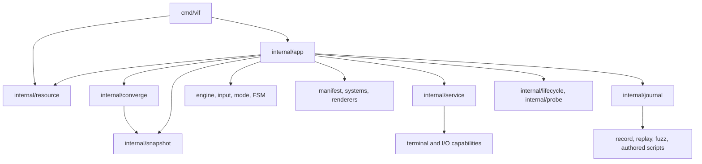
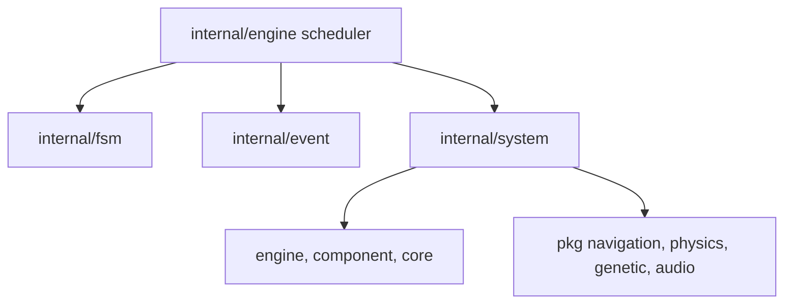
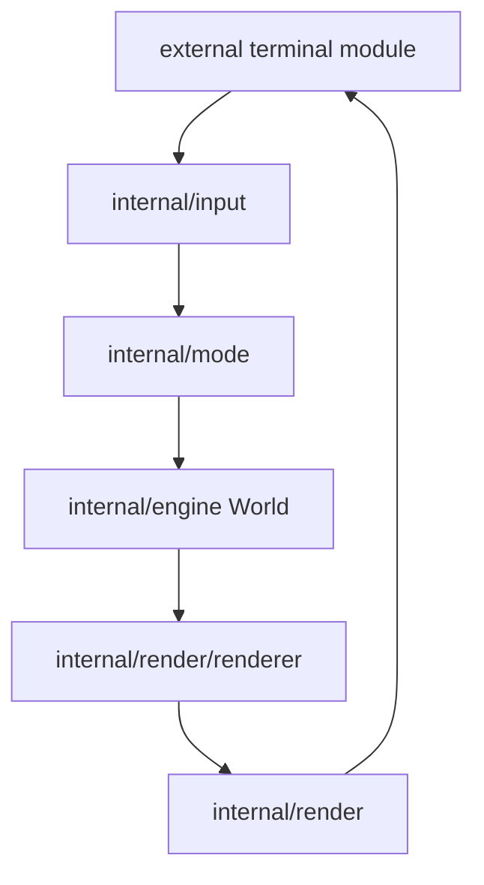
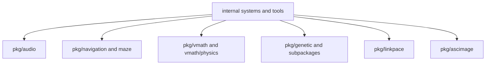

# Package Map

This document is the medium-level map between the high-level containers in
[Architecture overview](architecture.md) and individual implementation files.
It focuses on production packages first, then reusable libraries and tools.

## 1. Application package topology

`internal/app` is the composition root. Other packages should not construct an
entire game runtime or depend back upward on it.

## 2. Simulation package topology

The system package is intentionally broad: each file is a gameplay system, and
the generated manifest supplies construction order. Shared mechanics should
move downward into focused packages rather than creating system-to-system
object references; systems communicate through ECS data and events.

## 3. Presentation and interaction topology

Input parsing is engine-independent; mode routing is engine-aware. Rendering
reverses that direction: renderers read engine state and write only to the
render abstraction, while the orchestrator owns the terminal capability.

## 4. Production package responsibilities

| Package | Responsibility and boundary |
|---|---|
| `cmd/vif` | Grouped config/log/session flags including startup host/join selection, logging/journal/runtime-capture setup, replay/script/watch/check/schema selection, process exit policy. |
| `internal/content` | Immutable corpus model; root-directory load; plain-text sanitization and authored TOML blocks; corpus cursor. Internal because it depends on game `core.CodeBlock`. |
| `internal/app` | Negotiate startup sessions, compose play/headless/replay/script/server Apps, drive frame/input/playback/script loops, capture and install the shared world, choose the session's playout lead, and verify anchor/config identity. It owns the world and the lock over it; the authority protocol that reads and writes that world lives in `internal/converge` and reaches it only through the `converge.Instance` seam this package implements. |
| `internal/converge` | The authority protocol: which generation of the session this instance is part of and who is authoring it, the succession that moves authorship when the author goes, the adaptive per-link correction cadence a host publishes, the selective manifest/page exchange that makes a converged link cost hashes, the install a guest commits between two ticks, and the listening port and succession chain a survivor dials down. It holds no world and takes no world lock: `converge.Instance` is the whole of what it asks the run for, and every method on it acquires that lock itself — which is also what lets its own criteria drive it against a stub world instead of a composition root. |
| `internal/asset` | Every embedded shipped file — fallback FSM bundle, tutorial corpus, default keymap, built-in sound bank — plus the splash bitmap font. The only package with an `embed` directive for shipped data. |
| `internal/component` | Pure ECS component data and related enums/masks. Position is declared here but stored specially by `engine`. |
| `internal/core` | Small shared value types, entity ID and replication domain, modes, code blocks, the deterministic dependency resolver both `service` and `engine` order with, crash and stderr-capture support. |
| `internal/engine` | World, typed stores, positions/spatial grid, resources, game context/state, pausable/manual clocks, time control, scheduler, locking, and the roster/control re-derivation an install performs over the cursor store. |
| `internal/event` | Event catalog/payload registry, producer origins, replay record/anchor schema, MPSC queue, handler router, pooled/batched payload support. |
| `internal/fsm` | Generic hierarchical, parallel-region machine; TOML graph loader; transitions, delayed actions, variables, per-region trigger masks, and optional transition/region observation hooks. |
| `internal/fsm/std` | Reusable HFSM actions/guards and host capability interface. It does not import the game engine. |
| `internal/input` | Terminal-event parser, semantic intents, keymap override decoding/merging; the default document comes from `internal/asset`. It does not import the ECS. |
| `internal/bot` | Bot graphs: parse and validate a bot document, the vocabulary of actions and guards over the bot's own world, and the driver that releases a graph's intents through the router at the graph's rate. Engine-aware like `mode`; it imports neither `app` nor `converge`, and writes the world only through intents. |
| `internal/journal` | Runtime-agnostic deterministic-run machinery: recording lifecycle, in-memory capture, rotated JSONL loading, replay ordering/payload decoding, seeded fuzz input, and versioned authored tick scripts. Drivers depend on narrow target interfaces and never import `internal/app`. |
| `internal/lifecycle` | The allocated session's lifetime policy: a pure state machine over an injected clock turning roster observations into a phase (waiting, occupied, vacant, draining, expired), a deadline, and whether a dial may still be admitted. It opens nothing, reads no roster, and terminates nothing — the run supplies the observations and acts on the phase. |
| `internal/manifest` | Authoritative component/system/renderer lists, the simulation fingerprint two participants must share, capability-split generated builders, game binding for the generic FSM, and the JSON schema dump the map editor consumes. |
| `internal/mode` | Mode ownership, intent execution, motions/operators/search, mouse handling, macros, command mode, undo/history. |
| `internal/network` | Length-prefixed TCP transport, optional TLS configuration, anchor/start/ready session protocol, the peer-link handshake two participants open a stream with, the succession chain a handoff reads, peers, sequence/ack fields, bounded inbound notifications, and the per-address dial budget the coordinator admits against. |
| `internal/parameter` | Gameplay constants, timing, priorities, effect/audio tuning, and navigation/genetics settings. |
| `internal/parameter/visual` | Renderer-facing characters, masks, palettes, gradients, shapes, and post-process settings. |
| `internal/paths` | Platform config-root and user-state discovery and categorized resource names; performs no resource I/O. |
| `internal/resource` | Resolve the game config, keymap, corpus and audio overrides against the config-root precedence rule, and validate what those paths resolve to for `-check`. |
| `internal/pattern` | Convert a dual-mode `.vifimg` asset into wall spawn cells. One file, one path, no drawing. |
| `internal/prof` | Profiler: per-module wall time on the tick, event and render paths, process CPU/memory/GC/I/O sampling, and pprof CPU/heap and execution-trace captures. Publishes into the status registry; one atomic load per timed call while off. |
| `internal/probe` | The supervised run's HTTP endpoint: `/health` and `/metrics`. Stdlib only and stateless — a snapshot function supplies the run's answer and a status registry supplies the metrics, so the run decides what its words mean and this decides only how to say them. |
| `internal/render` | Render context, coordinate transforms, compositor buffer, blend modes, finalizers, renderer interface/orchestrator. |
| `internal/render/renderer` | Concrete visual projections of components/resources, UI, post-process passes, and flow/graph debug overlay. |
| `internal/service` | Dependency-ordered lifecycle hub and mode-selected adapters for categorized files, terminal, content, audio, and network transport. |
| `internal/snapshot` | Shared-capture wire model: the capture and its header, the compressed JSON envelope, the correction manifest with its pages and section hashes, and the selective shard set — none of which reads a world. Also the comparison surface: the key filters, the line format and diff, the per-store digest, the assembled shared and whole-instance line sets, and the capture/correction telemetry cells. The surface readers take the caller's world lock and never acquire one. |
| `internal/status` | Registered atomic metrics closed by `Freeze`, per-slot player metrics and the bare key that mirrors this instance's own slot, sorted/grouped snapshots, duration formatting, and the tick-sampled flight recorder. |
| `internal/system` | Gameplay mechanics and event handlers. Systems are constructed from the manifest and run in priority order. |
| `internal/vlog` | Build-tagged logger facade: levels, scopes, correlation stamps, correlated sets, standalone files, crash flush, and the ungated journal sink; no-op on WASM/`novlog`. |

## 5. Reusable `pkg` libraries

| Package | Public purpose | Important coupling |
|---|---|---|
| `pkg/ascimage` | Convert images to terminal cells and read/write dual-mode `.vifimg` assets. | External terminal/color types only. The interactive viewer lives in `cmd/ascimage` because it needs the in-repo render buffer. |
| `pkg/audio` | Synthesis, sound registry/cache, PCM mixer, patterns, harmony, voices, sequencer, backend detection, WAV sink. | Game policy *and the sound bank* are injected; the package ships no specs and imports nothing under `internal/`. |
| `pkg/audio/model` | Audio identifiers and arrangement values shared by events/configuration. | No mixer, backend, filesystem, or synthesis dependency; remains in audio-free profiles. |
| `pkg/genetic` | Generic generational and caller-driven streaming genetic engines, deterministic PCG streams, exact continuation checkpoints, and operators. | Core package uses the standard library only. |
| `pkg/genetic/fitness` | Convert lifetime metric bundles to scalar fitness. | Depends on tracking types. |
| `pkg/genetic/tracking` | Pooled lifetime metric collectors for simple and composite subjects. | No game-specific component dependency. |
| `pkg/genetic/registry` | Up to 256 species/populations, sampling, probes, tracking, stats, optional persistence. | Composes core genetic, fitness, tracking, and persistence. |
| `pkg/genetic/persistence` | Atomic file saves and TOML/JSON codecs for population DTOs. | TOML codec imports the external TOML module. |
| `pkg/linkpace` | Per-peer link estimation (round trip, jitter, delivery rate, saturation) and the bounded controller that turns it into a correction cadence and keyframe interval inside a convergence floor. | Standard library only, deliberately: the package cannot see a world, an event or a component, which is what makes "network timing may not enter the simulation" (D-24) structural rather than remembered. |
| `pkg/maze` | Recursive-backtracker maze generation, rooms, braiding, and solution data. | Uses shared point/value types and is surfaced through wall/maze events. |
| `pkg/navigation` | Flow fields, recompute caches, flow steering, composite passability, multi-route graphs. | Owns its route-graph tuning; wall access is callback-based. |
| `pkg/vmath/physics` | `float64` kinetic state, integration, bounce, homing/arrival, collisions, orbital and 3D operations. | Owns `physics.Kinetic`; depends only on the standard library and `pkg/vmath`. |
| `pkg/vmath` | `float64` scalar/vector math, LUTs, shapes, arcs, grid traversal, cell topology, and seeded randomness. | Standard-library-only foundation; integer `Point`/`Area` values are grid indices, not fixed-point numbers. |

No package under `pkg` imports anything under `internal`; `make arch-check`
enforces it. That is what lets a leaf take game data — the sound bank, wall
callbacks, fitness policy — from its caller instead of reaching for it. The
numeric stack is cleanly one-way: `pkg/vmath` imports only the standard library,
`pkg/vmath/physics` imports `pkg/vmath`, and neither exposes the removed
fixed-point types or conversion API. `pkg/audio`, the core `pkg/genetic`
package, `pkg/linkpace` and the numeric stack have the clearest game-independent
boundaries.

## 6. Generated assembly

`internal/manifest/definition.go` is the human-edited declaration for three
registries:

- component field/type pairs;
- system registry keys, constructors, and optional local build capability;
- renderer registry keys, constructors, and layer priorities.

`go generate ./internal/manifest/...` invokes `internal/gen-manifest` and
updates the core and audio system builders, terminal renderer builder, typed
component stores/removal masks, event reflection registry, and input enum strings.
Stable tie-breaking comes from manifest order when two systems or renderers share
a priority. Audio is the current local-only implementation capability; audio-free
builds select null event sinks without changing the simulation fingerprint.

Important exceptions:

- `MetaSystem` is event-only, declared in `manifest.ContextSystems` and
  registered directly by `internal/app` because it takes a `GameContext`; it
  is intentionally absent from the per-tick system manifest.
- `NetworkSystem` is a manifest-registered dual-domain system. It is inert with
  the default `RoleNone` resource and becomes the tick-owned wire bridge for a
  `-host` or `-join` session.
- runtime system control uses each system's `Name()` value, not necessarily the
  manifest construction key. New systems should keep those names identical.

## 7. Dependency direction rules

The practical dependency rules are:

1. `cmd` may depend on `internal/app`, `internal/resource` and `internal/manifest`; lower packages must not depend on `cmd`.
2. `app` may compose all runtime layers; domain packages should not import it.
3. `converge` sits between `app` and `snapshot`/`network`: it decides what a session publishes and installs, and asks the run for the world through `converge.Instance` rather than importing `app`. It exports the protocol's own operations and reports and nothing else: a criterion that has to fabricate protocol state belongs in that package, where it can reach the state directly, rather than behind an exported knob.
4. `snapshot` and `resource` sit below both: the first owns the capture wire model and the comparison surface, the second the config-root precedence rule. Neither imports `app`, and neither acquires a lock — the surface readers walk a world the caller has already locked, and the wire model reads none at all.
5. `journal` owns deterministic input-stream mechanics and may depend on event and input values, while App-specific construction, presentation, and session startup stay above it.
6. `engine` owns data/lifecycle infrastructure but should not import concrete
   gameplay systems or renderers.
7. `input` produces pure intents and must remain free of engine dependencies.
8. `mode`, `bot`, systems, and renderers may depend on engine data, but communicate
   laterally through resources/events rather than concrete peer references.
9. Generic FSM core/std stays independent of the game through `std.Host`; the
   manifest bridge is the adapter.
10. Blocking I/O stays behind services, render flush, audio backends, tools, or
   diagnostics—not inside a simulation update.
11. Reusable algorithms accept callbacks/data structures instead of reaching
   into global world state where practical.

## 8. External module boundary

| External module | Used by | What remains in vif |
|---|---|---|
| `lixenwraith/terminal` | app, service, input, render, ascimage/tools | Game-specific input semantics, compositor, renderers, and layout. |
| `lixenwraith/toml` | content, FSM, keymaps, audio specs, commands, genetic persistence | Schemas, validation policy, semantic models, and application resolution. |
| `lixenwraith/color` | renderers, visual parameters, ascimage | Layering, masks, game palettes, effects, and render scheduling. |
| `lixenwraith/log` | `internal/vlog` only in normal builds | Scopes, game correlation fields, crash/runtime capture integration, status snapshots. |

The pinned revisions are in `go.mod`; this document intentionally avoids
duplicating version strings that would become stale.

## 9. Commands, tools, sandboxes, and benchmarks

| Area | Contents |
|---|---|
| `cmd/ascimage` | Supported image converter/viewer command. |
| `cmd/soundlab` | Supported audio document editor, REPL/TUI, sequencer audition environment, and script runner. |
| `script/*` | Authored deterministic `vif -script` schedules: the phase host/guest pairs are the checked-in multiplayer diagnostics, and the sparring pair is the scripted-participant scenario a person joins. |
| `tool/blend-tester` | Inspect blend behavior and palette/effect combinations. |
| `tool/font-editor` | Edit the bitmap splash font. |
| `tool/hierarchy-map` | Analyze and visualize Go package/import hierarchy. |
| `tool/http-server` | Minimal static server used by `make serve` for the WASM bundle. |
| `tool/vif-allocator` | Website-to-K3s session allocator; a host service, not part of the game binary. |
| `sandbox/*` | Isolated prototypes and visual/interaction experiments; not part of application assembly. |
| `benchmark/*` | Standalone math, random, and render experiments; not Go benchmark test packages. |
