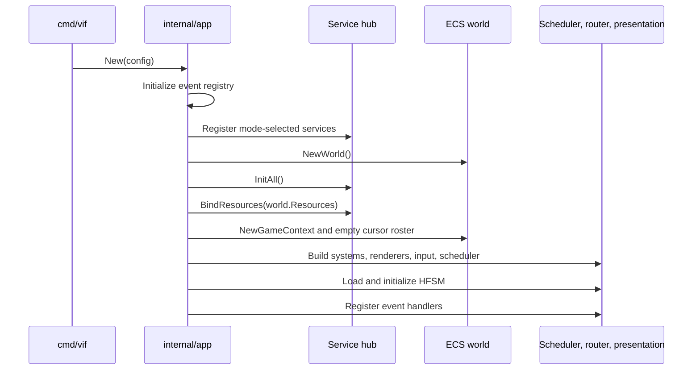
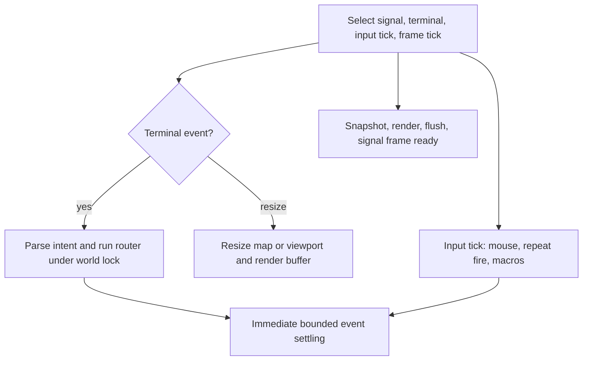
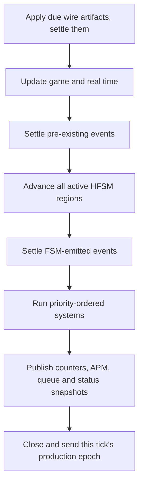

# Runtime, Scheduling, and Concurrency

This document describes the application runtime shapes and the
synchronization contract that makes the ECS safe. For the data structures
operated on by the runtime, see [ECS and events](ecs-and-events.md).

## 1. Process modes

`app.Mode` chooses which services, clock, and goroutines an `App` owns:

| Mode | Presents | Driven | Geometry/input owner | Audio | Execution |
|---|---:|---:|---|---:|---|
| `ModePlay` | Yes | No | terminal / terminal | If built | `PausableClock`; scheduler and event goroutines |
| `ModeHeadless` | No | Yes | caller / caller | No | `ManualClock`; harness or authored `ScriptDriver` invokes ticks and injections; an authored host/join script may attach network I/O |
| `ModeReplay` | Yes | Yes | journal / playback controls | If built | `ManualClock`; `journal.ReplayDriver` invokes ticks and injections |
| `ModeScript` | Yes | Yes | script / playback controls | If built | `ManualClock`; `journal.ScriptDriver` invokes ticks and injections; the presented form of a `ModeHeadless` script, network I/O included |
| `ModeServer` | No | No | config / none | No | `PausableClock`; scheduler and event goroutines, as `ModePlay`, with no terminal and no local cursor |

The five predicates in `internal/app/config.go` are the policy boundary:
`Presents`, `Driven`, `OwnsGeometry`, `OwnsInput`, and `Audio`. Assembly checks
them rather than scattering mode comparisons through the runtime. A driven
config defaults to terminal-equivalent geometry 80x24 when dimensions are not
supplied and rejects I/O settings the selected mode cannot honor. It also rejects
a simulation speed setting, because only `Tick` advances its clock — with one
exception: an authored script reads `-speed` as its wall pace, which is a
property of the run rather than of the clock. See §1.1.

Those predicates describe a full native build. Compile-time capabilities refine
them: `vif_headless` makes presenting modes unavailable and omits renderers;
`vif_noaudio` and `wasm` make `Audio` false and replace full audio systems with
event-only sinks. Runtime mode
and build profile remain separate so the same `ModeServer` behavior can run from
a full development binary or the smaller deployment artifact. See
[Build profiles and platform boundaries](multi-platform.md).

`-serve <address>` constructs `ModeServer`. `cmd/vif` normally constructs `ModePlay`; `-r`/`-replay <file>` constructs a replay
from the journal anchor, and `-script <file>` constructs a caller-driven
`ModeHeadless` run from an authored tick schedule, or `ModeScript` with `-watch`.
`-bot [N[:graph]|graph]` adds bots beside the human, including with `-host`
and `-join`; `-bots` accepts the same grammar. `-watch` uses the first bot's view
with no human, and `-headless` runs it without a terminal. Each additional bot is
its own instance in the same process. See [Bots](todo-bots.md).

| Tool path | Entry | Terminal initialized? | Result |
|---|---|---:|---|
| Validate | `app.Check` | No | Resolve and load FSM plus corpus; print accepted/rejected sources. |
| Export schema | `app.Schema` | No | Emit schema version 1 JSON for events, fields, actions, guards, operators, and config fields. |
| Run script | `app.RunScript` | Only with `-watch` | Execute a bounded versioned TOML schedule; optional `-host`/`-join` uses the normal TCP gate. |
| Run bot | `app.RunBot` | With `-watch` | Explicit `-watch` or `-headless` drives the first bot; remaining bots are seats. Headless solo runs are unpaced and default to 120x40. Ordinary `-bot` uses `app.Run` with a human. |

### 1.0 The four session flags, and what each still decides

Four ways to be in a session, and after the recent convergence they differ in
less than the flag names suggest:

| Flag | Binds a port | Local cursor | Terminal | Startup lobby | Default `-authority` |
|---|---:|---:|---:|---|---|
| `-host <addr>` | yes | yes | yes | none — plays from its first tick, opens once its clock runs | `migrate` |
| `-serve <addr>` | yes | no | no | its first guest: nobody plays until one arrives | `host` |
| `:host <addr> [host\|migrate]` | yes | yes | yes | none — the session opens at the tick it is running | the word given, else the run's |
| `-join <addr>` | in a migrate session, one of its own | yes | yes | waits for the host's start gate | adopted from the offer |

The guest's port is what makes migration mean anything: it is dialled back once to
confirm it, published to the other participants, and used only after a handoff.
`-listen <addr>` pins it, the default is the host's own port falling back to an
OS-assigned one, and `-no-advertise` — or a bind that fails, or an `-authority
host` session — leaves the participant a leaf that plays normally and is never
elected. See [Multiplayer](multi-player.md) §5.3.

Everything else about the session is now one implementation. `-players` is a
ceiling on every one of them and unset means the whole roster; the mid-run gate is
installed on all of them and armed once the clock is running; a reconnect takes the
same path as a first join; the correction cadence, the barrier, the roster
crossings and the succession do not know which flag opened the session.

**Can `-serve` and `-host` be merged?** They already are, everywhere it matters.
What is left is the first three columns, and those are one question — *is a person
sitting at this process* — asked three times. `-headless` requires bots to drive
its local cursor; `-serve` has no local cursor and remains the deployment shape. What is
*not* kept is the difference in what they mean: the two rows above disagree only
where the shape forces them to.

`:host` is the odd one and stays that way: it is an operator command rather than a
flag, and its session opens at whatever tick the run has reached. `-probe`,
`-first-join`, `-empty` and `-drain` are refused outside `-serve`, because each of
them answers to a supervisor and an interactive run has a person instead.

### 1.1 Script pacing and presentation

A script is a deterministic list of inputs at named simulation positions. Two
things about how one is *run* are policy rather than content:

| `-speed` | Effect on a script |
|---|---|
| unset | Real time in a session, unpaced when solo. A solo script that opens a session with `:host` starts pacing at that tick and re-anchors its clock there. |
| `1`, `2`, `1/2`, … | One tick occupies that multiple of the game interval. `2` is twice real time, `1/2` is half. |
| `max` | No wall pacing at all. Refused when `-host` or `-join` is present: a participant that outruns its peers is not simulating the session it is in. |

Every participant of one session must use the same rate. The runtime cannot see a
peer's pace, so it enforces only the `max` case: a participant running faster than
the rest reaches ticks they have not, and every correction rebases it back to the
authority's tick — which is a working session, but not one whose scripted actions
land where they were authored. A dedicated host and an interactive participant
always run real time, so a script sharing a session with either must too.

`-watch` presents the run on this terminal instead of running it headlessly. The
simulation is unchanged — the same manual clock, the same script geometry, the
same driver — so a presented run and a headless one of the same script produce
the same world. Only pan and quit are offered while a presented script is in a
session; pause, step and rate are instance-local and half a session cannot be
paused.

### 1.2 The dedicated host

`-serve <address>` runs a host with no terminal, no renderer, no audio and no
cursor of its own. What is left is what a session cannot do without: the Shared
world, the authority, the correction cadence and the roster, on the real clock and
the scheduler goroutine, because a session's simulation has to advance whether or
not anybody is watching it here.

Holding no cursor is a roster property rather than an absence. The coordinator
keeps its participant identity, its authority term and its vote; its slot is
`parameter.NoPlayerSlot`, so every "is this my cursor" test answers no without a
special case. The FSM's boot cursor is not suppressed — it is created as it always
is, and the roster hands it to the first guest, which is what keeps shared creation
order identical to an ordinary host's.

`-players <n>` is a ceiling on the roster and only a ceiling, on every host shape;
unset means the whole roster. A server's ceiling counts *guests*, because the
server is not one of them; an interactive host's counts one fewer, because it holds
a cursor itself. A lobby exists only where nobody plays: a server starts on its
first guest, an interactive host on its own first tick, and every later guest
arrives through the mid-run gate. `-host` is `:host` given at startup.

`-size WxH` gives a server the terminal-equivalent geometry it has no terminal to
derive, which is what every joiner adopts as the D-14 map latch.

Without it the server takes that geometry from its **first guest**. A run with no
`-size` falls back to `Config.DefaultWidth` x `DefaultHeight`, which is a 77x21
map — and because the joiner adopts the host's latch, every participant then plays
on it however large its own terminal is. The joiner's acceptance therefore carries
its own geometry (`network.JoinerReport`), and `App.adoptLobbyGeometry` applies the
first one before the roster closes, so the bounds it produces are the ones the
offer names and the tick-zero capture contains.

First rather than smallest, and the difference is the mid-run gate: guests arrive
throughout the run, so sizing from the smallest would mean shrinking the map under
participants already playing on it, which D-14 forbids for the same reason a
terminal may not crop a shared map. An explicit `-size` still wins, and a scenario
that fixes its own bounds (`crop_on_resize = false`, as `wad/scenario/td` does) is left
alone: those bounds are the scenario's statement rather than a stand-in for a
terminal nobody has.

`-probe <address>` binds the health and metrics endpoint for the run — one `/health`
path whose code is liveness and whose body carries everything else, plus `/metrics`.
See [Services and networking](services-and-networking.md) §12. It binds before the
lobby, because a run waiting for its first guest is a run a supervisor is watching
start.

#### The allocated session

`-first-join`, `-empty` and `-drain` bound a session that was created on somebody's
behalf rather than started by hand. They are refused outside `-serve`, because a
flag that ends a process must not silently do nothing.

| Flag | Meaning | Zero |
|---|---|---|
| `-first-join <d>` | End the run if no guest has connected within `d` of the listener binding. | Wait forever. |
| `-empty <d>` | End the run `d` after the last guest leaves. Also the window in which a guest that dropped reclaims the slot its departure released. | Stay open. |
| `-drain <d>` | On a termination signal, stop admitting and wait up to `d` for the roster to empty before exiting anyway. A second signal exits at once. | Exit at once. |

The policy itself is `internal/lifecycle`: a pure state machine over an injected
clock, with the phases `waiting`, `occupied`, `vacant`, `draining` and `expired`.
`Serve` starts it after the probe binds and before the lobby, folds the roster into
it once a second, and exits when it expires — logging one `session ended` line that
names the reason. The lobby wait carries the same deadline, because a pod nobody
dialled is exactly the case the first-guest window exists for and exactly the case
the start gate would otherwise wait in forever.

A signal reads the roster at the instant it arrives rather than the loop's last
reading, which can be a second old: a drain that read a stale empty roster would end
a session somebody had only just joined.

`draining` and `expired` refuse a dial with `ErrSessionEnding`, and `/health` keeps
answering 200 with `ready=false` plus the phase and the time remaining — a drain is
not a fault. The refusal is deliberately distinguishable from `ErrSessionStarting`:
that one means retry, this one means the session is leaving.

An abandoned startup gate — the first guest connects and then leaves before
confirming it installed the world — ends a dedicated host cleanly rather than as a
failure. On an interactive host it stays the error it always was; here there is
nobody in the session and nobody watching, so the Job completes instead of failing
and the allocator can place the next request.

Why the process holds this rather than the orchestrator: the roster is the only
thing that knows whether anybody is in the session, and it is inside the process. A
`Job` with an `activeDeadlineSeconds` can end a session on a wall clock; nothing
outside can end one on emptiness. See
[Deploying the session fleet](kube-docker-deploy.md).

```bash
./bin/vif -serve :7777 -probe :7778 -log-stdout -lv info \
    -players 4 -size 120x40 -first-join 90s -empty 90s -drain 20s
```

```bash
./bin/vif -serve :7777 -players 2 -size 120x40 -l -lv info
./bin/vif -join server.example:7777          # each person, elsewhere
```

The scheduler applies render backpressure at real time and slower, so the server
releases the same frame handshake on the same interval and draws nothing.

#### An empty session parks

A run whose roster empties stops its clock, and stops it at once. An empty session
has nothing to simulate for, and simulating it anyway is not free: with no cursor
on the map the gold cycle cannot place a sequence, so it fails, retries a tenth of
a second later, and fails again for as long as the process runs. It is also what
makes "a guest that dropped reclaims the slot its departure released" mean
something — the world it comes back to is the world it left rather than one that
aged without it.

On an unbounded host, a world nobody reclaimed inside
`parameter.SessionVacantReset` is replaced once and stays parked over the fresh
world. The reset briefly releases the clock, so the park is asserted on every
vacant reading. Its boot cursor belongs to nobody on a dedicated host, so the park
drops it before a mid-run join needs that slot.

A dial is what releases the park, on the accept goroutine and before the mid-run
gate reads its capture: that gate waits for a tick a stopped clock never reaches,
so a dial served by one would time out instead of being admitted. `/health` says
`clock=paused` beside `phase=vacant` throughout, and stays live — a park is not a
stall.

`-empty` outranks the fresh-world reset. A bounded session still parks immediately,
but keeps that exact world throughout the grace so a reconnect returns to the same
match; expiry then ends the process. Only `-empty=0` permits an in-process reset.

A server outlives its guests. Its mid-run gate is installed at construction and
armed once the scheduler is running, so a participant that dropped can dial back
into the slot its departure released and receive the world at whatever tick the
session has reached. `-players` bounds how many cursors the session holds, not how
many dials it will ever accept.

It also outlives its own authority, and that is why `-serve` defaults to
`-authority host`. A dedicated host *is* the session: its address is what the
allocator handed out and what every guest holds, so if the process goes, the answer
is an orchestrator putting another one at that address and the guests dialling back
— not a guest declaring itself the host. That is a policy rather than a limit now:
a migrate session's guests are dialable and its successor is one the session
confirmed it could reach ([Multiplayer](multi-player.md) §5.3), and
`-serve` still pins authorship because the address it was allocated at is the
session's identity.

The arming happens after `scheduler.Start` rather than before it, because the gate
waits for a capture one playout lead ahead of the current tick and a clock that has
not started never reaches it. Between the lobby reading its roster and that arming
there is a window neither gate can serve, so a dial landing in it is refused with
`ErrSessionStarting` — a refusal the dialer retries, rather than an identity and a
silent wait for a start gate no longer being sent.

A scripted participant schedules its actions on the ticks it issues, so it may
enter through the mid-run gate like anyone else ([Development](development.md)).

Together these make a scripted participant: one side of a session plays a fixed
sequence at real time while a person plays the other freely, which is how a
scripted demonstration is shown and how a reproduction is held constant while the
other participant is fuzzed by hand. `script/sparring-host.toml` and
`script/sparring-guest.toml` are the two directions.

Diagnostics are configured before the terminal enters its alternate screen so
startup failures and runtime reports remain recoverable.

## 2. Composition sequence



`-join` adds a pre-composition step: `Run` or `RunScript` dials, receives the host's
`JournalAnchor`, validates/adopts its seed and configuration identity, and only
then calls `New`. `-host` composes first so its acceptor can snapshot the live
tick-zero anchor. After service start, both roles complete the start/ready gate
before interactive play releases its first frame token or the authored driver
advances its first tick. A session clock is frozen during construction and lobby
wait, before the HFSM creates deadlines, and is resumed only after that gate;
tick zero therefore does not inherit how long the host waited for its peers.

The detailed construction order is significant:

1. Validate the application config and configure any embedder-provided log
   scope.
2. Initialize the generated event registry. FSM trigger resolution and
   `:emit` reflection depend on it.
3. Register services selected by mode and available build capability: files and
   content always; terminal for presenting modes; audio for play/replay/script
   when compiled; network for native play in `RoleNone`, or for native
   play/headless script sessions in `RoleHost` or `RolePeer` according to startup
   configuration.
4. Create an empty world and initialize services in deterministic topological
   order.
5. Let initialized services contribute typed resources to the world.
6. Resolve geometry from the terminal or config and create `GameContext`, which
   initializes the status registry, map/camera config, selected clock, event
   queue, game state, transient state, empty player roster, and target resource.
7. Publish corpus telemetry now that the status registry exists.
8. Construct systems from the generated manifest. `World.AddSystem` sorts them
   by priority and preserves manifest order for equal priorities.
9. For a presenting mode, construct and priority-sort renderers.
10. Create the input parser and mode router for semantic injection in every
    mode; merge the live keymap and bind terminal mouse control only when the
    terminal owns simulation input.
11. Create frame synchronization channels and the scheduler.
12. Resolve and load the external or embedded scenario, initialize its regions,
    enqueue their entry actions (including the shipped cursor spawn request),
    and apply global/region system toggles.
13. Register the event-only `MetaSystem`, then every constructed system that
    implements `event.Handler`.

If any step fails, `App.New` calls `Close` on the partially built application.
Services therefore must make `Stop` idempotent and able to release resources
acquired by `Init` even when `Start` was never reached.

## 3. Runtime clocks and cadence

Play mode has separate cadences rather than treating a rendered frame as the
only clock.

| Path | Default interval | Owner | Purpose |
|---|---:|---|---|
| Render frame | 16 ms | main goroutine | Snapshot frame state, render, flush, and release the next simulation tick. |
| Input tick | 16 ms | main goroutine | Reconcile terminal mouse mode, repeat held/automatic fire, and advance macros. |
| Simulation tick | 50 ms | scheduler goroutine | Advance pause-aware game time, FSM, systems, APM, and telemetry. |
| Event attempt | 4 ms | event goroutine | Settle queued events between simulation ticks, including while paused. |
| Audio buffer | 50 ms | audio mixer goroutine | Drain audio commands, synthesize/mix the next PCM buffer, and write it. |

The simulation is fixed-step but frame-gated. The main loop primes one
`frameReady` token. After a simulation update signals `updateDone`, the next
render completes and then returns another token. The scheduler also has a
bounded timeout while waiting, so a missed render token does not block forever.
This limits the simulation to one outstanding update and prevents rendering a
world that is being advanced concurrently.

Headless and replay modes replace `PausableClock` with `ManualClock`. They do
not call `Scheduler.Start`, so there is no scheduler loop, event loop, or
frame gate racing the world lock. `App.Tick(n)` advances the manual instant by
exactly the fixed interval and executes `n` tick bodies on the caller's
goroutine; `App.Settle` drains an injected event group without advancing time.
`Tick` deliberately executes even when operator pause state is true, because
the caller is the clock authority.

For a solo driven App, the resulting run is a pure function of seed, resolved
config, and injected event groups. A headless TCP script additionally consumes
the peer's ordered stream; the authored driver paces those sessions at the fixed
50 ms tick interval so one process cannot race thousands of ticks ahead of the
other. Concurrent Apps in one process are still
not fully isolated: the status recorder trigger hook, navigation debug
pointers, help key table, and vlog correlation stamp are package/process-wide.
They do not enter a simulation snapshot, but harnesses should run Apps
sequentially unless those observer surfaces are deliberately coordinated.

## 4. Play, playback, and authored-script loops

### Interactive play



Terminal key and mouse events flow through the input machine. A complete intent
is handled under `World.RunSafe`; afterward the scheduler immediately settles
events so the next frame can see its effects. A resize updates the main-loop
dimensions, then modifies map/viewport state under the world lock and resizes
the render buffer.

The input ticker is independent of rendering so held-button fire and macro
playback have stable cadence even when frames fluctuate. Macro intents re-enter
the same locked `handleIntent` path as physical input.

For a render frame, the application:

1. increments and publishes the frame counter;
2. under the world lock, copies `TimeResource`, local-cursor position, map,
   viewport, and camera data into a value `RenderContext`;
3. while paused, updates real time so pause visuals continue animating;
4. invokes the orchestrator, which separately locks the world while concrete
   renderers read components;
5. flushes terminal cells outside the world lock;
6. when the previous simulation update is complete and the game remains
   unpaused, sends a non-blocking `frameReady` token.

### Replay playback

`app.PlayJournal` (`-r`/`-replay <file>`) loads journal records, rebuilds config
and geometry from the first anchor, verifies the config/corpus fingerprint, and
drives a `ModeReplay` App with `journal.ReplayDriver`. The reader accepts several
files and sorts/deduplicates them by `jseq`; the CLI passes one path. A set whose
first anchor says `StartRun != 0` or `StartTick != 0` is refused: records alone
cannot rebuild a world that began elsewhere. The record format is
[Logging and diagnostics](logging-and-diagnostics.md) §9.

The playback keys are fixed; any other key is parsed by the keymap in NORMAL,
which keeps only quit, the audio toggle and `:`.

| Control | Playback action |
|---|---|
| `SPACE` | Pause/resume; at the end, play again from the start. |
| `.` | Pause and advance one tick. |
| `,` | Pause and step back one tick. |
| `+` / `-` | Move the viewer rate up/down the rational scale ladder. |
| `h j k l` / `0` | Scroll a map larger than the view by four cells; re-centre. |
| Ctrl+S | Cycle the viewer's mute, which starts as `-mute` says; no journal records it. |
| `:r tick <n>` | Go to the first step at or past tick `n` of the run shown, the status bar's `GT`. |
| `:r time <[[h:]m:]s>` | Go to that game time at 1x: seconds alone, `m:s` or `h:m:s`. |
| `:r restart` | Play again from the recording's start; also Simulation → Restart replay. |
| `:` | Command line: `replay`, `help`, `about`, `telemetry`, `hud`, `debug`, `content`, `flow`, `graph`, `log`, `q`. |
| `q` | Quit. |

The status bar adds `diverged by tick <n>` once the replay fails to reproduce a
world digest the run wrote (logging and diagnostics §9), and a `journal`
`replay diverged` Warn record names it. `-r <file> -headless` runs the same check
flat out, with no terminal.

In a replay `:r` is `:replay`; elsewhere it remains `:region`, which a replay
refuses. A game reset starts a run whose ticks count from zero, so `tick` and
`time` address the run shown; the status bar reports run, tick and its 1x time.

Pacing converts the recorded tick interval and speed to wall time, then applies
the viewer's rate. A presented step is one recorded tick: a guest's written world
and the groups that landed on it take none of the run's time, so they share the
tick after them rather than holding the view a tick of their own. The simulation
keeps its recorded geometry; the frame is laid out for the viewer's terminal, and a
resize re-lays it. A map the view holds is
centred in void as the game centres it; a larger one is shown from the recorded
view's centre, and scroll stops at the map's edges. The command line holds
playback, as the game's does, and borrows the recorded mode without announcing a
change to the world or pausing its clock (`GameContext.Viewer`), so closing it
leaves the run as recorded; a command that would change the recording is refused.

A world cannot be rewound, so going back presents another copy of the run: a
`ModeReplay` App on the viewer's terminal, built off the frame loop, muted and
without a flight recorder until it is presented. One fresh copy waits idle, and
one job at a time builds it or moves it into place on its own goroutine.

After each step the presented copy plays, the player keeps the whole state of the
run (`app.checkpoint`) and its world digest: the last `parameter.ReplayRing` (8)
steps in a ring, and every `parameter.ReplayCheckpointSteps` (100) on a ladder that
drops every other and doubles its spacing past `parameter.ReplayCheckpoints` (32).
A checkpoint holds every store and grid cell in its own order and both domains'
allocators (`engine.WorldCopy`), RNG streams, FSM position, scheduler and queue with
its pending events, every registry cell, each system's FSM toggle and its private
state (`engine.StateCopier`, or `SharedStateSaver` for a carrier without one), the
corpus cursor, the latched session (`engine.SessionState`, from the journal) and the
driver's place. One costs about 1 ms at 146×34, and 6 ms and 6.5 MB at the 500×250
map limit, where a restore takes about 35 ms with the copy's construction.

Every move goes to the first step at or past a tick of the run shown: `,` to the
step before, one a frame, as `.` steps on; `:r` to the tick asked; a restart to the
start. The presented copy plays there unpaced for most of each frame when it stands
before it and no checkpoint is more than a ring nearer, so the view keeps drawing;
otherwise the idle copy restores the nearest checkpoint, or starts fresh, replays
there and keeps the last ring of steps before it, and is presented the next frame.
So `,` within the ring restores without replaying.

A step that fails, such as a written world failing its integrity check once the
replay has left its run, ends the stream there: the viewer pauses on it with the
error on the bar for the rest of the replay, `,` and seeks still work, and nothing
plays past it. Quitting then exits with that error.

A restored copy must reproduce its checkpoint's digest (positions, kinetics,
combat, entity counts), and every copy stepping through ticks the run has passed
must stand and diverge where the run did. One that does not is never presented:
every checkpoint is dropped and none is taken again (a `journal` `replay checkpoint
left the run` Warn), and the move replays from the start. The bar's `diverged by
tick` is the run's, which the first copy past it found, not one copy's. A copy that
takes over brings the HUD pins, the speakers, whose engine plays on while the gates
the copy replayed decide what sounds, and the process's flight recorder, whose
window starts again, and draws into the same cells rather than repainting.

A replay logs as play does, so `:log on` and `:log off` bound a window around an
issue found by seeking. Each copy writes through its own log handle, muted until it
is presented, so records carry the presented copy's `run` and `tick` and a copy
replaying off the frame loop writes only its failures. Each jump of the presented tick (`,`,
a seek, a restart) is a `journal` `replay moved` Info record with `tick`,
`from_tick`, `delta` and their runs, stamped after the jump; a seek ahead
is recorded as it starts, and the ticks it plays log as they pass. Ticks played
again after going back log again, after the record that explains them.

### Authored headless scripts

`app.RunScript` loads a versioned TOML file through `internal/journal`, applies
its optional terminal-equivalent geometry, and builds a driven App. Actions are
addressed by `(run, tick)` and execute before the next tick at that position.
Same-position actions retain file order and each settles independently, matching
separate live input groups. Four deliberately small action forms exist:

- a canonical semantic input action from `input.ActionNames`, with optional
  count and target character;
- a string of semantic text-character intents;
- a complete ex-command round trip;
- a registered event plus journal-compatible TOML payload and, when needed, an
  explicit replication domain.

The script's `ticks` is a hard bound, so a process terminates without terminal
input and reports an action whose `(run, tick)` was never reached. With neither
`-host` nor `-join`, ticks run flat out. A networked script uses the same
anchor/roster/start/ready gate as play mode, then wall-paces the caller-driven
ticks. The two processes may use different files; this is how one schedule
targets the host's local participant and another targets the guest's.
Unknown top-level/action fields are rejected rather than ignored; action fields
that apply only to intents or events are rejected on the other forms.

## 5. Simulation tick steps



`Scheduler.processTick` holds the world lock for steps 1–9:

1. apply the wire artifacts whose fixed playout deadline has arrived and, if any
   did, settle them in their own `"wire"` group — before the tick stamp advances,
   so both copies of a crossing land at the same absolute tick (see the domain
   model, §6). With no live peer this step returns zero and creates no group;
2. open the next journal tick stamp, then update pause-aware `GameTime`,
   `RealTime`, and fixed `DeltaTime`;
3. update elapsed-time status;
4. consume/dispatch events accumulated before the tick until the queue is empty
   or the settling cap is reached;
5. advance the FSM by the fixed interval, then publish foreground telemetry and
   one metric set per declared region;
6. settle events emitted by state transitions and actions;
7. run all systems sequentially against that settled state;
8. snapshot position-derived entity counts before unlocking;
9. close this tick's production epoch and hand it to the transport, so a peer
   receives one tick's artifacts as one tick's worth.

Step 8 is inside the critical section deliberately: `Position` has no internal
lock, so counting entities after unlocking would race removals on the
event-loop and main goroutines.

After the lock is released, the scheduler uses only atomic or internally
synchronized paths to increment tick count, roll APM windows, publish entity
and event counters, report queue overflow, sample the flight recorder,
optionally emit a grouped status snapshot, and drain any pending recorder
flush request.

That tail is not a barrier. Because the lock is already released, the event
loop, input path and render goroutine can commit between step 8 and the
sample, so a status snapshot or recorder window is stamped with tick *n* but
reads "at or after tick *n*" for anything not written inside the locked body.
See [Logging and diagnostics](logging-and-diagnostics.md) §6.

`Scheduler.Prepare`, reached from `Start` or the first driven operation,
calls `Registry.Freeze` immediately after `World.Seal`. Both close a
registration surface before any tick reads it:
`Seal` freezes the system list, `Freeze` freezes the metric set and lays out
the recorder ring.

Systems may emit events during `Update`. Those events are normally handled by
the inter-tick event loop before the next frame; if contention delays that loop,
the next tick's initial settling is the fallback.

Each completed event-settle group advances the journal `boundary` counter.
This preserves distinctions between separately injected groups whose system
events would be ordered differently if merged. See
[Logging and diagnostics](logging-and-diagnostics.md) for the complete journal
stamp lattice.

## 6. Event-loop concurrency

The queue accepts multiple producers, but `Consume` is a single-consumer
operation. The world lock is therefore both an ECS lock and the consumer token.
No path may consume the event queue without holding it.

This goroutine exists only in `ModePlay`. Driven Apps use `Tick` and `Settle`
on the caller goroutine and therefore do not need the `TryLock` backoff path.

On each event-loop interval:

- an empty approximate queue length avoids lock contention;
- `World.TryLock` handles short idle windows cheaply;
- a miss increments backoff telemetry;
- after a configured number of misses, the event loop takes a blocking lock to
  guarantee progress after a long tick or render pass;
- one whole settle runs, then the lock is released. A single pass would split a
  cascade across wakeups and interleave it with the next records by wall time.

Each dispatched event goes to the HFSM first and then to registered handlers in
registration order. The FSM's answer — whether any active region consumed the
event — is recorded in the pass summary, so a system-handler count of zero is
no longer ambiguous.
A handler may enqueue another event; bounded settling loops repeat consume 
passes up to `EventLoopIterations` (currently 16) for immediate paths.
The queue capacity is 2,048. Producers that overrun it evict the oldest
unread events and increment a monotonic dropped counter; this represents real
state loss and is logged when observed.

## 7. Lock and ownership matrix

| State | Synchronization owner | Allowed access |
|---|---|---|
| Entity IDs, component stores, component masks, positions, spatial grid, map/camera mutation | `World.updateMutex` | Tick, event dispatch, input/router, reset, and renderers while holding the same lock. |
| Event queue writes | Lock-free MPSC producer protocol | Any producer; payload lifetime rules still apply. |
| Event queue consume | World lock as single-consumer token | Scheduler tick, event loop, immediate dispatch, or reset only. |
| System list | Single-threaded construction, then `World.Seal` | Read-only after scheduler start. |
| Render buffer | Render orchestrator | Main/render path only; cleared and reused per frame. |
| Context flags/counters | Atomics | Cross-goroutine reads for pause, macros, mouse, auto-fire, frame/status strings. |
| APM history | `GameState.mu` plus atomic published totals | Scheduler admits gestures at dispatch and rolls history. |
| Target groups | `TargetResource` RW lock | Navigation writes; species/genetic code reads snapshots. |
| Status metric values | Per-value atomics; set closed by `Registry.Freeze` | Systems cache pointers during construction; snapshots and the recorder load atomically off the world lock. |
| Audio sequencer, voices, active effects | Mixer-goroutine confinement | Other goroutines send bounded commands or read atomic mirrors. |
| Service registry/lifecycle | `service.Hub.mu` | Composition/start/stop paths only. |
| Network inbound buffer | Bounded channel | Transport callbacks push without blocking; active `NetworkSystem` sessions drain at the tick poll boundary. |

### Non-reentrant router rule

`App.handleIntent` acquires the world lock before calling
`mode.Router.Handle`. Nothing reachable from the router may call
`World.RunSafe`, `World.Lock`, or another lock wrapper for the same mutex. The
router can directly access stores because its caller already provides the
critical section.

### Operator commands hold the lock

`App.handleIntent` runs command mode under the world lock, so a command that
performs I/O stalls the tick, the event loop and rendering for its duration.
`:log on` opens the session file. `:t save` only captures its records under the
lock; a second logger drains them to disk on its own goroutine, bounded by a 3 s
drain timeout, so it is available in a live session too.
Both are deliberate operator costs and neither is reachable from gameplay
input. `:log off` and `:log rec flush` are explicitly not in this class — the
first detaches the sink and drains on another goroutine, the second only sets a
flag the tick goroutine reads.

### Pointer and slice lifetime rules

Sparse-set `GetPtr` pointers and dense entity slices are live views. Structural
store changes can invalidate pointers or reorder swap-removed entries. They must
not escape the world-locked operation that obtained them unless a component's
API explicitly guarantees otherwise. Similarly, pooled event payloads and
scratch slices must not be retained by asynchronous logging or later work;
logging call sites pass primitive values or copies.

## 8. Pause semantics

Pause freezes simulation ticks through `PausableClock` and the scheduler's
pause gate. It does not freeze the whole process:

- terminal input and signals still arrive;
- the event loop still dispatches queued events;
- the pause/overlay frame still renders using wall-clock time;
- mouse reporting state can still be reconciled;
- gameplay pointer input, auto-fire, and macros are withheld while input is
  suspended;
- `AudioSystem` propagates pause to the mixer, which fades the audio path.

`MetaSystem` is the single owner that keeps pause flag, clock, and pause-change
events aligned. It refuses a request to enter pause while a transport has a live
peer: stopping one participant would also stop its barrier production and apply
loop while every peer continued. Command and overlay modes still open, but do not
pause a live network session.

In a driven App, pause remains observable/operator state but never revokes the
caller's authority: `App.Tick` uses the stepped tick path and still advances.

## 9. Time control

`TimeScale` is an exact rational `Num/Den`, not a float. Operator-visible rates
are the fixed ladder `1/8`, `1/4`, `1/2`, `1`, `2`, `4`, `8`; `+` and `-` step
along it and clamp at the ends. `PausableClock` re-anchors game time on a rate
change, so there is no time jump or catch-up burst. Above 1x the scheduler
skips render backpressure so the world can outrun the display.

`-speed <rate>` sets the initial play-mode rate. Runtime commands are:

| Command | Effect |
|---|---|
| `:speed` | Report the current rate. |
| `:speed <rate>` | Select one ladder rate. |
| `:speed +`, `-`, `reset` | Step faster/slower or restore 1x. |
| `:step [n]` | Pause and grant one or `n` complete ticks, capped at 10,000. |
| `:step [rate] fsm [region] [pause]` | Run until the next matching region transition. |
| `:step [rate] ev <Event> [pause]` | Run until the named event is dispatched. |
| `:step off` | Disarm and restore 1x. |

A run-until request stores the pre-request rate in `BreakState.Restore`, switches
to the optional run rate, and trips exactly once. The `pause` suffix pauses at
the match; without it, the previous rate is restored and execution continues.
FSM and event modes are probed at the transition and dispatch sites rather than
by polling telemetry. `Expiry` self-disarms a request after 20,000 game ticks
so a misspelled assumption cannot run forever; a hit or expiry triggers a
`break` flight-recorder flush. Reset cancels tick allowances and run-until
requests because their region/event context was destroyed, while the ordinary
rate remains operator-owned.

These controls are operator pacing under `ModePlay`. Replay records and
reinjects their events, but its manual clock advances only under
`ReplayDriver`; viewer `+`/`-` controls presentation pacing instead.
Speed changes, tick stepping and run-until controls are refused in a live network
session for the same per-instance-clock reason as pause.

## 10. Reset and operator state

`:n <scenario>` is not a reset. The regions a scenario declares are what register
the FSM metric set, and `Scheduler.Prepare` freezes that set for the life of a
run, so another scenario needs another run: `Run` owns a loop that builds one App
per scenario, and the command validates the name and latches which one comes next.
Everything operator-owned restarts with it. See
[HFSM and configuration](fsm-and-configuration.md) §2.

In a session every participant does this together. Only the coordinator may ask;
it broadcasts `MsgSessionRestart` before its transport goes and rebuilds solo,
reopening its address once its clock runs. Each guest latches the same restart,
rebuilds on its own command line and redials, arriving through the mid-run gate a
reconnect has always used — so the roster, the world install and the scenario
transfer are the paths that already existed. Nothing is carried in the notice: the
offer a guest is given when it redials names what is being played.

A `:new` command emits `EventGameResetRequest` and requests scheduler reset
without reconstructing the process. In a live session only the coordinator may
request it; the request crosses and every participant applies it at one barrier
tick. A reset from the shared monitor FSM remains re-derived on every instance.
`MetaSystem` snapshots the roster's slot/control/peer assignments, pauses
audio/time, clears entities and `GameState`, advances the journal run while
rebasing its tick to zero, restores viewport-sized map/camera/mode state, and
cancels pending step controls. The reset FSM's first cursor spawn carries the
configured heat/energy template and expands the saved roster in deterministic
slot order. The scheduler serializes these phases with the world lock:

1. drain and discard stale queued events;
2. reset deadlines and elapsed-time anchors;
3. reset all initially configured HFSM regions, variables, and delayed actions;
4. reapply global and active-region system toggles;
5. enqueue an unpause request and settle reset/unpause events;
6. advance the RNG session and emit a fresh journal anchor.

Simulation state is rebuilt; operator state describes how that simulation is
being driven or observed and survives plain `:new`. Its explicit contract is:

- free-mouse and auto-fire preferences;
- the current time scale;
- telemetry HUD visibility and pinned overlay cards.

Both `:new` and `:new!` clear recorded/playing macros, close overlays, return to
Normal mode, and clear command/search/status text. `:new!` additionally purges
the initiating instance's operator contract: free mouse and auto-fire become
off, speed returns to 1x, and the telemetry HUD/pins are cleared. A peer receiving
the crossed reset retains its own operator state. Logging target, level, scope,
snapshot period, and recorder depth are process diagnostics and are never part
of this purge.

Other session-observer fields have explicit behavior rather than belonging to
that purge list: the render frame remains monotonic, reset ends paused state,
and the terminal-wide `MouseDisabled` flag currently survives both reset
forms. The full `session` snapshot record reports these values even though
replay comparison omits the record.

The genetic registry is not recreated. Its reset drops proposals and in-flight
evaluations but retains scored archives, so evolution continues across `:new`
within the process.

### Replay comparison boundary

`App.Snapshot` includes the full observer surface. Replay verification uses
`App.SnapshotSimulation`, which drops the `session` context record and the
exact replay-excluded keys in `internal/snapshot/surface.go`:

| Surface | Excluded keys |
|---|---|
| Operator time control | `engine.paused`, `engine.speed`, `engine.speed_pct`, `engine.step`, `engine.breakpoint` |
| Presentation | `engine.fps`, `context.frame` |
| Live contention | `event.backoffs` |
| Recorder bookkeeping | `rec.depth`, `rec.flushes`, `rec.records`, `rec.skipped` |
| Snapshot bookkeeping | `stat.late`, `stat.groups`, `stat.metrics` |
| Capture and correction | the whole `snapshot.` prefix |

`engine.fps` counts frames per wall second, which no replay reproduces; the other
entries describe pacing, contention, or telemetry rather than world behavior. The deny-list
uses exact keys, not whole prefixes, because the same metric groups also
contain simulation counters that must still compare — with one exception, and it
is a whole group rather than a compromise. A replay installs no capture and applies
no correction: it re-derives the run from its record stream, so what a read cost,
what an install cost, how many corrections arrived and how far this instance's
prediction had drifted when they did all describe the session the run was part of
rather than the simulation the replay reproduces. Comparing any of them would be
asserting that a replay had a network.

## 11. Shutdown and failure handling

Normal shutdown is triggered by quit intent, terminal close/error, or an OS
signal. `App.Close` stops the scheduler before stopping services so no tick can
use an I/O resource after it is released. The hub stops every initialized
service in reverse dependency order.

Crash handling is designed around terminal restoration:

- scheduler and logger goroutines are launched through `core.Go`, which routes
  panics to the central crash handler;
- the terminal polling goroutine has its own emergency reset because it owns a
  particularly sensitive raw-mode boundary;
- the optional logger receives a crash record and bounded flush opportunity;
- race/fatal/panic text written to stderr can be redirected and drained into
  structured diagnostics on supported native builds;
- terminal finalization is unconditional if terminal initialization succeeded,
  even when service startup did not.

The audio engine bounds its wait for a blocked backend writer so shutdown does
not indefinitely leave the terminal in raw mode.

## 12. Source map

| Concern | Primary source |
|---|---|
| Runtime modes and composition | `internal/app/config.go`, `app.go`, `headless.go` |
| Build capability adapters | `internal/app/presentation_*`, `audio*`, `network_*` |
| Interactive, playback, and script loops | `internal/app/loop.go`, `play.go`, `script.go` |
| Recording, replay, fuzz, and authored script drivers | `internal/journal` |
| Replay identity and comparison boundary | `internal/app/replay.go`, `surface.go`, `internal/snapshot/surface.go` |
| Tick and event scheduling | `internal/engine/scheduler.go` |
| World locking and system execution | `internal/engine/world.go`, `sync_*.go` |
| Play/manual clocks and time control | `internal/engine/pausable_clock.go`, `manual_clock.go`, `time_control.go` |
| Game context, reset flags, and snapshots | `internal/engine/game_context.go`, `game_state.go`, `snapshot.go` |
| Event queue and routing | `internal/event/queue.go`, `router.go` |
| Pause/reset owner | `internal/system/meta.go` |
| Service teardown | `internal/service/hub.go`, `adapter_terminal.go`, `adapter_audio.go` |
