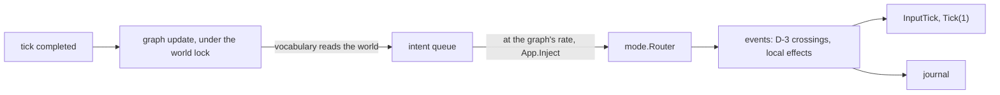

# Bots

Working plan for bots that play as participants, merged with
[Delegate convergence to relays](todo.md#delegate-convergence-to-relays). It is the
basis for a `doc/bots.md` once the phases below land; until then `todo.md` points
here. Landed work and superseded behaviour remain as a work log.

## 1. What a bot is

A bot is a participant whose input comes from a graph instead of a terminal. It is
its own instance: its own `World`, `mode.Router`, scheduler and journal, holding a
roster slot and a cursor, bound by the same barrier, lead, admission and eviction as
a person. Nothing in the simulation knows a graph exists; it sits above `App.Inject`
exactly where a terminal, an authored script and the fuzz driver sit.

Bots belong to the instance that started them. A process running a person and two
bots is a participant with two more behind it — a relay whose leaves share its
fate. That relation, not a new protocol, is what fits bots under the session
protocol: every bot is admitted by the ordinary handshake, and the relay item later
lets a holder carry its bots' traffic without changing who they are or when they go.

## 2. Decisions

| Question | Decision | Why |
|---|---|---|
| Intents or events | `input.Intent` values through the bot's own router: keys and the mouse. | The router's grammar, modes and cooldowns bind a bot as they bind a person; the journal records what the router produces, so a replay needs no graph; touch input drives the same contract. |
| Pointer | A bot's pointer names a map cell (`Intent.MapCell`) the bot's viewport shows, as a person's mouse names a cell on the screen; the camera follows it. | Movement is one intent rather than a chain of motions, with the reach of a mouse. |
| Brains | One mechanism: an `internal/fsm` graph per bot, with the bot vocabulary of §6. A fixed sequence is a state whose actions carry `delay_ms`. | Scripted and reactive play are one document shape and one runtime, and the game's HFSM already loads, validates and times them. `-script` stays the deterministic harness it is. |
| Seats | One headless instance per bot. | D-2 stays whole: two Player domains in one `World` would share one grid partition, one D-18 ring and one input binding. |
| Ownership | A bot belongs to the instance that started it. The host's bots are participants for as long as the host runs; a guest's bots leave when that guest does. A guest cannot hand its bots to the host. | A bot a person brought must not outlive the person, and one a host started is part of the session it offers. |
| Compositions | On the host and on a guest alike: a person, a person with bots, or bots alone. | §4. |
| Networking | Ordinary participant links: a host's bots dial loopback; a guest's bots dial its join address. After succession, the holder admits new bots through a loopback listener on its surviving transport. | The same handshake and gate serve every join. Permanent holder-local admission while still a guest needs the relay work in §4. |
| Occupancy | Bots count: a session of bots alone is occupied. A guest's bots leave with it, so only the host's bots keep an allocated session alive, and its deadline still ends it. | A host that offers bots offers a session to play in. |
| Pause | An instance may pause only while it is the authority and every other participant is its own bot; the pause stops its bots with it, and an arrival ends it. | A paused authority stops committing, and a participant it cannot pause would run on ahead of every commit; only its own bots can stop with it. Anyone else in the session, or being a guest, refuses as today, and a joiner's gate waits on ticks. |
| Perception | The whole local instance, present state only, read by the vocabulary under the bot's own world lock while its graph updates. | A bot reads what its instance holds; another participant's Player domain does not exist locally. |
| Objective | Cooperative: a teammate against the environment. | Cursor-versus-cursor combat is not built ([Combat](todo.md#combat) items). |
| Learning | Deferred. No genetic code or hooks before bots and their networking are stable (phase 7). | The bot comes first. |
| Marking | Every remote cursor shows its existing slot as `0`–`F`; the local cursor stays unmarked. `4P:1` means four cursors and local slot 1. | Slots already agree across the session. No bot flag, name, protocol field or new colour is needed. |
| Budget | The router's limits, plus a per-graph intent rate: intents wait their turn in a bounded queue. | Whole-instance perception is already an advantage over a person's viewport. |
| Determinism | A graph draws from its own stream, seeded from the session seed and its participant, never a world stream (D-8). | A solo bot run is a pure function of its seed; in a session only its journal reproduces it, as for a person. |
| Succession | A bot seat never advertises: it lives in its holder's process. A watched or headless front bot follows `-no-advertise` like any other independent participant. | A seat elected successor would leave with its holder. |

## 3. Architecture

### 3.1 One tick of a bot



The driver runs the shape of the authored-script loop: at a completed tick it updates
the graph by one tick of game time, releases what the rate allows from the queue
through `App.Inject`, calls `App.InputTick` so auto-fire and held buttons advance,
and ticks. Graph actions only queue intents; nothing reachable from the update takes
the world lock, and the injection that does happens after it is released. A bot run
ends when an intent quits the game, a signal arrives, or its session ends.

### 3.2 `internal/bot`

A package beside `internal/mode`: engine-aware, imported by `internal/app`,
importing neither `app` nor `converge`.

| Piece | Responsibility |
|---|---|
| `Graph` | A parsed bot document: the `[bot]` settings and the FSM graph, validated by compiling it once. |
| `Driver` | The loop in §3.1: one `fsm.Machine` per bot over the bot's mind, the intent queue and its rate. |
| Vocabulary | The bot actions and guards of §6, registered with `internal/fsm/std`'s generic ones. |

Graphs resolve like every resource: a path, then `bot/<name>.toml` under
`-config-dir`, the user root and the XDG system roots, then the embedded copy in
`internal/asset/bot/`, which `make install-config` installs.
The shipped policy is `default`: text and gold first, with patrol and nugget
jumps when text is absent. Legacy names `roam` and `patrol` fall back to this
policy; explicitly installed graphs under those names still take precedence.

### 3.3 Run paths

`vif -bot [N[:graph]|graph]` adds bots beside the human player. Bare `-bot`
means `1:default`; `-bot 2`, `-bot 2:default`, and a plain graph name/path
use the same parser as `:bot add`. `-bots` accepts the same syntax; if both
flags are given their requests add together. `-host` and `-join` retain the human.

`-watch` gives the first requested bot the terminal view and leaves no human
player. `-headless` drives that same bot without a terminal; a solo headless
bot runs flat out unless `-speed` is set. More bots use ordinary paced sessions,
so `-speed max` is refused with multiple bots or a network address. `-serve`
remains a cursorless coordinator and seats all requested bots as guests.

Watched bot commands and overlays suspend graph input; a networked run keeps
ticking. `:n`, `:bot`, `:player` and the [configuration menu](config-menu.md)
are live controls. Journal viewers remain inspection-only and stop at the saved
simulation boundary, including quiet trailing ticks. Replays never restart a graph.

Seats (`internal/app/seat.go`) are the same driver on further headless instances
in the holder's process, each on its own goroutine, paced against the authority
like any guest, and standing still while a holder with a real clock is paused.
Process-wide state assumes one instance per process:

| State | Shared by | For seats |
|---|---|---|
| `status.active` flight recorder | the last registry to register wins `status.Trigger` | seats run with no recorder and no status snapshots |
| `vlog` | one sink, stamped with the front run's tick | a seat's own lines name its graph and participant; its instance's lines are untagged |
| `engine.divergentReads` | package-level once-per-key warning latch | harmless across instances |
| signals, terminal, audio, probe | the front App only | seats are headless and stop when their holder says so |
| corpus, scenario, keymap and graph parse | per App | still per seat (§9) |

## 4. Compositions under the session protocol

| Composition | On the host | On a guest |
|---|---|---|
| A person | today | today |
| A person with bots | `-bot N[:graph]`, with `-host …` to let others in, or `:bot add` | `-join … -bot N[:graph]`, or `:bot add` |
| Bots alone | `-serve … -bot N`, or `-bot N[:graph] -watch` / `-headless` | `-join … -bot N[:graph] -watch` / `-headless` |

| Bot of | Joins by | Leaves when | Occupies the session |
|---|---|---|---|
| the host | its holder's own listener over loopback, which a run in no session opens first: the same accept loop, roster, anchor and capture as anyone's, and a loopback dial spends no join budget | the host ends, `:bot drop`, or a `-serve` host's drain begins | yes |
| a guest | dialling the address the guest joined, from the guest's process, on its own link | the guest leaves or loses its session: it closes its bots, and its process ending takes them | while its guest is in it |

Direct links remain the transport. The join reply, roster and shared cursor carry
a bot's holder identity for removal and succession (§13). A host's bot is admitted by the accept loop that
already serves TCP and WebSocket listeners; a guest's bot is one more participant
from the guest's address, which shares that address's join budget. A seat never
advertises, so it is never elected, and it ends once no session is left for it.
An inherited authority lazily binds a loopback admission listener on the existing
transport. Its established links stay attached; newly added bots use that listener
instead of the departed host's address.

The relay item is where a guest's bots move onto its own link. That changes the
link and nothing a roster says, and it waits until bots work in every composition:

| Step | Work |
|---|---|
| R1 | **Admission through a relay.** The holder forwards a bot's `JoinerReport`; the coordinator admits it and answers through the holder, which serves the join capture from its own proved world — a leaf proves it by the authority's root. A new message pair and a `ManifestVersion` bump. |
| R2 | **One subtree proof upstream.** The holder's answer carries each leaf's newest proved tick in `Relayed`, so the authority's floor, flood and cadence count subtrees and the keyframe floor stops crossing every link while anyone is behind a relay. |
| R3 | **Bundled epochs.** The holder sends its leaves' raw epochs with its own, one frame a tick. |
| R4 | **Ingress through the relay.** The authority accepts a leaf's traffic only through its relay and budgets each link's ingress into eviction, so a bad relay stalls only its own subtree. |
| R5 | **People behind a relay.** Path advertisement for a leaf's lead, re-parenting, and reaching a relay behind NAT. A relay for people is native with a declared port; a browser relays only its own bots. |

A bot is the easiest leaf R1–R4 can have: its hop is a function call, it shares
its holder's fate so it never re-parents, and it needs no hole punching.

## 5. Phases

| Phase | Priority | Delivers |
|---|---|---|
| 1 | landed | The bot itself: pointer in map cells, `internal/bot`, `vif -bot`, shipped graphs. |
| 2–3 | landed | Seats: the host's and a guest's bots in every composition of §4, `-bots`, `:bot`, occupancy, the pause rule. |
| 6 | P1, next | Relays own subtrees: ownership/removal foundation landed (§13); R1–R4 for a guest's bots, then R5. |
| 4 | P2, after 6 | The fleet: an allocator request for bots. Slot marking landed in §12. |
| 5 | P2, after 6 | Decision logic: richer vocabulary and a motor layer. |
| 7 | P3 | Offline genetic training. |
| 8 | P3 | Session adaptation. |

### Phase 1 — the bot itself (landed)

Originally, `vif -bot <name|path>` played the seat from a graph, solo, hosting or joining
through the driven session path `-script` uses. `internal/bot` holds the graph, the
driver and the vocabulary of §6; `IntentFor` and `AppendCommand` in `internal/input`
serve scripts and graphs alike; `default` ships in `internal/asset/bot/`.
A solo run is a pure function of its seed, and `./script/test.sh bot` plays every
shipped graph through the binary and joins `default` to a dedicated host.

### Phases 2–3 — seats (landed)

The original `-bots N[:graph]` on a played, served or bot run, and `:bot [add [N[:graph]|graph]|drop
<hex-slot>]`, seat bots as §4 lays out; the run's restart carries its seats into the
next run. Occupancy counts them, since they are roster entries. The pause rule is
`World.SeatsOnly`. Two fixes came with it: a startup lobby waits for every rostered
handshake before its gate sends to them, which simultaneous dials used to fail, and
a loopback dial spends no join budget at the game host, while the fleet's front
door keeps its own budget per player. Seat instance logs still need a seat tag.

### Phase 6 — relay subtrees (next)

Holder identity, group departure and host removal landed as the prerequisites
in §13. R1–R4 and then R5 (§4) still move admission, convergence proofs and traffic
onto the holder's link. Permanent guest-local admission, including adding bots
through a guest after the original host has departed, remains part of this work.

### Phase 4 — the fleet (after phase 6)

- The create request gains `bots` (0 to `players - 1`); the session pod runs with
  `-bots K` and requests per bot what §9 measured.
- A load test of networked bots, which also gives the session stack continuous play.

### Phase 5 — decision logic (after phase 6)

- A motor layer over `pkg/navigation` for targets the viewport does not show,
  event transitions from the bot's own dispatch, threat and evasion guards, and
  utilities scored within a state.
- Exit: a graph outscores `default` over a fixed seed set on every shipped scenario.

### Phases 7–8

Learning (§8) follows the relay, fleet and decision-logic work.

## 6. Vocabulary

A bot document is a scenario graph (see [FSM reference](fsm-reference.md)) plus a
`[bot]` table. `internal/fsm/std` supplies variables, timing, compound guards
(`And`, `Or`, `Not`), status guards over the bot's own registry, whose bare keys —
`heat.current`, `energy.current`, `boost.active`, `shield.active` — mirror its own
slot, and config guards over its own view (`map_width`, `camera_x`, …), which a
private graph reads without the divergence warning a shared script gets.

| Action | Payload | Queues |
|---|---|---|
| `Intent` | `name` (a keymap action, or a list drawn from), `count` (a number, or a `[min, max]` range drawn from), `char` | one semantic key press |
| `Text` | `text` | a character intent per rune |
| `Command` | `text` | the ex-command round trip |
| `TypeGlyph` | — | the rune of the glyph under the cursor, if there is one |
| `PointAt` | `target`, `fire` | the nearest target, clamped to the viewport; text starts at its visible run's left edge; `fire` clicks instead of moving |

| Guard | Args | Passes when |
|---|---|---|
| `HasTarget` | `target`, `within` | a target of the class exists, within `within` cells when non-zero |
| `OnTarget` | `target` | the cursor's cell holds one |
| `InMode` | `mode` | the router is in `normal`, `insert`, `visual`, `search` or `command` |
| `Chance` | `percent` | a draw from the bot's own stream |

A payload with no choice draws nothing, so a fixed sequence leaves the stream
alone; `Chance` as an action guard is how a graph does something now and then.

Targets: `glyph` (typeable text), `gold` (a gold member), `nugget`, `species` (a
hostile combat entity), `cursor` (another participant) and `random` (a cell the
viewport shows). Nearest is by cell distance with rows counted twice, as the
terminal draws them.

`PointAt` and `TypeGlyph` read the world, so each acts only when the rate releases
everything it queues before the next tick: behind a backlog, what it read would be
stale by the time it lands. `TypeGlyph` switches to Insert first when the router is
elsewhere. Of `std`'s actions, `EmitEvent` and system control are inert — a graph
writes the world only through intents — and region control runs the bot's own
machine.

| `[bot]` setting | Default | Meaning |
|---|---|---|
| `actions_per_second` | 12 | intents released per second of game time; a queue of 256 holds the rest |

A fixed sequence:

```toml
[bot]
actions_per_second = 8

[regions.play]
initial = "Out"

[states.Out]
on_enter = [
    { action = "Intent", payload = { name = "motion_right", count = 12 } },
    { action = "Intent", payload = { name = "fire_main" }, delay_ms = 500 },
]
transitions = [{ trigger = "Tick", target = "Back", guard = "StateTimeExceeds", guard_args = { ms = 1500 } }]

[states.Back]
on_enter = [{ action = "Intent", payload = { name = "motion_left", count = 12 } }]
transitions = [{ trigger = "Tick", target = "Out", guard = "StateTimeExceeds", guard_args = { ms = 1500 } }]
```

Perception is the whole local instance's present state. The vocabulary never reads
the event queue or barrier-held crossings, RNG positions, FSM delayed actions, the
prediction ledger or network state: those are the future, or somebody else's. So
a keystroke can still miss, as a person's can: a tick's own fire queues deaths —
special fire's dust, a cleaner's hits — that settle before the next keystroke does.
Settling first would make a bot run unreplayable, since a recorded driven run
settles only what it pushed.

## 7. Driver contract

- One graph update per tick, dt one tick of game time, under the bot's world lock.
- Actions queue; guards and actions read the world and never write it.
- Each step earns its allowance before the update, so the graph knows what will land
  before the tick; the queue releases at most `actions_per_second` intents a
  second, carrying the remainder, and a full queue drops and counts. Allowance left
  idle is capped at one second's worth.
- A draw is the bot's own: `vmath.NewSeededRand(seed, "bot.<participant>")`.
- A graph's state is private: in no capture, no journal and no fingerprint. A
  correction or a reset reaches it only through the world it reads next.

## 8. Decision logic and learning, later

- **Motor layer** (phase 5): a goal cell the viewport does not show is reached by
  clicks along a `pkg/navigation` route rather than a blind clamp.
- **Offline training** (phase 7): a genome is a graph's declared numeric parameters
  as a bounded vector; `pkg/genetic`'s generational `Engine` evaluates whole runs on
  `network.Mesh`, whose virtual clock makes each evaluation reproducible, over a
  matrix of scenarios and seeds; cooperative fitness is scalarised by
  `pkg/genetic/fitness`; genomes ship beside their graphs. The in-game genetic
  registry is Shared state captures carry (D-19), and bot genomes never enter it.
- **Session adaptation** (phase 8): a small model of each other participant from
  Shared state, keyed by participant for the session and dropped at its end, and a
  bandit over trained genomes. The key is a type of its own, so a player identity
  can key it if one ever exists; nothing is persisted.

## 9. Costs

| Measure | Value | Source |
|---|---|---|
| Heap, one headless solo instance at 120×40 before the grid fix | 34.0 MiB, 89% of it the ceiling-sized spatial grid | heap profile, 2026-09-29 |
| The same after it | 4.5 MiB | the same run |
| Spatial grid on td, the 500×250 ceiling | 32 MB per world, and a guest's staging world holds a second | 256 bytes a cell |
| A seat at 120×40 | about 45 ms of CPU a second and 24 MB resident, not yet broken down | `-serve -bots 1` against `-bots 8`, 20 s steady state, 2026-09-30 |
| Link | a host's bot costs the encode and decode of a guest's traffic over loopback; a guest's bot costs a guest's link until R1–R4 | — |

## 10. Verification

- Phase 1: two solo runs from one seed journal the same records; every shipped graph
  plays without overflowing its queue and `default` types what it reaches; a broken
  graph fails at load naming the fault; intents land in order at the rate; the
  pointer rule; `./script/test.sh bot` through the binary, solo and joined.
- Phases 2–3: over real loopback sockets, a holder's bots come and go as participants,
  a guest's leave with it while the host's stay, an authority pauses only while its
  other participants are its own bots, a lobby its bots fill at once closes cleanly,
  and a held seat stands still; `./script/test.sh bot` joins a bot with bots of its
  own to a dedicated host and keeps a `-serve -bots 2` session past its `-empty`.
- Phase 4: a fleet load test of networked bots.
- Phase 6: relayed topologies under `LinkShape`s, asserting hash-only convergence and
  the authority's per-link fan-out.

## 11. Open questions

1. **Labels.** Participants have no names; hexadecimal slots identify cursors for this session only.
2. **Difficulty.** The intent rate is the natural knob; whether `-bots` and the site
   expose it is open.
3. **td per bot.** A sparse or shared grid representation, if phase 2's
   measurements say bots on td matter.
4. **A bot's geometry.** A seat takes the fleet's 120×40, so a dedicated host with no
   `-size` whose first joiner is its own bot serves the fleet's map; whether a
   person's seats should take the person's terminal instead is open.

## 12. Troubleshooting after phases 2–3

This pass fixes the manual reports against the first seven implementation commits.
The old behaviour is retained here for the next iteration; the sections above
describe the current contract.

| Report | Previous behaviour | Current behaviour |
|---|---|---|
| Add a bot after guest takeover | `seatConfigLocked` always reused `JoinAddress`, including after that host departed. | Authority is checked first. A successor lazily opens one loopback admission listener on its existing transport; subsequent additions reuse it. |
| Identify cursors | Colour distinguished peers locally; a future bot-only wire flag was proposed. | All remote cursors display their existing slot in uppercase hexadecimal. The local cursor remains unmarked, with its slot in `nP:s`; colours and latency qualifiers remain. |
| Backward typing | Nearest-glyph acquisition could select the rightmost remaining letter, then reacquire letters to its left. | `PointAt glyph` starts at the left edge of the contiguous typeable run within the viewport. Gold and composite members are excluded from that scan. |
| No glyphs / unrewarding patrol | `roam` waited for text; `patrol` moved and fired randomly without seeking nuggets. | One `default` graph keeps text/gold behaviour, patrols when text is absent and checks for nugget jumps between movements, including distant nuggets. |
| Loot stuck at corners | An owner's private loot flow could survive wall changes while its goal stayed still. Small goal movements also failed to dirty the common cache. | `FlowFieldCache` observes passability by value, invalidates immediately on change and schedules small target changes at its existing throttle. Loot and ordinary navigation use this mechanism. |
| `:n` reported a replay / `:bot add 1:patrol` failed under `-watch` | Presented bots borrowed the replay viewer's read-only commands; addition accepted only a graph name. | Watched bots route operator commands through `App.Inject`. Addition shares `-bots`' count grammar and accepts a plain graph too. |

### Admission and succession

The extra listener uses the ordinary session handshake, admission budget and
mid-run capture gate, and closes with its transport. It does not replace existing
peer links or recreate the holder's bots. The old authority's participant ID is
also released for reuse: the protected ID is the current authority, not always 1.

Permanent loopback admission while the holder is still a guest would require
forwarding admission and captures through it (R1–R4). That remains phase 6. This
fix only adds a local entry point once the holder actually has authority; it adds
no messages, wire fields or manifest changes. Existing bots survive through the
session's established succession links.

The takeover regression waits until the holder sees its bot and has its warm peer
link, then removes the host, adds two bots through `:bot add 2:patrol` and verifies
the original bot remains running. Killing the host during incomplete admission
does not provide that precondition.

At this pass, a separate reproducible session limit remained (addressed in §13): an established host and its seats
leaving together can straddle a roster crossing at handoff. Survivors may see
different roster lengths and refuse the new term, or retain departed cursors.
The missing succession regression and ownership needed a later pass; opening a
bot admission listener alone did not repair conflicting handoff rosters.

### Policy, identity and operator controls

`default` replaces the two embedded graphs. `roam` and `patrol` remain fallback
aliases, after normal resource resolution. An installed old graph under either
name still overrides the fallback; use `-bot default` for the merged policy or
update that installed graph deliberately. The policy uses the existing vocabulary
and intent rate. Path planning, threat scoring and learning remain later phases.

Slot markers identify people and bots equally, are stable across views and survive
handoff. They are session slots, not persistent identities; departed slots can be
reused. `:bot` lists slots in the same notation and `:bot drop A` drops slot 10.
This replaces the proposed phase-4 bot flag with the presentation change requested
here; the fleet request and occupancy accounting need no bot identity field.

While the operator holds a watched bot's command line, its graph stops supplying
input. A networked run continues ticking so joins and peers can progress; a solo
run waits. Actual replay viewers keep their read-only rules. `:n` resets the
current game, and `:bot add [N[:graph]|graph]` adds seats. This does not introduce a
new human-takeover mode or the scenario restart loop absent from driven runs.

### Navigation and verification

The `flow` overlay showed the shared navigation group's field, while loot followed
its owner's separate private field. A correct overlay therefore did not prove the
loot cache was current. Both now compare the grids they consume; ordinary point
and composite fields also observe wall changes, and route graphs compare their
grid generation before reuse. Restored fields retain their captured throttle
phase. No per-store write counters or new snapshot fields were added.

Regression coverage includes approaching text from the right, movement without
text and a distant nugget jump; all hexadecimal peer markers and the local badge;
a watched operator resetting and admitting a bot while a command stays open;
takeover additions over real sockets; small-goal cache refreshes; and loot reaching
a stationary owner through a maze built after its cache was warmed.

The affected packages and `./script/test.sh bot` pass, as do the default,
`vif_headless` and WebAssembly builds. Generated CLI documentation/completions
were refreshed. This earlier pass did not fix the
simultaneous-departure limitation above; see the follow-up in §13. Seat log tags,
holder-sized bot geometry and future phase work remain open.

## 13. CLI, replay and session control follow-up

The reports and their resolutions are retained here; §§3–5 describe the current
interface. Phase 6 now precedes phases 4 and 5.

| Report | Resolution |
|---|---|
| Bare `-bot` failed, or consumed `-watch` as a graph | Optional operands are parsed at the flag boundary; omitted count and graph mean one `default` bot. Counts and graph names share one parser with live addition. |
| `-host -bot` removed the human player | Bot addition retains the player by default. `-watch` and `-headless` explicitly select autonomous play; `-serve` remains cursorless. The earlier bot-only examples require one of those explicit modes. |
| Replay bounds and controls | A journal writes its final simulation stamp on close. Playback includes trailing input-free ticks and freezes at that stamp. Recorded network state does not turn playback into a live session or disable its pause controls. A file without an end marker stops at its last recorded event. |
| Bot lightning invisible | A one-tick zap could be settled and aged out before a driven frame. Its two-tick lifetime leaves a frame after the fire-and-tick step; the existing local-owner effect boundary stays intact. Other players' private weapon effects are still not replicated. |
| Bot movement erased command feedback | Bot intents omit action-name feedback. Ordinary input no longer clears timed status messages; active messages take precedence over the separate last-command display. |
| Host could not remove guest bots or players | `:bot drop <slot>` removes your bot, or any bot when you are host. `:player drop <slot>` is host-only and removes a player with its bots, or a single bot alone. Multiplayer menu rows invoke the same operation; local Bots rows also cancel pending admissions. |
| Host and its bots leaving straddled a handoff | The roster, join reply and Shared cursor carry holder identity. A holder departure retires its subtree at one crossing. Handoff compares the surviving roster, tolerating only differences within the lost predecessor's subtree; bot leaves are never successors. Implicit hosting binds the boot cursor before assigning ownership; autonomous successors start their correction publisher. |
| Removing a guest also removed surviving bots or triggered succession | A dismissed participant stops draining and publishing before closing its links. Notices from retired participants are ignored, and a relayed loss notice cannot retire a participant or replace an authority that is still directly connected. |

Slots accept decimal `10`, hexadecimal `A` and `0xA`, all selecting the cursor
marked `A`. `:player` lists players and bots. Menu removal captures the shared
cursor entity, so a stale row cannot remove a new occupant of the same slot.
A dismissed human starts a new local game without its bots; a dismissed autonomous
run stops. Removal ends membership; it is not an address ban.

Ownership is structurally checked against an admitted, independent holder.
Links are still unauthenticated as documented in multiplayer; this is no new
security boundary. Wire protocol 4, capture schema 12 and journal schema 18
require matching builds. R1–R5 traffic relaying and per-instance log tagging
remain pending; this pass does not claim to implement them.

Manual checks after building `bin/vif`:

```sh
# Human and two bots, local only.
bin/vif -bot 2:default

# Human host and two bots; another terminal can join.
bin/vif -host :7777 -bot 2:default
bin/vif -join 127.0.0.1:7777

# Human guest and two bots joining that host.
bin/vif -join 127.0.0.1:7777 -bot 2:default

# Watch one default bot; multiple bots are -bot 2 -watch.
bin/vif -bot -watch

# Record a solo bot at maximum speed; Ctrl-C saves its ending boundary.
bin/vif -bot default -headless -speed max -j -l
bin/vif -replay <journal-path>

# Dedicated coordinator with two bots and room for people.
bin/vif -serve :7777 -size 120x40 -bot 2
```

Use `:player` to find slots, then `:bot drop A` or `:player drop 10` on the
host. Verify one bot's removal leaves its siblings and holder present; removing
the holder removes all its bots. Ctrl-G / Multiplayer offers the same actions.
For succession, use `-authority migrate`, connect two human guests (one with
bots), then exit the host and verify both survivors agree on the new host and
retain only their own groups. Replay should show `END` at its recorded boundary,
remain there after waiting or stepping, and retain working pause/speed controls.

Regression coverage includes a bot journal ending after 1,100 active ticks and
seven input-free ticks, network replay controls, lightning lifetime, command
feedback, individual and grouped removal, and host succession with bots. Terminal
checks exercise local player plus two bots, host plus two bots, a plain guest,
a guest with two bots, individual bot removal and removal of the guest's remaining
group; the host's original bots remain present. Bare `-bot -watch` also runs.
Affected package tests and the bot smoke suite pass, together with the default,
`vif_headless` and WebAssembly builds. CLI documentation and shell completions
were regenerated.
