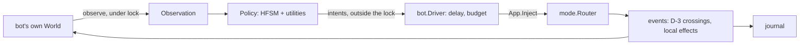
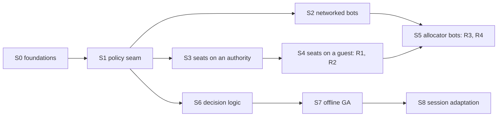

# Bots

Working plan for bots that play as participants, merged with
[Delegate convergence to relays](todo.md#delegate-convergence-to-relays). It is the
basis for a `doc/bots.md` once the stages below land; until then `todo.md` points
here and each landed stage is deleted from §5 and described in the doc instead.

## 1. What a bot is

A bot is a participant whose input comes from a policy instead of a terminal. It is
its own instance: its own `World`, `mode.Router`, scheduler and journal, holding a
roster slot and a cursor, bound by the same barrier, lead, admission and eviction as
a person. Nothing in the simulation knows a policy exists; the policy sits above
`App.Inject` exactly where a terminal, an authored script and the fuzz driver sit.

One process may run several bots. Each still is an instance, and the one holding the
process's link to the session carries the others' traffic: a process with three
bots is a relay whose own seat is a bot and who has two participants behind it. That
is why bots and relay delegation are one plan — bots are the relay's first and
easiest consumer, and relays are what let bots scale past one link each.

## 2. Decisions

| Question | Decision | Why |
|---|---|---|
| Intents or events | `input.Intent` values through the bot's own router. | The router's grammar, modes and cooldowns bind a bot as they bind a person; the journal records the events the router produces, so a replay needs no policy; touch input will drive the same contract. |
| Which intents | The keyboard grammar: motions with counts, `f`/`t`, Tab/Shift-Tab jumps, mode switches, typed text, fire. No ex commands and no pointer. | Commands are the operator surface (`:god`, `:energy`). A pointer is deferred (§11). |
| Local seats | One headless instance per bot, joining over an in-process stream through the ordinary handshake. | D-2 stays whole. Two Player domains in one `World` would share one spatial grid's player partition, one D-18 ring and one input binding. |
| Seats on a guest | The seat holder relays for its seats. | The merge in §4. |
| Perception | The whole local instance, present state only (§6). | A bot reads what its instance holds, never another participant's Player domain, which does not exist locally. |
| Objective | Cooperative first: a teammate against the environment. | Cursor-versus-cursor combat is not built ([Combat](todo.md#combat) items). |
| Learning | Genomes trained offline and shipped as data; bounded adaptation per session, keyed by participant, discarded at session end. | There is no player identity to key a profile on. §8 keeps the key replaceable and persists nothing. |
| Marking | `RosterEntry.Bot`, reported by the joiner and fixed for the participant's life, and a Shared `Bot` flag on its cursor. Presentation reads it; no mechanic does. | Value comparison of rosters still holds, and a capture carries the flag to a late joiner. |
| Fairness | The router's limits, plus a reaction delay and an action budget per policy, both bounded parameters. | Whole-instance perception is already an advantage over a person's viewport. |
| Determinism | The policy draws from its own stream, `vmath.NewSeededRand(seed, "bot")`, never a world stream (D-8). | A solo headless bot run is a pure function of its seed; in a session only its journal reproduces it, as for a person. |
| Succession | A bot never advertises and is never a succession candidate. | A session of bots alone has no one to play for. |
| Allocated lifetime | Only human participants make a session occupied. | A bot-filled session must still expire when its people leave. |
| Fleet placement | A bot pod per session that asked for bots, joined to the session pod; its first bot relays for the rest. | Every seat is a full predictor, so seating bots in the session pod multiplies a CPU and memory budget sized for one. |

## 3. Architecture

### 3.1 Data flow



The driver observes after a tick completes, releases the lock, lets the policy
decide, and injects what is due before the next tick — the shape of the authored
script loop in `RunScript`, with the actions coming from a policy. It calls
`App.InputTick` once per tick so auto-fire and held repeats advance.

### 3.2 `internal/bot`

A new package beside `internal/mode`: engine-aware, imported by `internal/app`,
importing neither `app` nor `converge`.

| Piece | Responsibility |
|---|---|
| `Observation` | A value copied from the bot's world under its lock into reused buffers (§6). |
| `Policy` | Turns an observation into intents (§7). Policies are a table indexed by name. |
| `Driver` | Decision cadence, reaction delay, action budget, and the reused intent buffer. |
| Baseline policy | Seeded and world-blind: the fuzz driver's player actions, drawn from its alphabets rather than a copy of them, and none of its operator actions. The first policy and the reproducibility fixture. |
| HFSM policy | `fsm.Machine[*bot.Mind]` loaded from `wad/bot/<name>.toml` (§8). |

The App already exposes what the driver needs — `Position`, `Tick`, `Inject` and
`InputTick`, the surface `journal.FuzzTarget` names — so the driver takes an
interface of those four and the App gains only an observation read.

### 3.3 Seats in one process

A seat is a headless session App (`newScriptApp`'s shape) with a bot driver, on its
own goroutine and paced against the authority like any guest. The seat holder owns
their lifetime: closing a seat closes its stream, and the authority crosses the
departure as for any link loss.

The link is an in-process listener: a `net.Listener` whose `Accept` returns one end
of a `net.Pipe` the seat dials with the other. `Transport.acceptLoop` already serves
any listener — TCP, TLS and WebSocket today — so a seat is admitted by the same
`AcceptSession`, offered the same roster and anchor, and installs the same capture.
The per-peer send queue keeps an unbuffered pipe from blocking the authority's tick.
The listener is pure Go, so a browser build can seat bots though it cannot listen.

What changes for a seat:

- It is exempt from the per-address `AdmissionLimiter` and counts against the roster
  ceiling and `-players` like anyone.
- It never advertises (§2), so it never binds a socket of its own.
- A solo run that seats a bot becomes a session hosted on the in-process listener
  alone, so the map locks and command mode stops pausing (§11).

Process-wide state assumes one instance per process and is audited before seats:

| State | Today | For seats |
|---|---|---|
| `status.active` flight recorder | the last registry to register wins `status.Trigger` | route lock-hold triggers through `World`'s own registry; crash and stderr triggers flush every registry |
| `vlog` | one sink, correlated per `GameContext` | a seat tag in each seat's correlation |
| `engine.divergentReads` | package-level atomics | per world, or proven harmless |
| signals, terminal, audio, probe | the front App only | seats are headless and ignore signals |
| corpus, scenario and keymap parse | per App | share the parsed immutable values across seats |

## 4. Seats and relays: the merge

| Seat holder | Its seats are | The authority sees | Needs |
|---|---|---|---|
| Solo run or terminal host (authority) | direct guests over in-process streams | a link per seat, all local | §3.3 only |
| Dedicated host `-serve` | the same; the fleet does not use it (§2) | the same | §3.3 only |
| Guest: a person's instance or a bot pod | leaves behind the holder, which relays | one link carrying the subtree | R1–R4 |

A seat is the easiest leaf a relay can have. Its hop is a function call, so two-hop
staleness is the relay's own; it shares its relay's fate, so it never re-parents; it
needs no hole punching; and it runs its holder's own binary. The
hard half of the relay item — a person behind another person — keeps those problems
and follows once the easy half is proven. The relay work, in the order bots need it:

| Step | Work | First needed by |
|---|---|---|
| R1 | **Admission through a relay.** The holder accepts a seat's join and forwards its `JoinerReport` upstream; the coordinator admits it (identity, slot, the barrier-bound arrival) and returns the offer through the holder, which serves the join capture from its own proved world — a leaf proves it by the authority's root, since dense order and so integrity differ. A new message pair and a `ManifestVersion` bump. | S4 |
| R2 | **One subtree proof upstream.** The holder's answer carries each leaf's newest proved tick in `Relayed`, so the authority's floor, flood and cadence count subtrees and the keyframe floor stops flooding a whole world through every link while anyone is behind a relay. | S4 |
| R3 | **Bundled epochs.** The holder sends its leaves' raw epochs with its own, one frame a tick. The authority's per-source commit, fences and eviction accounting are unchanged. | S5 |
| R4 | **Ingress through the relay.** The authority accepts a leaf's traffic only through its relay and budgets each link's ingress into the eviction policy, so a bad relay stalls only its own subtree. | S5 |
| R5 | **People behind a relay.** Path advertisement for a leaf's lead, re-parenting to the authority or another relay, and reaching a relay behind NAT. A relay for people is native with a declared port; a browser relays only its own seats, over the in-process listener. | the relay item's own goal |

A seat's lead follows from its holder's: the holder's round trip to the authority,
its slack tick, and a hop of zero.

## 5. Stages



S6–S8 need only S1 and can run beside S2–S5: training uses headless solo and mesh
runs, not the fleet.

### S0 — Foundations (this branch)

- The spatial grid is sized to its map: 34.0 → 4.5 MiB per headless instance at
  120×40 (§9).
- `Intent` carries a pointer cell in `X`, `Y` instead of `Count` and `Char`.
- `ControlKind` is `ControlLocal` or `ControlRemote`; the unused in-simulation
  `ControlBot` is gone.
- One ex-command round trip in the journal drivers.

### S1 — Policy seam and a baseline that replays

- `internal/bot`: `Observation`, `Policy`, `Driver`, the baseline policy.
- `vif -bot <policy>` makes this instance's own seat a bot and runs it headless: solo
  until it is given `-join` or `-host`; `-watch` presents it, as for `-script`;
  `-seed` seeds the policy.
- Exit: one seed gives the same journal twice, and replaying it reproduces the run
  without the policy.
- Affected: `internal/bot`, `internal/app/script.go`'s loop, `cmd/vif`.

### S2 — Networked bots

- `vif -bot <policy> -join <addr>` joins as a participant; `-join https://<site>`
  gives it a session of its own. Bots on one machine share its address's join and
  creation budgets, so a load test raises `-client-joins` and `-client-creates`.
- `JoinerReport.Bot` → `RosterEntry.Bot` → `ParticipantJoinedPayload.Bot` → the
  cursor's Shared flag. The peer cursor renderer marks a bot's cursor; the status
  bar's participant badge counts bots apart.
- The run reports only human participants to `internal/lifecycle` as occupancy.
- Exit: a host and two networked bots converge in a mesh test; the roster and
  badge agree on every instance.
- Affected: `internal/network/session.go`, `internal/event/payload.go`,
  `internal/component/cursor.go`, `internal/system/network.go`,
  `internal/render/renderer`, `internal/app/serve.go`.

### S3 — Seats on an authority

- The in-process listener and dialer in `internal/network`, an internal endpoint
  scheme, and the admission exemption.
- `-bots N[:policy]` adds N seats at startup, and `:bot add [policy]` /
  `:bot drop <slot>` do it in command mode, beside the session membership commands.
- The process-wide audit in §3.3.
- Exit: a solo terminal run seats three bots; a seat dropped mid-run departs on
  every instance; per-seat heap and tick cost are measured on every shipped scenario.
- Affected: `internal/network/transport.go`, `endpoint.go`, `internal/app`,
  `internal/mode/commands.go`, `internal/status/recorder.go`.

### S4 — Seats on a guest

- R1 and R2. A guest's `-bots` or `:bot add` seats behind it.
- Exit: on `network.Mesh` under link shapes, a guest relaying two seats converges
  hash-only, the authority's fan-out counts one link for the subtree, and the
  keyframe floor no longer crosses that link while its seats are proved.
- Affected: `internal/converge/relay.go`, `selective.go`, `correction.go`,
  `internal/network/protocol.go`, `internal/app/join.go`.

### S5 — The allocator fills a session

- R3 and R4.
- The create request gains `bots` (0 to `players - 1`). The allocator starts a bot
  Job running `vif -bot <policy> -bots <K-1> -join vif://<session>`, owned by the
  session Job so it goes with it, sized per seat from S3's measurements.
- Exit: a fleet session asked for three bots shows them to the first person to join,
  and expires when that person leaves.
- Affected: `tool/vif-allocator`, `deploy/guest/vif-allocator.env`.

### S6 — Decision logic

- The HFSM policy (§8.1) and a motor layer that turns a goal cell or glyph into
  intents.
- Exit: a bot outscores the baseline over a fixed seed set on every shipped scenario.
- Affected: `internal/bot`, `wad/bot/`, `internal/asset/bot/`.

### S7 — Offline genetic training

- A training entry point under `cmd/` that composes headless sessions (§8.2).
- Exit: a trained genome beats S6's hand-tuned defaults on a held-out seed set, and
  training resumes from a `pkg/genetic` checkpoint.

### S8 — Session adaptation

- Per-participant teammate models and a bandit over a genome archive (§8.3).
- Exit: against scripted teammates of two styles, a bot's choice converges to the
  better genome for each within one session.

## 6. Perception

The observation is copied from the bot's own world at the tick it completed, under
the world lock, into buffers the driver reuses. It holds present state only:

| Included | Excluded, and why |
|---|---|
| Every component store: the Shared world as this instance predicts it, and its own Player domain | the event queue and barrier-held crossings: other participants' future |
| Its own cursor through `World.LocalCursor`, the D-18 cell a person sees | RNG stream positions: every future draw |
| Its owner-authored cursor values: heat, energy, shield, boost, weapon charges | FSM delayed actions and pending triggers: scheduled future |
| Map bounds, walls and the current FSM region states and variables | the prediction ledger, network and convergence state |
| The tick, its run, and a count of installs | nothing of another participant's Player domain, which is not here |

A correction can move the world under a plan, so the install count lets the motor
layer re-plan rather than chase a cell that no longer holds what it aimed at. The
observation is typed — its own state, the nearest entities per class with cell and
distance, the roster's cursors — and S6 derives a fixed-length feature vector from
it for the utilities the genome tunes. Its cost is bounded per decision, not per
tick, and measured in S6.

## 7. Policy contract

```go
// Policy turns one observation into the intents for one decision.
type Policy interface {
	Decide(obs *Observation, out []input.Intent) []input.Intent
	Reset(seed uint64) // a new run: forget plans, keep learned parameters
}
```

- Given its seed and its sequence of observations, a policy is deterministic.
- It reads nothing but the observation and writes nothing but intents.
- It does not block, allocate per decision in steady state, or do I/O.
- It emits at most the driver's budget per decision; the driver drops the excess and
  counts it.
- Its state is private: in no capture, no journal and no fingerprint. A correction or
  a reset reaches it only through the next observation.

## 8. Decision logic and learning

### 8.1 A state machine the game already has

The bot's state machine reuses `internal/fsm`, which is generic over its context and
already loads hierarchical, parallel-region graphs from TOML. A policy is an
`fsm.Machine[*bot.Mind]`: guards read the observation, actions queue intents, tick
transitions evaluate guards, and event transitions react to what the bot's own
instance dispatched. Starting states: explore, harvest (glyphs and gold), engage,
evade, recover heat and energy, and assist a teammate under threat. Inside a state a
utility table scores candidate targets; that table and every threshold in the graph
are named, bounded parameters, which is what makes them a genome.

The motor layer turns a goal into the grammar a person uses: a motion and a count,
`f`/`t` onto a glyph, Tab to a nugget, Shift-Tab to gold, `i` and typed text, Escape,
fire. Routing around walls uses `pkg/navigation` over the bot's own world.

### 8.2 Offline training

- Genome: the policy's declared parameters as a bounded vector. `pkg/genetic`'s
  generational `Engine` fits, since one evaluation is one whole run.
- Evaluation: a headless session of several bots and scripted teammates on
  `network.Mesh`, whose virtual clock makes an evaluation reproducible, over a matrix
  of scenarios, map sizes and fixed seeds.
- Fitness, cooperative: team score, survival, gold typed, drains and species killed,
  damage taken, all per minute, scalarised by `pkg/genetic/fitness`.
- Output: genome TOML in `wad/bot/`, with an embedded fallback in
  `internal/asset/bot/`. Training resumes from a `pkg/genetic` checkpoint.

The in-game genetic registry is Shared state that captures carry (D-19); a bot's
genomes never enter it.

### 8.3 Session adaptation, and room for profiles

- The bot keeps a small model of each other participant from Shared state it can
  already see — distance kept, movement rate, what it engages — keyed by participant
  identity for the session and dropped at its end.
- A bandit over a small archive of trained genomes, per (map class, situation,
  teammate model), picks what the bot plays next. It is the bot's own, never the
  simulation's `AdaptationSystem`.
- The model key is a type of its own rather than a bare participant ID, so a player
  identity can key the same models if one ever exists. Nothing is persisted, and no
  profile code is written before an identity exists.

## 9. Costs

| Measure | Value | Source |
|---|---|---|
| Heap, one headless solo instance at 120×40 before S0 | 34.0 MiB, 89% of it the ceiling-sized spatial grid | heap profile, 2026-09-29 |
| The same after S0 | 4.5 MiB | the same run |
| Spatial grid on td, the 500×250 ceiling | 32 MB per world, and a guest's staging world holds a second | 256 bytes a cell |
| CPU per seat | about a guest's: it predicts the Shared world and simulates its own Player domain | to measure in S3 |
| Link | in process, the encode and decode of a guest's traffic and no bandwidth; behind a relay, one upstream link for the subtree | — |

On the maps a person plays solo, a handful of seats now costs less than one
instance cost before S0. td stays expensive per seat until its grid is.

## 10. Verification

- S1: the double-run journal comparison and a replay without the policy.
- S2 and S3: mesh tests with bots as participants, on `network.Mesh` and on the
  in-process listener; the existing parity and convergence assertions apply
  unchanged, which is the point of a bot being an instance.
- S4: relayed topologies under `LinkShape`s, asserting hash-only convergence and
  the authority's per-link fan-out.
- S5: a fleet load test of networked bots, which is also the continuous real play the
  session stack and the fleet lack.
- S6–S8: fixed seed sets per scenario, held out from training.

## 11. Open questions

1. **Pausing with seats.** Seating a bot makes a solo run a session, and a live
   session refuses a pause. When every other participant is a seat of this process,
   the authority could pause the session and its seats together.
2. **A pointer for bots.** A map-cell pointer, limited to the bot's viewport as a
   person's is, would give bots mouse play. Not before a policy needs it.
3. **Labels.** Participants have no names; a bot's marker is its only label.
4. **Difficulty.** Reaction delay and action budget are the natural knobs; whether
   the site and `-bots` expose them is open.
5. **td per seat.** A sparse or shared grid representation for seats, if S3's
   measurements say seats on td matter.
