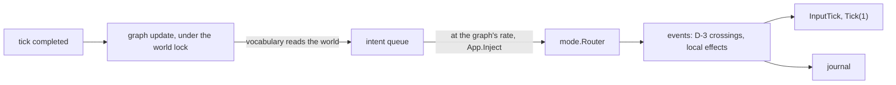

# Bots

Working plan for bots that play as participants, merged with
[Delegate convergence to relays](todo.md#delegate-convergence-to-relays). It is the
basis for a `doc/bots.md` once the phases below land; until then `todo.md` points
here and each landed phase is deleted from §5 and described in the doc instead.

## 1. What a bot is

A bot is a participant whose input comes from a graph instead of a terminal. It is
its own instance: its own `World`, `mode.Router`, scheduler and journal, holding a
roster slot and a cursor, bound by the same barrier, lead, admission and eviction as
a person. Nothing in the simulation knows a graph exists; it sits above `App.Inject`
exactly where a terminal, an authored script and the fuzz driver sit.

Bots belong to the instance that started them. A process running a person and two
bots is a participant with two more behind it — a relay whose leaves share its
fate. That relation, not a new protocol, is what fits bots under the session
protocol: every bot is admitted by the ordinary handshake, and the relay item later
lets a holder carry its bots' traffic without changing who they are or when they go.

## 2. Decisions

| Question | Decision | Why |
|---|---|---|
| Intents or events | `input.Intent` values through the bot's own router: keys and the mouse. | The router's grammar, modes and cooldowns bind a bot as they bind a person; the journal records what the router produces, so a replay needs no graph; touch input drives the same contract. |
| Pointer | A bot's pointer names a map cell (`Intent.MapCell`) the bot's viewport shows, as a person's mouse names a cell on the screen; the camera follows it. | Movement is one intent rather than a chain of motions, with the reach of a mouse. |
| Brains | One mechanism: an `internal/fsm` graph per bot, with the bot vocabulary of §6. A fixed sequence is a state whose actions carry `delay_ms`. | Scripted and reactive play are one document shape and one runtime, and the game's HFSM already loads, validates and times them. `-script` stays the deterministic harness it is. |
| Seats | One headless instance per bot. | D-2 stays whole: two Player domains in one `World` would share one grid partition, one D-18 ring and one input binding. |
| Ownership | A bot belongs to the instance that started it. The host's bots are participants for as long as the host runs; a guest's bots leave when that guest does. A guest cannot hand its bots to the host. | A bot a person brought must not outlive the person, and one a host started is part of the session it offers. |
| Compositions | On the host and on a guest alike: a person, a person with bots, or bots alone. | §4. |
| Networking | Nothing bot-specific on the wire. A host's bot joins over an in-process stream into the host's own accept loop; a guest's bot dials the session its guest joined, from the guest's process. | The handshake, barrier, fences and eviction already hold for any participant; the relay item later moves a guest's bots onto its link (§4). |
| Occupancy | Bots count: a session of bots alone is occupied. A guest's bots leave with it, so only the host's bots keep an allocated session alive, and its deadline still ends it. | A host that offers bots offers a session to play in. |
| Pause | An instance may pause only while it is the authority and every other participant is its own bot; the pause stops its bots with it. | A paused authority stops committing, and a participant it cannot pause would run on ahead of every commit; only its own bots can stop with it. Anyone else in the session, or being a guest, refuses as today. |
| Perception | The whole local instance, present state only, read by the vocabulary under the bot's own world lock while its graph updates. | A bot reads what its instance holds; another participant's Player domain does not exist locally. |
| Objective | Cooperative: a teammate against the environment. | Cursor-versus-cursor combat is not built ([Combat](todo.md#combat) items). |
| Learning | Deferred. No genetic code or hooks before bots and their networking are stable (phase 7). | The bot comes first. |
| Marking | `RosterEntry.Bot`, reported by the joiner and fixed for the participant's life, and a Shared flag on its cursor. Presentation reads it; no mechanic does. An authored `-script` participant is a bot too. | Value comparison of rosters still holds, and a capture carries the flag to a late joiner. |
| Budget | The router's limits, plus a per-graph intent rate: intents wait their turn in a bounded queue. | Whole-instance perception is already an advantage over a person's viewport. |
| Determinism | A graph draws from its own stream, seeded from the session seed and its participant, never a world stream (D-8). | A solo bot run is a pure function of its seed; in a session only its journal reproduces it, as for a person. |
| Succession | A bot seat never advertises: it lives in its holder's process. A process started with `-bot` follows `-no-advertise` like any other. | A seat elected successor would leave with its holder. |

## 3. Architecture

### 3.1 One tick of a bot



The driver runs the shape of the authored-script loop: at a completed tick it updates
the graph by one tick of game time, releases what the rate allows from the queue
through `App.Inject`, calls `App.InputTick` so auto-fire and held buttons advance,
and ticks. Graph actions only queue intents; nothing reachable from the update takes
the world lock, and the injection that does happens after it is released. A bot run
ends when an intent quits the game, a signal arrives, or its session ends.

### 3.2 `internal/bot`

A package beside `internal/mode`: engine-aware, imported by `internal/app`,
importing neither `app` nor `converge`.

| Piece | Responsibility |
|---|---|
| `Graph` | A parsed bot document: the `[bot]` settings and the FSM graph, validated by compiling it once. |
| `Driver` | The loop in §3.1: one `fsm.Machine` per bot over the bot's mind, the intent queue and its rate. |
| Vocabulary | The bot actions and guards of §6, registered with `internal/fsm/std`'s generic ones. |

Graphs resolve like every resource: a path, then `bot/<name>.toml` under
`-config-dir`, the user root and the XDG system roots, then the embedded copy in
`internal/asset/bot/`, which `make install-config` installs.

### 3.3 Run paths

`vif -bot <name|path>` drives the process's own seat with a graph. It is headless,
or presented with `-watch`, and plays solo, hosts with `-host` or joins with
`-join` through the driven session path `-script` already uses; the two share the
paced loops, told apart only by their driver. Solo and headless it runs flat out
unless `-speed` says otherwise; presented or in a session it is paced.

Seats (phases 2 and 3) are the same driver on further headless instances in the
holder's process, each on its own goroutine and paced against the authority like
any guest. Process-wide state assumes one instance per process and is audited
before they land:

| State | Today | For seats |
|---|---|---|
| `status.active` flight recorder | the last registry to register wins `status.Trigger` | route lock-hold triggers through `World`'s own registry; crash and stderr triggers flush every registry |
| `vlog` | one sink, correlated per `GameContext` | a seat tag in each seat's correlation |
| `engine.divergentReads` | package-level atomics | per world, or proven harmless |
| signals, terminal, audio, probe | the front App only | seats are headless and ignore signals |
| corpus, scenario, keymap and graph parse | per App | share the parsed immutable values across seats |

## 4. Compositions under the session protocol

| Composition | On the host | On a guest |
|---|---|---|
| A person | today | today |
| A person with bots | `-host … -bots N[:graph]`, or `:bot add` | `-join … -bots N[:graph]`, or `:bot add` |
| Bots alone | `-serve … -bots N`, or `-bot <graph> -host …` | `-bot <graph> -join …`, with `-bots N` for more |

| Bot of | Joins by | Leaves when | Occupies the session |
|---|---|---|---|
| the host | an in-process stream into the host's accept loop: the same `AcceptSession`, roster, anchor and capture, exempt from the per-address budget | the host ends, or `:bot drop` | yes |
| a guest | dialling the session the guest joined, from the guest's process, on its own link | the guest leaves: it closes its bots, and its process ending takes them | while its guest is in it |

Nothing here is a new message. A host's bot is admitted by the accept loop that
already serves TCP, TLS and WebSocket listeners; a guest's bot is one more
participant from the guest's address, which shares that address's join budget.

The relay item is where a guest's bots move onto its own link. That changes the
link and nothing a roster says, and it waits until bots work in every composition:

| Step | Work |
|---|---|
| R1 | **Admission through a relay.** The holder forwards a bot's `JoinerReport`; the coordinator admits it and answers through the holder, which serves the join capture from its own proved world — a leaf proves it by the authority's root. A new message pair and a `ManifestVersion` bump. |
| R2 | **One subtree proof upstream.** The holder's answer carries each leaf's newest proved tick in `Relayed`, so the authority's floor, flood and cadence count subtrees and the keyframe floor stops crossing every link while anyone is behind a relay. |
| R3 | **Bundled epochs.** The holder sends its leaves' raw epochs with its own, one frame a tick. |
| R4 | **Ingress through the relay.** The authority accepts a leaf's traffic only through its relay and budgets each link's ingress into eviction, so a bad relay stalls only its own subtree. |
| R5 | **People behind a relay.** Path advertisement for a leaf's lead, re-parenting, and reaching a relay behind NAT. A relay for people is native with a declared port; a browser relays only its own bots. |

A bot is the easiest leaf R1–R4 can have: its hop is a function call, it shares
its holder's fate so it never re-parents, and it needs no hole punching.

## 5. Phases

| Phase | Priority | Delivers |
|---|---|---|
| 1 | landed | The bot itself: pointer in map cells, `internal/bot`, `vif -bot`, shipped graphs. |
| 2 | P0 | Marking, and the host's bots: seats on an in-process stream, `-bots`, `:bot`, occupancy, the pause rule. |
| 3 | P0 | A guest's bots: every composition in §4. |
| 4 | P1 | The fleet: an allocator request for bots. |
| 5 | P1 | Decision logic: richer vocabulary and a motor layer. |
| 6 | P2 | Relays own subtrees: R1–R4 for a guest's bots, then R5. |
| 7 | P3 | Offline genetic training. |
| 8 | P3 | Session adaptation. |

### Phase 1 — the bot itself (landed)

`vif -bot <name|path>` plays the seat from a graph, solo, hosting or joining
through the driven session path `-script` uses. `internal/bot` holds the graph, the
driver and the vocabulary of §6; `IntentFor` and `AppendCommand` in `internal/input`
serve scripts and graphs alike; `roam` and `patrol` ship in `internal/asset/bot/`.
A solo run is a pure function of its seed, and `./script/test.sh bot` plays every
shipped graph through the binary and joins `roam` to a dedicated host. `roam` types
a few hundred glyphs a minute and misses about one keystroke in two hundred (§6).

### Phase 2 — marking and the host's bots

- `JoinerReport.Bot` → `RosterEntry.Bot` → `ParticipantJoinedPayload.Bot` → the
  cursor's Shared flag, for `-bot` and `-script` participants. The peer cursor
  renderer marks a bot; the status bar's participant badge counts bots apart.
- The in-process listener and dialer in `internal/network`, served by the transport's
  existing accept loop, and exempt from the per-address `AdmissionLimiter`.
- `-bots N[:graph]` on `-host`, `-serve` and a solo run, which then hosts on the
  in-process listener alone; `:bot add [graph]` and `:bot drop <slot>` beside the
  session membership commands.
- Occupancy counts bots; the pause rule of §2; the process-wide audit of §3.3.
- Exit: a solo terminal run with three bots pauses and resumes with them; a
  `-serve -bots 2` session stays occupied with nobody else in it; a bot dropped
  mid-run departs on every instance.
- Affected: `internal/network`, `internal/app`, `internal/mode/commands.go`,
  `internal/system/network.go`, `internal/system/meta.go`, `internal/render/renderer`,
  `internal/status/recorder.go`.

### Phase 3 — a guest's bots

- `-join … -bots N` and `:bot add` on a guest dial the guest's own session; the guest
  closes its bots when it leaves, forks or quits.
- Exit: the §4 compositions each converge in a mesh or loopback test; a guest that
  leaves takes its bots, and the host's bots stay.

### Phase 4 — the fleet

- The create request gains `bots` (0 to `players - 1`); the session pod runs with
  `-bots K` and requests per bot what phase 2 measured.
- A load test of networked bots, which also gives the session stack continuous play.

### Phase 5 — decision logic

- A motor layer over `pkg/navigation` for targets the viewport does not show,
  event transitions from the bot's own dispatch, threat and evasion guards, and
  utilities scored within a state.
- Exit: a graph outscores `roam` over a fixed seed set on every shipped scenario.

### Phases 6–8

Relays (§4), then learning (§8), in that order.

## 6. Vocabulary

A bot document is a scenario graph (see [FSM reference](fsm-reference.md)) plus a
`[bot]` table. `internal/fsm/std` supplies variables, timing, compound guards and
status guards over the bot's own registry, whose bare keys — `heat.current`,
`energy.current`, `boost.active`, `shield.active` — mirror its own slot.

| Action | Payload | Queues |
|---|---|---|
| `Intent` | `name` (a keymap action), `count`, `char` | one semantic key press |
| `Text` | `text` | a character intent per rune |
| `Command` | `text` | the ex-command round trip |
| `TypeGlyph` | — | the rune of the glyph under the cursor, if there is one |
| `PointAt` | `target`, `fire` | the pointer at the nearest target, clamped to the viewport; `fire` clicks instead of moving |

| Guard | Args | Passes when |
|---|---|---|
| `HasTarget` | `target`, `within` | a target of the class exists, within `within` cells when non-zero |
| `OnTarget` | `target` | the cursor's cell holds one |
| `InMode` | `mode` | the router is in `normal`, `insert`, `visual`, `search` or `command` |
| `Chance` | `percent` | a draw from the bot's own stream |

Targets: `glyph` (typeable text), `gold` (a gold member), `nugget`, `species` (a
hostile combat entity), `cursor` (another participant) and `random` (a cell the
viewport shows). Nearest is by cell distance with rows counted twice, as the
terminal draws them.

`PointAt` and `TypeGlyph` read the world, so each acts only when the rate releases
everything it queues before the next tick: behind a backlog, what it read would be
stale by the time it lands. `TypeGlyph` switches to Insert first when the router is
elsewhere. Of `std`'s actions, `EmitEvent` and system control are inert — a graph
writes the world only through intents — and region control runs the bot's own
machine.

| `[bot]` setting | Default | Meaning |
|---|---|---|
| `actions_per_second` | 12 | intents released per second of game time; a queue of 256 holds the rest |

A fixed sequence:

```toml
[bot]
actions_per_second = 8

[regions.play]
initial = "Out"

[states.Out]
on_enter = [
    { action = "Intent", payload = { name = "motion_right", count = 12 } },
    { action = "Intent", payload = { name = "fire_main" }, delay_ms = 500 },
]
transitions = [{ trigger = "Tick", target = "Back", guard = "StateTimeExceeds", guard_args = { ms = 1500 } }]

[states.Back]
on_enter = [{ action = "Intent", payload = { name = "motion_left", count = 12 } }]
transitions = [{ trigger = "Tick", target = "Out", guard = "StateTimeExceeds", guard_args = { ms = 1500 } }]
```

Perception is the whole local instance's present state. The vocabulary never reads
the event queue or barrier-held crossings, RNG positions, FSM delayed actions, the
prediction ledger or network state: those are the future, or somebody else's. So
a keystroke can still miss, as a person's can: a tick's own fire queues deaths —
special fire's dust, a cleaner's hits — that settle before the next keystroke does.
Settling first would make a bot run unreplayable, since a recorded driven run
settles only what it pushed.

## 7. Driver contract

- One graph update per tick, dt one tick of game time, under the bot's world lock.
- Actions queue; guards and actions read the world and never write it.
- Each step earns its allowance before the update, so the graph knows what will land
  before the tick; the queue releases at most `actions_per_second` intents a
  second, carrying the remainder, and a full queue drops and counts. Allowance left
  idle is capped at one second's worth.
- A draw is the bot's own: `vmath.NewSeededRand(seed, "bot.<participant>")`.
- A graph's state is private: in no capture, no journal and no fingerprint. A
  correction or a reset reaches it only through the world it reads next.

## 8. Decision logic and learning, later

- **Motor layer** (phase 5): a goal cell the viewport does not show is reached by
  clicks along a `pkg/navigation` route rather than a blind clamp.
- **Offline training** (phase 7): a genome is a graph's declared numeric parameters
  as a bounded vector; `pkg/genetic`'s generational `Engine` evaluates whole runs on
  `network.Mesh`, whose virtual clock makes each evaluation reproducible, over a
  matrix of scenarios and seeds; cooperative fitness is scalarised by
  `pkg/genetic/fitness`; genomes ship beside their graphs. The in-game genetic
  registry is Shared state captures carry (D-19), and bot genomes never enter it.
- **Session adaptation** (phase 8): a small model of each other participant from
  Shared state, keyed by participant for the session and dropped at its end, and a
  bandit over trained genomes. The key is a type of its own, so a player identity
  can key it if one ever exists; nothing is persisted.

## 9. Costs

| Measure | Value | Source |
|---|---|---|
| Heap, one headless solo instance at 120×40 before the grid fix | 34.0 MiB, 89% of it the ceiling-sized spatial grid | heap profile, 2026-09-29 |
| The same after it | 4.5 MiB | the same run |
| Spatial grid on td, the 500×250 ceiling | 32 MB per world, and a guest's staging world holds a second | 256 bytes a cell |
| CPU per bot | about a guest's: it predicts the Shared world and simulates its own Player domain | to measure in phase 2 |
| Link | a host's bot costs the encode and decode of a guest's traffic and no bandwidth; a guest's bot costs a guest's link until R1–R4 | — |

## 10. Verification

- Phase 1: two solo runs from one seed journal the same records; every shipped graph
  plays without overflowing its queue and `roam` types what it reaches; a broken
  graph fails at load naming the fault; intents land in order at the rate; the
  pointer rule; `./script/test.sh bot` through the binary, solo and joined.
- Phases 2–3: mesh and loopback tests with bots as participants; the existing parity
  and convergence assertions apply unchanged, which is the point of a bot being an
  instance; a script scenario per composition in §4.
- Phase 4: a fleet load test of networked bots.
- Phase 6: relayed topologies under `LinkShape`s, asserting hash-only convergence and
  the authority's per-link fan-out.

## 11. Open questions

1. **Labels.** Participants have no names; a bot's marker is its only label.
2. **Difficulty.** The intent rate is the natural knob; whether `-bots` and the site
   expose it is open.
3. **td per bot.** A sparse or shared grid representation, if phase 2's
   measurements say bots on td matter.
4. **A bot's geometry.** Its `-size` decides what its pointer can reach, and a
   dedicated host with no `-size` takes its map from its first joiner, bot or not.
